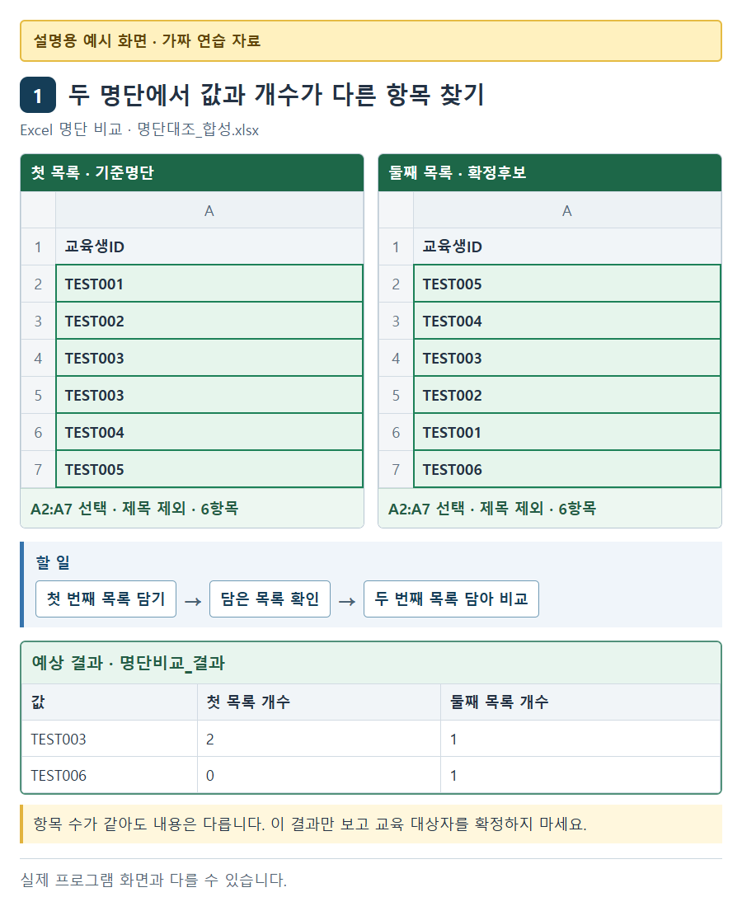
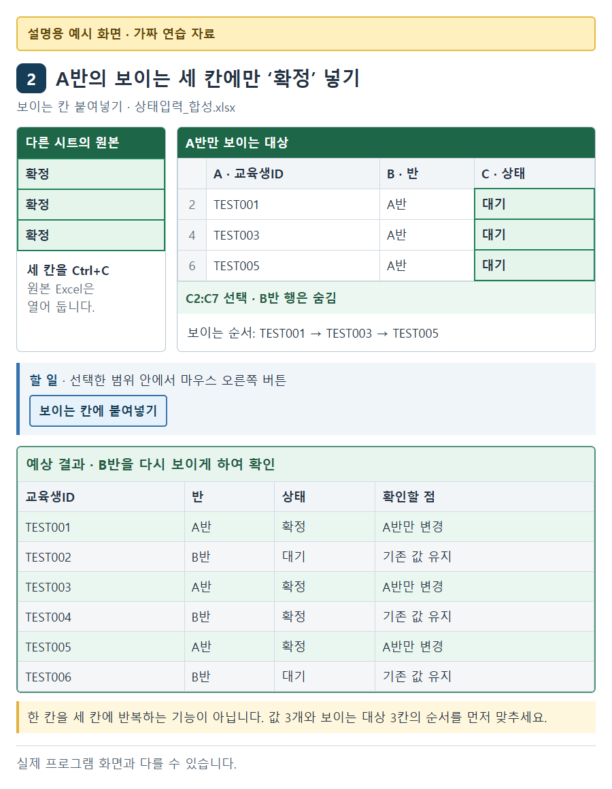
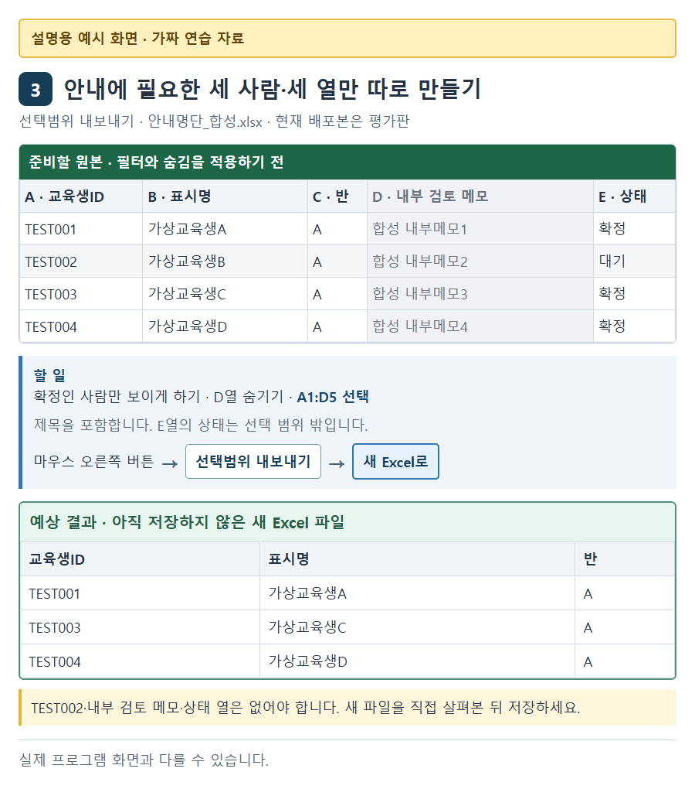
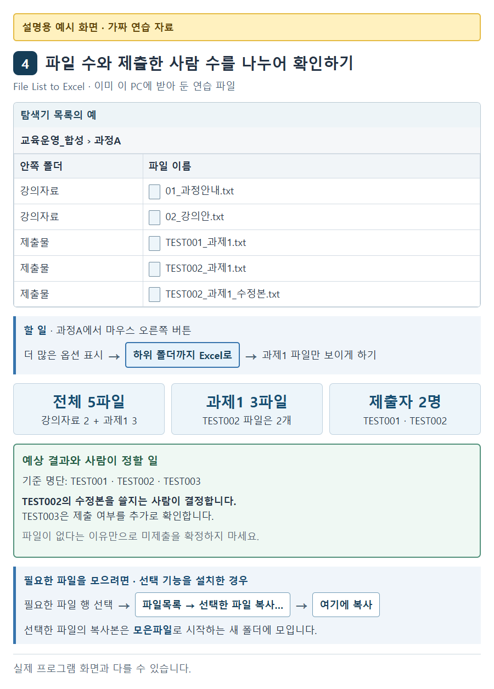
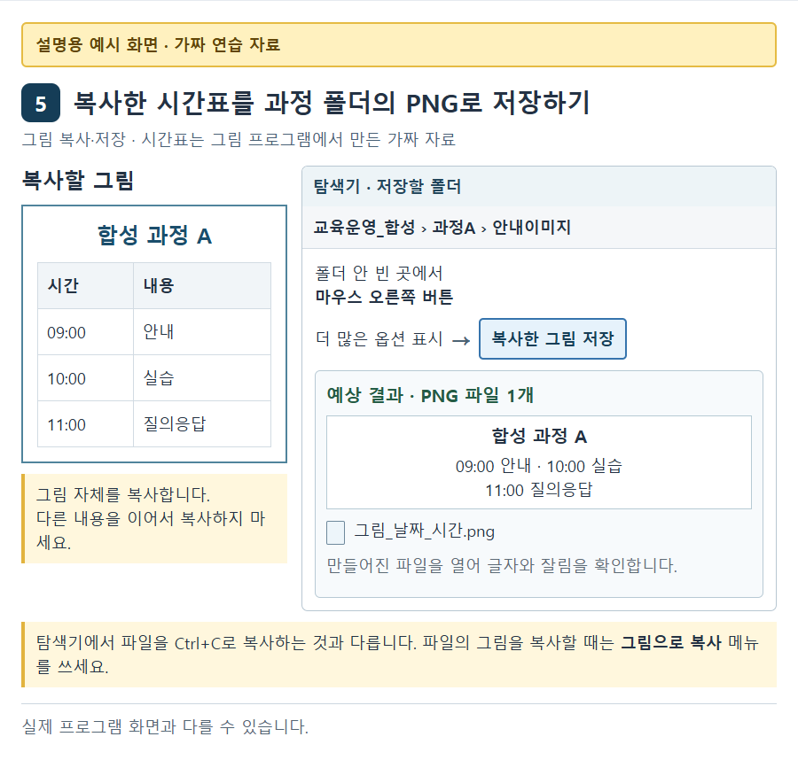
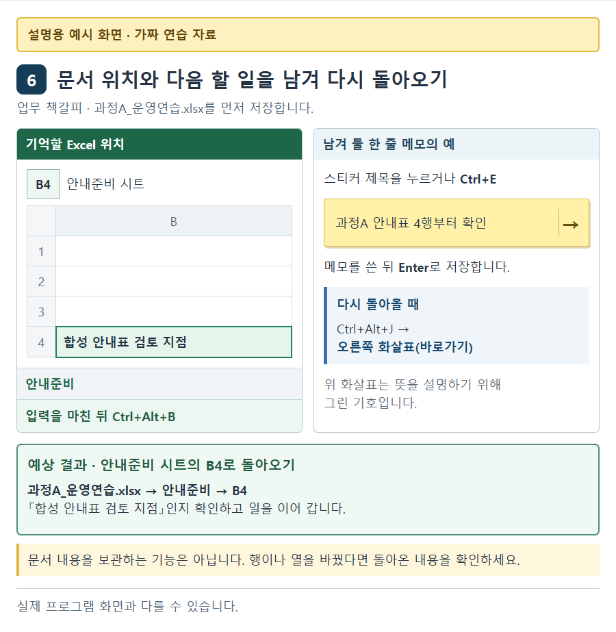
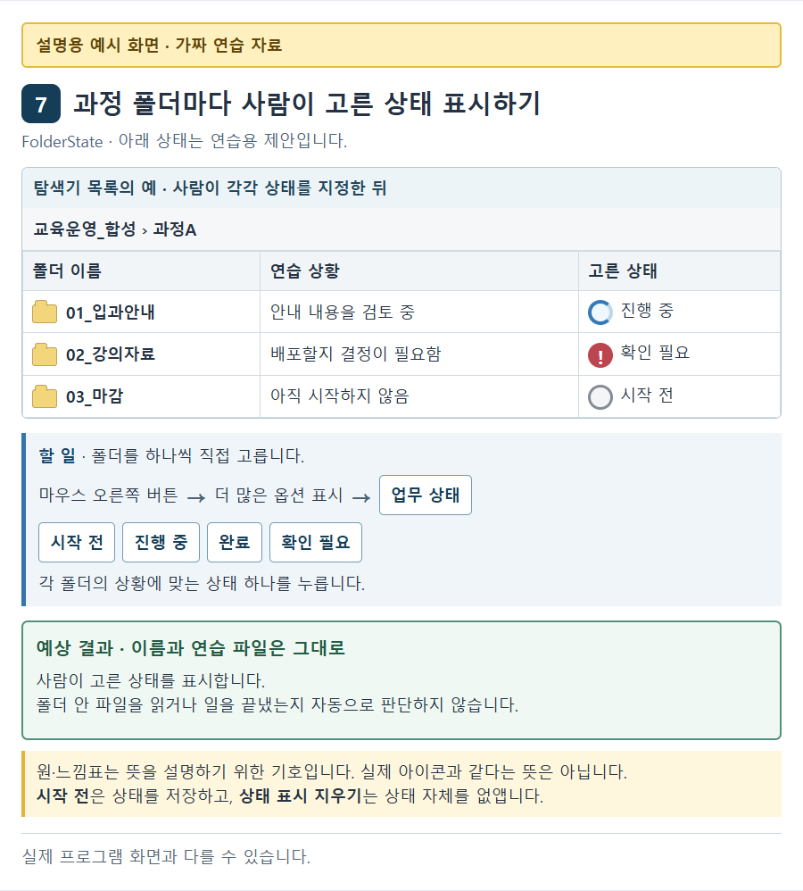

# 교육 업무에 도구 써 보기

명단을 확인하고, 안내 자료를 만들고, 중단한 일을 다시 시작할 때 쓸 수 있는 예입니다. 아래 표에서 지금 가장 번거로운 일 하나를 고르세요.

이 안내는 공개된 사용 안내를 바탕으로 만든 활용 제안입니다. 실제 회사 업무에서 실행해 효과를 확인한 결과는 아닙니다. 회사에서 정한 명단 기준, 저장 위치, 설치 방법이 있다면 그 기준을 따르세요. 회사마다 달라지는 방법은 이 문서에서 확정하지 않습니다.

| 지금 하는 일 | 쓸 도구 | 확인할 결과 |
|---|---|---|
| 두 명단의 빠진 값과 중복을 찾기 | [Excel 명단 비교](#compare) | 값과 개수가 다른 항목 |
| 이번 반의 보이는 행만 고치기 | [보이는 칸 붙여넣기](#paste) | 순서대로 들어간 상태값 |
| 안내에 필요한 명단만 따로 만들기 | [선택범위 내보내기](#export) | 필요한 사람과 열만 든 Excel 파일 |
| 이미 받은 자료와 제출물 모으기 | [File List to Excel](#collect) | 파일 목록과 필요한 파일의 복사본 |
| 복사한 안내 그림을 저장하기 | [그림 복사·저장](#image) | 과정 폴더에 생긴 PNG 그림 파일 |
| 중단한 문서 작업으로 돌아가기 | [업무 책갈피](#bookmark) | 저장한 문서 위치와 다음 할 일 |
| 과정 폴더에 진행 상태 표시하기 | [FolderState](#state) | 사람이 고른 상태와 아이콘 |

## 시작하기 전에

아래 그림은 가짜 자료로 만든 설명용 화면을 촬영한 것입니다. 실제 프로그램 화면과 다를 수 있습니다. 그림을 누르면 크게 볼 수 있습니다.

아래 TEST001 같은 값과 폴더 이름은 모두 가짜 연습 자료입니다. 실제 사람의 이름, 사번, 메일 주소나 회사 문서는 넣지 마세요. 여기서는 자료를 준비하는 방법을 설명합니다. 내려받을 연습 파일을 따로 만든 것은 아닙니다.

이미 사용이 허용된 도구에서 필요한 예 하나부터 해 보세요. 새로 설치해야 한다면 각 도구의 설치 안내와 회사의 설치 절차를 확인하세요. 보안 경고를 없애려고 보안 설정을 끄지 마세요.

이 도구들은 담당자의 확인을 돕습니다. 교육 대상자, 승인 여부, 제출하지 않은 사람과 최종 자료는 사람이 정합니다. 메일을 보내거나 회사 제출 시스템에서 자료를 받는 일은 기존 절차를 따르세요.

Excel에서 **필터**는 조건에 맞는 행만 보이게 하는 기능입니다. Excel 아래쪽 탭으로 나뉜 표를 **시트**라고 합니다. 다음 예에서는 실제 메뉴 이름과 단축키를 그대로 적었습니다.

## 1 두 명단의 차이 찾기 {#compare}

**Excel 명단 비교**를 씁니다. 기준 명단과 교육 대상 후보를 대조할 때 쓸 수 있습니다. 어떤 명단을 기준으로 삼을지는 담당자가 먼저 정하세요.

### 준비할 자료

**명단대조_합성.xlsx**를 만듭니다. 시트 두 개의 이름을 **기준명단**, **확정후보**로 정합니다. 각 시트의 A1에는 제목을, A2:A7에는 아래 값을 넣으세요.

| 넣을 칸 | 기준명단 | 확정후보 |
|---|---|---|
| A2 | TEST001 | TEST005 |
| A3 | TEST002 | TEST004 |
| A4 | TEST003 | TEST003 |
| A5 | TEST003 | TEST002 |
| A6 | TEST004 | TEST001 |
| A7 | TEST005 | TEST006 |

### 사용 순서

1. 연습 파일을 저장합니다. 기준명단의 **A2:A7**을 고르고 **첫 번째 목록 담기**를 누릅니다. 제목은 고르지 않습니다.
2. **담은 목록 확인**에서 기준명단을 담았는지, 항목이 6개인지 확인합니다.
3. 같은 Excel에서 확정후보의 **A2:A7**을 고르고 **두 번째 목록 담아 비교**를 누릅니다. 진행 상황은 명단 비교 도구 모음에 나옵니다.
4. 결과 위쪽에서 두 명단의 출처와 비교·제외 개수를 확인합니다. 값과 개수가 다른 이유를 확인한 뒤 결과를 직접 저장합니다.

### 결과 확인과 주의할 점

연습의 정답은 다음과 같습니다. 두 명단 모두 6항목이지만 두 항목의 개수가 다릅니다.

| 값 | 첫 목록 개수 | 둘째 목록 개수 |
|---|---|---|
| TEST003 | 2 | 1 |
| TEST006 | 0 | 1 |

설명용 예시: 두 명단은 각각 6항목이며 TEST003과 TEST006의 개수가 다릅니다.

이 결과만 보고 교육 대상자를 확정하지 마세요. 이름이 같아도 같은 사람이라는 뜻은 아닙니다. 실제 업무에서 사람을 구별할 번호와 중복을 허용할 기준은 담당자가 정해야 합니다.

- 숨긴 행, 필터로 가린 행, 빈칸과 오류가 난 칸 등은 비교에서 빠집니다. 결과의 제외 개수를 확인하세요.
- 메일 주소로 비교한다면 **메일 전체 주소 비교 (@ 뒤 포함)** 설정을 확인하세요. 처음에는 꺼져 있어 @ 앞부분만 비교합니다.
- 첫 목록을 담은 뒤 원본을 고쳐도 담은 목록은 바뀌지 않습니다. 수정한 범위를 다시 고르고 **첫 번째 목록 바꾸기**를 누르세요.
- 합쳐진 칸은 비교할 수 없습니다. Excel이 계산 중이면 끝날 때까지 기다리세요. 따로 실행된 Excel끼리는 담은 목록을 함께 쓰지 않습니다.
- Excel의 기존 **Ctrl+Z** 기록이 남지 않을 수 있으니 중요한 편집은 먼저 저장하세요. 결과를 전달할 때는 원본 값과 자료 위치가 들어 있는지 확인하세요.

작업을 멈추려면 **작업 취소** 또는 작업 중인 Excel 창에서 **Esc**를 누르고, 도구 모음의 **취소 완료**를 확인하세요.

[Excel 명단 비교 설치·사용 안내](tools/excel-list-compare/index.md)

## 2 이번 반의 보이는 행만 고치기 {#paste}

**보이는 칸 붙여넣기**를 씁니다. 여러 반이 섞인 명단에서 이번 반의 상태만 바꿀 때 쓸 수 있습니다. 넣을 값과 사람의 순서는 먼저 맞춰 두어야 합니다.

### 준비할 자료

**상태입력_합성.xlsx**를 만듭니다. A~C열의 제목은 **교육생ID**, **반**, **상태**입니다. 아래 순서대로 넣으세요.

| 교육생ID | 반 | 상태 |
|---|---|---|
| TEST001 | A반 | 대기 |
| TEST002 | B반 | 대기 |
| TEST003 | A반 | 대기 |
| TEST004 | B반 | 확정 |
| TEST005 | A반 | 대기 |
| TEST006 | B반 | 대기 |

필터로 A반만 보이게 합니다. 다른 시트의 이어진 세 칸에는 **확정**, **확정**, **확정**을 하나씩 넣습니다. 연습용 상태 열에는 수식, 합쳐진 칸, 보호나 입력값 제한을 두지 않습니다.

### 사용 순서

1. 파일을 별도 사본으로 저장합니다. A반만 보이는지, 교육생ID가 **TEST001 → TEST003 → TEST005** 순서인지 확인합니다.
2. 다른 시트에서 준비한 **확정 세 칸**을 **Ctrl+C**로 복사합니다. 원본 Excel은 열어 둡니다. 한 칸을 복사해 세 칸에 반복하는 기능은 아닙니다.
3. 명단으로 돌아와 상태 열의 **C2:C7**을 고릅니다. 선택한 칸 안을 마우스 오른쪽 버튼하고 **보이는 칸에 붙여넣기**를 누릅니다.
4. A반의 세 값이 맞는지 확인합니다. B반도 다시 보이게 하여 기존 값이 그대로인지 확인한 뒤 저장합니다. 잘못된 값이 보이면 추가 편집을 멈추고 저장해 둔 사본과 대조하세요.

### 결과 확인과 주의할 점

정답은 **TEST001·TEST003·TEST005만 확정**으로 바뀌는 것입니다. B반은 **TEST002 대기, TEST004 확정, TEST006 대기**로 남아야 합니다.

설명용 예시: A반의 세 값만 확정으로 바뀌고 B반의 기존 값은 남습니다.

- 복사한 값과 보이는 대상 칸의 **개수와 순서**를 모두 확인하세요. 개수가 다르면 아무 칸도 바꾸지 않습니다. 개수가 같아도 사람의 순서가 맞는지는 사람이 확인해야 합니다.
- 복사한 뒤 정렬, 행 삽입, 필터 변경을 하지 마세요. 다른 프로그램이 같은 칸을 동시에 고치는 동안에도 사용하지 마세요.
- 빈칸도 한 항목으로 셉니다. 빈칸을 복사하면 대상 내용을 지울 수 있습니다. 수식을 값으로 바꾸거나 빈칸으로 지우는 안내가 나오면 내용과 개수를 확인하세요.
- 이름이나 번호를 찾아 값을 연결하지 않습니다. 여러 열을 한꺼번에 넣을 수도 없습니다.
- 값을 목록에서 고르는 칸, 합쳐진 칸, 여러 칸이 함께 계산되는 수식, 값을 자동으로 모아 계산하는 표, 보호된 시트와 읽기 전용 파일은 사용 범위에서 빠집니다. 회사 양식의 제한을 없애서 사용하지 마세요.

**되돌리기에는 조건이 있습니다.** 붙여넣은 직후 같은 범위를 유지한 채 **마지막 붙여넣기 되돌리기**를 누르면 마지막 성공 작업 한 번을 되돌릴 수 있습니다. 다른 칸을 고르거나 값을 고치거나 시트를 바꾸면 제한됩니다. 기존 정렬 설정이 남은 시트나 표에서는 직후에도 제공하지 않습니다. 위 4단계처럼 B반을 다시 보이게 하여 결과를 확인한 뒤에는 되돌리기가 가능하다고 가정하지 마세요. 기존 **Ctrl+Z** 기록도 지워질 수 있으므로 작업 사본을 먼저 저장해 두세요.

[보이는 칸 붙여넣기 설치·사용 안내](tools/visible-cells-paste/index.md)

## 3 안내에 필요한 명단만 따로 만들기 {#export}

**선택범위 내보내기**를 씁니다. 운영용 명단에서 받는 사람에게 필요한 사람과 열만 골라 새 Excel 파일로 만듭니다. **현재 배포본은 평가판**입니다. 평가판은 정식 배포 전 단계로 표시한 프로그램입니다. 32비트 Excel에서 실제 설치·사용한 결과는 확인되지 않았습니다. 사용 전에 연결된 안내의 제한을 읽으세요.

### 준비할 자료

**안내명단_합성.xlsx**를 만듭니다. A~E열에 아래 제목과 값을 넣습니다.

| 교육생ID | 표시명 | 반 | 내부 검토 메모 | 상태 |
|---|---|---|---|---|
| TEST001 | 가상교육생A | A | 합성 내부메모1 | 확정 |
| TEST002 | 가상교육생B | A | 합성 내부메모2 | 대기 |
| TEST003 | 가상교육생C | A | 합성 내부메모3 | 확정 |
| TEST004 | 가상교육생D | A | 합성 내부메모4 | 확정 |

**확정**인 사람만 필터로 보이게 하고 **D열**을 숨깁니다. 내보낼 범위는 제목을 포함한 **A1:D5**입니다. 상태가 있는 E열은 이 범위 밖에 둡니다.

### 사용 순서

1. 받는 사람에게 필요한 항목을 정합니다. 연습에서는 확정자만 보이는지, 내부 검토 메모 열을 숨겼는지 확인합니다.
2. **A1:D5**를 고르고 **마우스 오른쪽 버튼 → 선택범위 내보내기 → 새 Excel로**를 누릅니다.
3. 열린 새 파일에서 제목, 세 사람과 세 열을 확인합니다. 날짜나 앞자리 0이 있는 번호가 필요하다면 원본과 대조하세요.
4. 전달용 이름으로 직접 저장합니다. 실제 자료를 보낼 때는 받는 사람, 메일 내용과 첨부 파일을 기존 절차로 확인합니다.

### 결과 확인과 주의할 점

정답은 제목과 **TEST001·TEST003·TEST004**의 **교육생ID·표시명·반** 세 열입니다. 대기자인 TEST002, 내부 검토 메모와 상태 열은 없어야 합니다.

설명용 예시: 제목과 세 사람의 필요한 세 열만 남기고 내부 메모는 넣지 않습니다.

- 새 파일의 전체 행·열·시트를 살펴보고 개인정보나 내부 메모가 없는지 확인하세요. 원본에서 숨겼다는 이유만으로 바로 보내지 마세요.
- 수식은 현재 계산된 값으로 바뀝니다. 원본의 계산을 아직 마치지 않았다면 이전 값이 나올 수 있습니다. 원본에서 필요한 계산이 끝났는지 확인하세요.
- 수식, 다른 시트, 댓글, 그림과 다른 파일로 이어지는 연결까지 보존하는 사본이 필요하다면 이 예에 맞지 않습니다. 새 파일은 원본이 바뀌어도 함께 바뀌지 않습니다.
- 한 시트의 이어진 네모 모양 범위 하나만 고르세요. Ctrl로 떨어진 여러 범위나 행·열 전체를 고르는 방식은 지원하지 않습니다.
- 한 칸 안에 서로 다른 글꼴이 섞이거나 배경색이 점차 바뀌는 서식은 지원하지 않습니다. 오류가 나면 안내된 원본 행·열을 확인하세요. 도구가 그 칸을 알아서 빼거나 원본을 고치지는 않습니다.
- 작업 중 이 PC에 중간 파일을 만듭니다. 프로그램을 강제로 종료하면 남을 수 있습니다. 회사 자료를 이 PC에 임시로 저장해도 되는지 확인하세요.

[선택범위 내보내기 설치·사용 안내](tools/excel-selection-export/index.md)

## 4 받은 자료와 제출물 모으기 {#collect}

**File List to Excel**을 씁니다. 이미 이 PC에 받아 둔 강의자료와 제출물을 목록으로 보고 필요한 파일을 모을 때 쓸 수 있습니다.

### 준비할 자료

**교육운영_합성/과정A** 안에 **강의자료**와 **제출물** 폴더를 만듭니다. 아래 다섯 개의 글 파일을 준비하세요. 실제 제출물이나 회사 문서는 넣지 않습니다.

| 폴더 | 만들 파일 | 넣을 내용 |
|---|---|---|
| 강의자료 | 01_과정안내.txt | 합성 안내 |
| 강의자료 | 02_강의안.txt | 합성 강의안 |
| 제출물 | TEST001_과제1.txt | 가짜 연습 제출물 |
| 제출물 | TEST002_과제1.txt | 가짜 연습 제출물 |
| 제출물 | TEST002_과제1_수정본.txt | 가짜 연습 수정본 |

제출자를 확인할 기준 명단은 **TEST001, TEST002, TEST003**입니다.

### 사용 순서

1. **과정A** 폴더를 **마우스 오른쪽 버튼 → 더 많은 옵션 표시 → 하위 폴더까지 Excel로**를 누릅니다.
2. 열린 목록에서 파일 이름, 저장 위치, 수정일과 **Errors**를 확인합니다. Errors는 읽지 못한 항목을 보여 줍니다. 목록을 **다른 이름으로 저장**합니다.
3. 과제1 파일만 보이게 하여 기준 명단과 대조합니다. TEST002의 두 파일 중 사용할 파일은 사람이 정합니다. TEST003은 제출 여부를 추가로 확인할 대상입니다.
4. 설치할 때 **Excel에서 선택한 파일 복사 (선택)**를 고른 경우에는 새 목록에서 필요한 파일 행을 선택합니다. **칸에서 마우스 오른쪽 버튼 → 파일목록 → 선택한 파일 복사…**를 누르고, 목적 폴더·파일 개수·예상 크기·제외 수를 확인한 뒤 **여기에 복사**를 누릅니다. 이 기능이 없다면 목록까지만 쓰고 평소 복사 방법을 따르세요.
5. 새로 생긴 **모은파일**로 시작하는 폴더와 **작업 결과 보기**에서 성공한 파일과 제외된 파일을 확인합니다.

### 결과 확인과 주의할 점

다섯 파일의 이름과 저장 위치가 목록에 있어야 합니다. **과제1 파일은 세 개지만 제출자는 두 명**입니다. TEST002의 수정본을 쓸지는 사람이 결정합니다. 목록에 TEST003 파일이 없다고 바로 미제출로 확정하지 마세요. 기준 명단과 실제 제출 경로를 함께 확인해야 합니다.

설명용 예시: 과제1 파일 세 개는 TEST001과 TEST002 두 사람의 자료입니다. TEST003의 제출 여부는 따로 확인합니다.

- 이 예는 이미 이 PC에 받은 파일을 다룹니다. 메일이나 회사 제출 시스템에서 자료를 자동으로 가져오지 않습니다.
- 처음 만든 목록은 임시 파일입니다. 보관하려면 **다른 이름으로 저장**하세요. 목록에는 전체 저장 위치와 원본 링크가 들어가므로 그대로 외부에 보내도 되는지 확인하세요.
- **Errors**, **Skipped**와 제외 수를 확인하세요. Skipped는 검사에서 빠진 항목입니다. 복사를 취소해도 이미 복사된 파일은 남습니다. 일부만 모인 결과를 완성본으로 보내지 마세요.
- 아직 PC에 내려받지 않은 파일, 다른 저장 위치로 이어지는 파일, 목록을 만든 뒤 바뀌거나 삭제된 원본은 복사에서 빠질 수 있습니다. 내려받은 OneDrive 파일도 빠질 수 있습니다.
- 원본을 열 수 없는 다른 PC에서는 Excel 목록만 받아 파일을 복사할 수 없습니다. 복사할 위치에도 사용 조건이 있으므로 자세한 제한은 아래 안내를 확인하세요.
- 원본을 볼 수 있는 사람의 권한이 복사본에도 그대로 적용되는 것은 아닙니다. 모은 폴더를 누가 볼 수 있는지 따로 확인하세요. 모든 파일과 접근 권한을 보존하는 백업 용도로 쓰지 마세요.

내용이 같은 파일을 찾는 기능은 별도입니다. 이때는 파일 내용을 읽습니다. 같은 내용이라는 결과만 보고 원본을 삭제하지 마세요. 위 연습에는 삭제가 필요하지 않습니다.

[파일 목록 만들기와 선택한 파일 복사 안내](tools/file-list-to-excel/index.md)

## 5 안내 그림을 과정 폴더에 저장하기 {#image}

**그림 복사·저장**을 씁니다. 복사해 둔 시간표나 안내 그림을 지금 열어 둔 폴더에 PNG 그림 파일로 저장합니다.

### 준비할 자료

그림 프로그램에서 아래 시간표를 만듭니다. 제목은 **합성 과정 A**입니다.

| 시간 | 내용 |
|---|---|
| 09:00 | 안내 |
| 10:00 | 실습 |
| 11:00 | 질의응답 |

**교육운영_합성/과정A/안내이미지** 폴더를 준비합니다. 그림에는 실제 직원, 교육생, 계정이나 회사 화면을 넣지 않습니다.

### 사용 순서

1. 연습 시간표를 그림으로 복사합니다. 다른 내용을 이어서 복사하지 마세요.
2. 탐색기에서 **안내이미지** 폴더를 엽니다. 저장 위치가 이번 과정의 폴더인지 확인합니다.
3. **폴더 안 빈 곳을 마우스 오른쪽 버튼 → 더 많은 옵션 표시 → 복사한 그림 저장**을 누릅니다.
4. 만들어진 PNG를 열어 시간표, 글자 크기, 잘림과 투명 배경을 확인합니다. 필요한 파일 이름은 평소 방법으로 바꾸세요.

### 결과 확인과 주의할 점

정답은 대상 폴더에 PNG 파일 하나가 생기고 시간표 글자가 읽히는 것입니다. 원하지 않는 화면이나 개인정보가 들어 있지 않아야 합니다.

설명용 예시: 안내이미지 폴더에 저장한 PNG를 열어 시간표 글자와 잘림을 확인합니다.

- 이전에 복사한 다른 그림이 저장될 수 있으니 만든 파일을 직접 열어 보세요. 탐색기에서 파일을 일반 **Ctrl+C**로 복사하는 것과 그림 자체를 복사하는 것은 다릅니다. 파일에서 그림을 복사하려면 **그림으로 복사** 메뉴를 쓰세요.
- 회사 화면을 실제로 저장할 때는 이름, 로그인 정보, 회사 주소와 문서 내용이 드러나는지 확인하세요. Windows나 다른 앱이 복사 내용을 보관하거나 다른 기기로 보내는 설정은 이 도구가 바꾸지 않습니다.
- 이 PC의 실제 폴더에서 사용합니다. 네트워크 드라이브나 온라인에만 있는 파일 위치는 지원하지 않습니다. PDF나 SVG 등을 PNG로 바꾸는 도구도 아닙니다.
- 원본 그림의 모든 추가 정보와 색상 설정을 보존하지는 않습니다. 다른 앱에 넣었을 때 투명 배경이 똑같이 보이는지도 별도로 확인하세요.
- 설치·업데이트에는 관리자 승인이 필요합니다. 설치 파일에는 제작자를 확인하는 전자 서명이 없습니다. 탐색기가 응답하지 않거나 결과가 불분명하면 반복 클릭을 멈추고 파일이 생겼는지 먼저 확인하세요.

[그림 복사·저장 설치·사용 안내](tools/image-copy-save/guide.md)

## 6 중단한 문서 작업으로 돌아가기 {#bookmark}

**업무 책갈피**를 씁니다. 다른 일 때문에 잠시 멈춘 문서의 위치와 다음 할 일을 남길 때 쓸 수 있습니다.

### 준비할 자료

**과정A_운영연습.xlsx**를 저장합니다. **안내준비** 시트의 **B4**에 **합성 안내표 검토 지점**을 넣으세요. 책갈피 메모는 **과정A 안내표 4행부터 확인**으로 준비합니다. 잠시 열어 볼 다른 가짜 문서도 하나 준비하세요.

### 사용 순서

1. 연습 파일을 저장합니다. 안내준비 시트의 **B4**를 선택하고 칸에 입력을 마칩니다.
2. **Ctrl+Alt+B**를 누르고 **책갈피를 남겼습니다** 안내를 확인합니다.
3. 작은 메모창이 보이면 제목을 누르거나 그 창에서 **Ctrl+E**를 누릅니다. 목록으로 보이면 항목에서 **마우스 오른쪽 버튼 → 메모**를 고릅니다. **과정A 안내표 4행부터 확인**을 적고 저장합니다. 작은 메모창에서는 **Enter**로 저장할 수 있습니다.
4. 다른 연습 문서를 잠시 본 뒤 **Ctrl+Alt+J**를 누릅니다. 스티커의 **오른쪽 화살표(바로가기)** 또는 목록의 **Enter**로 원래 작업을 엽니다.
5. 파일 이름, 안내준비 시트와 B4의 내용이 맞는지 확인한 뒤 일을 이어 갑니다. 행이나 열을 바꿨다면 새 위치에 책갈피를 다시 남기세요.

### 결과 확인과 주의할 점

정답은 같은 저장 파일의 **안내준비 시트·B4**로 돌아오고, 다음 할 일을 적은 메모를 확인할 수 있는 것입니다.

설명용 예시: 안내준비 시트의 B4와 다음 할 일을 적은 책갈피 메모를 확인합니다.

- 책갈피를 남기기 전에 Office 문서를 저장하세요. Office 문서의 수정 내용이나 저장하지 않은 내용을 보관하는 기능은 아닙니다.
- 시트 이름, 행·열이나 Word 문서 앞부분이 바뀌면 같은 위치에 다른 내용이 있을 수 있습니다. 돌아온 뒤 내용을 확인하세요.
- 스티커는 화면 공유 중에도 보일 수 있습니다. 메모에 개인정보나 민감한 사정을 쓰지 마세요.
- 동료에게 책갈피나 문서 권한이 자동으로 전달되지 않습니다. 담당자 배정, 마감 알림이나 함께 쓰는 업무 목록이 필요하면 기존 방법을 따르세요.
- 웹페이지는 제목과 주소를 기억합니다. 로그인 상태, 입력하던 글과 원래 브라우저의 사용 환경까지 보관하지는 않습니다. 회사 로그인, 문서 보호와 공유 드라이브에서의 동작은 모두 확인된 것이 아닙니다. 이 연습은 이 PC에 저장한 Excel 파일을 씁니다.

[업무 책갈피 설치·사용 안내](tools/bookmark/index.md)

## 7 과정 폴더에 진행 상태 표시하기 {#state}

**FolderState**를 씁니다. 폴더 이름을 바꾸지 않고 지금 진행 중이거나 확인이 필요한 일을 표시할 때 쓸 수 있습니다.

### 준비할 자료

**교육운영_합성/과정A** 안에 아래 폴더 세 개를 만듭니다. 상태는 이 연습에서 고르는 **제안**입니다. 회사에서 정한 기준이 있으면 그 기준을 따르세요.

| 폴더 | 연습 상황 | 고를 상태의 예 |
|---|---|---|
| 01_입과안내 | 안내 내용을 검토 중 | 진행 중 |
| 02_강의자료 | 배포할지 결정이 필요함 | 확인 필요 |
| 03_마감 | 아직 시작하지 않음 | 시작 전 |

### 사용 순서

1. 각 폴더의 상황과 상태를 확인합니다. 실제 업무에서는 누가 상태를 보는지, 완료를 어떤 기준으로 고르는지 정하세요.
2. 폴더 하나를 **마우스 오른쪽 버튼 → 더 많은 옵션 표시 → 업무 상태**에서 원하는 상태로 바꿉니다. 관리 화면에서는 **폴더 확인** 후 표시된 전체 위치를 먼저 확인합니다.
3. 나머지 폴더도 필요한 것만 직접 고릅니다. 탐색기에서 폴더 이름과 아이콘을 확인하세요. 표시가 늦으면 **F5**를 누릅니다.
4. 결과물, 필요한 승인과 전달을 실제로 확인한 폴더만 **완료**로 바꿉니다. 다음 교육에 복사해서 쓸 기본 폴더는 필요하면 **시작 전**으로 준비합니다.

### 결과 확인과 주의할 점

정답은 각 폴더에 사람이 고른 상태가 표시되고 폴더 이름이 그대로 남는 것입니다. 폴더 안에 연습 파일을 두었다면 그 파일도 그대로 있어야 합니다. 아이콘만 보고 제출이나 승인이 끝났다고 판단하지 마세요.

설명용 예시: 폴더 이름은 그대로 두고 사람이 진행 중·확인 필요·시작 전을 고릅니다.

- 프로그램은 폴더 안의 업무 파일을 읽거나 하위 폴더를 찾아 상태를 바꾸지 않습니다. 폴더마다 사람이 필요한 상태를 고릅니다.
- **시작 전**은 새 상태를 저장합니다. **상태 표시 지우기**는 상태 자체를 없앱니다. 다음 교육을 시작하려고 상태 파일을 직접 지우지 마세요.
- 복사해서 쓰는 기본 폴더에 이전 교육의 완료 표시가 남지 않았는지 확인하세요. 이미 시작 전이면 복사할 때마다 표시를 지울 필요는 없습니다.
- 공유·동기화 폴더나 회사에서 보안을 관리하는 폴더는 아이콘 표시가 충분히 확인되지 않았습니다. 함께 일하는 사람이 모두 같은 아이콘을 본다고 가정하지 마세요.
- 상태나 설정 파일이 손상되었거나 다른 곳에서 바뀌었다는 안내가 나오면 파일을 지우지 마세요. 반복해서 복구를 누르기보다 사용 안내에서 해당 상황을 확인하세요.
- 승인 이력, 담당자, 기한과 업무 기록이 필요한 공식 관리표를 대신하지 않습니다. 기존 관리표의 내용을 여기에도 다시 적는 부담만 늘어난다면 쓰지 않아도 됩니다.

[FolderState 설치·사용·문제 해결 안내](tools/folderstate/index.md)

## 실제 업무에서 쓸지 고르기

연습 뒤에는 원래 하던 일보다 결과를 확인하기 쉬워졌는지 살펴보세요. 빠진 값이나 파일을 담당자가 설명할 수 있는지, 같은 내용을 여러 곳에 또 적게 되지는 않는지도 살펴보세요. 이미 쓰는 기능으로 충분하다면 새 도구를 추가할 필요가 없습니다.

어느 명단을 기준으로 삼을지, 자료를 어디에 저장할지, 최종 자료와 완료 상태를 누가 정할지는 회사마다 다릅니다. 이 안내의 폴더와 상태 예는 확정된 회사 규칙이 아닙니다.

**다운로드 이름 유지(DownloadVersionManager)는 일상 교육 업무에 쓰는 추천을 미룹니다.** 현재 평가판에는 설치 실패 뒤 설치 정보를 원래대로 되돌리지 못하는 문제가 남아 있습니다. 이 안내에서는 새 설치나 복구 시험을 권하지 않습니다. [현재 사용 안내와 알려진 제한](tools/download-version-manager/index.md)을 확인하세요.

작성 기준: 2026-10-05 공개 사용 안내와 제공된 교육 업무 활용 문서. 위 연습을 실제 회사 자료로 실행하거나 효과를 측정하지 않았습니다. 최신 설치 파일과 지원 범위는 각 도구의 사용 안내에서 확인하세요.
