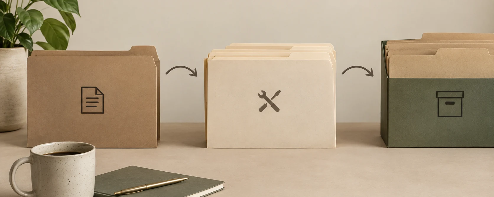

<section class="handbook-hero" aria-labelledby="handbook-title" markdown>

파일 · 메일 · 업무 진행 안내

# 자료는 쉽게 찾고, 다음 할 일은 바로 알도록 {#handbook-title}

파일과 메일을 어디에 둘지,  일이 어디까지 됐는지 확인하는 방법을 안내합니다.

지금 맡은 업무 하나부터 따라 해 보세요.

[지금 할 일 찾기](quick-reference.md){ .md-button .md-button--primary }
[업무 하나로 시작하기](getting-started.md){ .md-button }
[프로그램 받기](#programs){ .md-button }

회사에서 정한 저장·보관 기준에 맞춰 사용할 수 있는 제안입니다.

<figure class="hero-visual">

<figcaption>같은 업무의 자료를 한곳에 모아 두세요.</figcaption>
</figure>
</section>

<section class="handbook-section" aria-labelledby="programs" markdown>

필요한 프로그램을 골라 받으세요

## 프로그램 받기 {#programs}

| 하고 싶은 일 | 프로그램과 설치 안내 |
|---|---|
| 폴더에 업무 진행 상태를 표시하고 싶어요 | **[FolderState 0.1.2 RC1 받기](tools/folderstate/installation.md)** — 폴더를 고르고 현재 상태를 누르세요. |
| Excel의 두 목록에서 다른 값과 중복을 찾고 싶어요 | **[Excel 명단 비교 받기](tools/excel-list-compare/index.md)** — 첫 번째 목록을 담고 두 번째 목록을 선택해 비교하세요. |

두 프로그램 모두 시험용입니다. Excel 설치 파일은 이전 공개 RC7이며 이번 문구 교정은 아직 포함되지 않았습니다. 다운로드 전에 각 설치 안내에서 사용 환경과 알려진 문제를 확인하세요.

</section>

<section class="handbook-section" aria-labelledby="resume" markdown>

필요한 정보를 찾을 수 있나요?

## 이 세 가지를 확인해 보세요 {#resume}

지금 맡은 업무 하나에서 아래 내용을 찾을 수 있다면, 하던 일을 이어가거나 다른 사람에게 넘기기 쉬워집니다.

### 자료가 어디에 있나요?

지금 쓰는 자료와 마지막으로 확정한 파일을 찾을 수 있습니다.

[자료를 둘 곳 찾기](quick-reference.md#where)

### 다음에 무엇을 하나요?

어디까지 했는지, 다음에 무엇을 언제까지 해야 하는지 알 수 있습니다.

[다음 할 일 확인하기](quick-reference.md#work)

### 다른 사람도 찾을 수 있나요?

업무를 넘겨받은 사람도 기준으로 쓰는 자료와 일정, 중요한 결정 이유를 찾을 수 있습니다.

[기준으로 쓸 원본 정하기](policies/workspace.md#source-of-truth)

</section>

<section class="handbook-section" aria-labelledby="workflow" markdown>

새 업무부터 마무리까지

## 복사해서 시작하고, 끝나면 통째로 보관하세요 {#workflow}

반복하는 업무는 빈 양식과 단계별 폴더를 준비해 두세요. 이 복사용 기본 폴더를 <strong>MASTER</strong>라고 합니다. 새 업무를 시작할 때 복사해서 쓰면 됩니다.

<figure class="lifecycle-visual">

<figcaption>기본 폴더를 복사해 쓰고, 끝난 업무는 폴더째 보관합니다.</figcaption>
</figure>

<ol class="event-flow">
<li>01<strong>새 자료를 받으면</strong>
쓰임을 모르면 <code>00_Inbox</code>에 잠시 두세요. 지금 하는 업무 자료는 해당 업무 폴더에 넣으세요.
</li>
<li>02<strong>반복 업무를 시작하면</strong>
기본 폴더를 <code>10_Active</code>에 복사하세요. 이번 업무의 이름과 일정을 적으세요.
</li>
<li>03<strong>일을 진행하면</strong>
시작하거나 마친 단계의 상태를 바꾸세요. 중요한 결정을 했다면 이유를 짧게 적으세요.
</li>
<li>04<strong>업무가 끝나면</strong>
남은 일과 문제, 보관 조건을 확인하세요. 확인이 끝나면 업무 폴더 전체를 <code>80_Archive</code>로 옮기세요.
</li>
</ol>

[반복 업무 시작과 일정 관리](policies/kits.md){ .text-link }

</section>

<section class="handbook-section principles-summary" aria-labelledby="ten-principles" markdown>

자주 쓰는 방법

## 필요한 방법만 골라 보세요 {#ten-principles}

파일을 찾기 어렵거나 같은 내용을 여러 번 적고 있다면, 관련된 항목을 읽어 보세요.

<ol class="principle-index" markdown>

1. [지금 필요한 자료부터 정리하세요](principles.md#principle-01)
2. [자료의 용도에 맞는 폴더에 넣으세요](principles.md#principle-02)
3. [일을 시작하거나 마칠 때 표시하세요](principles.md#principle-03)
4. [계속 수정할 원본을 하나 정하세요](principles.md#principle-04)
5. [한 업무의 자료는 한 폴더에 모으세요](principles.md#principle-05)
6. [반복 업무는 기본 폴더를 복사해서 시작하세요](principles.md#principle-06)
7. [진행 상태는 아이콘으로 표시하세요](principles.md#principle-07)
8. [메일에서 받은 파일은 쓸 것만 저장하세요](principles.md#principle-08)
9. [중요한 결정은 이유를 짧게 적으세요](principles.md#principle-09)
10. [같은 불편이 반복될 때 자동 처리를 검토하세요](principles.md#principle-10)

</ol>

[자료 정리의 10가지 습관과 예시](principles.md){ .text-link }

</section>

<section class="handbook-section" aria-labelledby="roles" markdown>

어디에서 확인하나요?

## 같은 내용은 한곳에서 고치세요 {#roles}

일정과 담당자 정보가 회사 시스템에 있다면 그곳을 기준으로 쓰세요. 운영현황 파일에는 그 위치를 연결하면 됩니다.

<dl class="role-map">

<dt>누가 언제까지 하나요?</dt><dd>일정표와 담당자 정보</dd>

<dt>어디까지 했나요?</dt><dd>FolderState에 표시한 진행 상태</dd>

<dt>어떤 자료를 만들었나요?</dt><dd>해당 업무 폴더</dd>

<dt>무슨 대화를 했나요?</dt><dd>메일의 요청·답장</dd>

<dt>왜 그렇게 정했나요?</dt><dd>문제·결정 기록</dd>

</dl>

[자료를 둘 곳 정하기](policies/workspace.md){ .md-button }
[폴더에 진행 상태 표시하기](tools/folderstate/index.md){ .md-button }

</section>

<section class="handbook-section" aria-labelledby="next-steps" markdown>

같은 불편이 반복된다면

## 요청을 놓치거나 같은 일을 반복하나요? {#next-steps}

여러 곳에서 오는 요청을 모으고, 전에 해결한 방법을 찾아보면 다음 업무에 도움이 됩니다. 지금 필요한 방법부터 골라 보세요.

<ol class="efficiency-path" aria-label="불편에 따라 살펴볼 방법">
<li>자료 찾기</li>
<li>할 일 확인</li>
<li>기본 폴더</li>
<li>이유 기록</li>
<li>해결법 찾기</li>
<li>자동 처리</li>
<li>AI 도움</li>
</ol>

**업무 하나에 써 보고, 같은 불편이 반복될 때 필요한 방법을 더하세요.**

[요청 모아 보기](policies/work-efficiency.md#work-inbox)는 메일이나 메신저에서 받은 부탁을 놓치지 않도록 돕습니다. [지난 해결 방법 찾기](policies/work-efficiency.md#knowledge)는 같은 문제를 다시 조사하는 수고를 줄이는 방법입니다. [AI에 작업 맡기기](policies/work-efficiency.md#ai-agent)는 작업 순서와 판단 기준을 정한 뒤 검토하세요.

[반복되는 불편 줄이기](policies/work-efficiency.md){ .text-link }

</section>

<figure class="closing-visual">

</figure>

**자료와 다음 할 일을 찾을 수 있으면 됩니다.**

지금 맡은 업무 하나부터 써 보세요. 다른 사람에게 업무를 넘기거나 답장을 확인하기 어렵다면 아래 안내에서 필요한 방법을 고르세요.

[일을 이어서 하고 다른 사람에게 넘기기](policies/folder-workflow.md)

!!! info "회사 기준을 먼저 확인하세요"
    이 업무 안내는 **제안 단계**입니다. 회사에서 허용한 저장 위치와 자료 보관 기간, 기준으로 쓸 원본, 백업 방법은 [회사에서 정할 항목](policies/decisions.md)을 참고해 결정하세요. 상태를 바꾸거나 업무를 끝내도 되는지는 담당자가 확인합니다. 프로그램은 시험용이며 사용 가능한 환경과 제한은 [FolderState 설치 안내](tools/folderstate/installation.md)와 [Excel 명단 비교 안내](tools/excel-list-compare/index.md)를 보세요.

