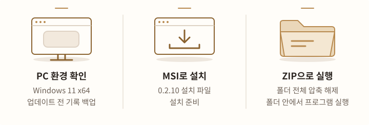
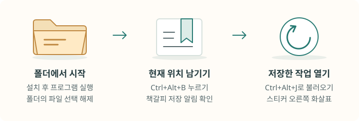
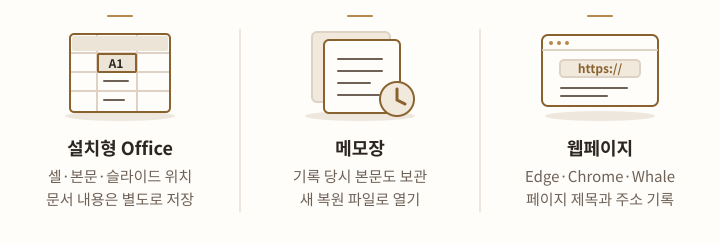
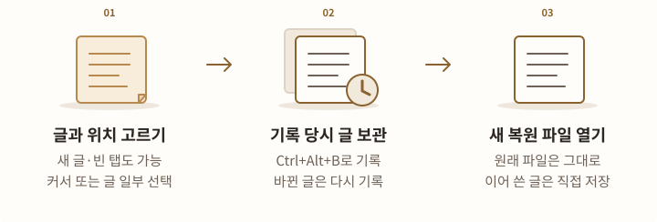
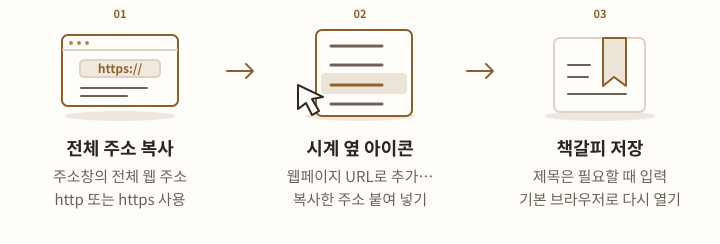
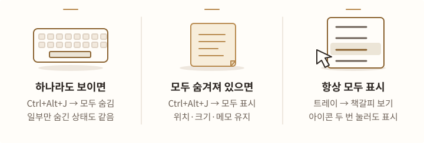
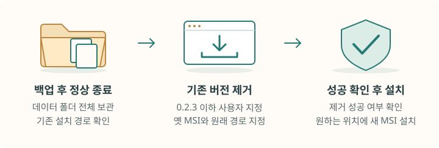
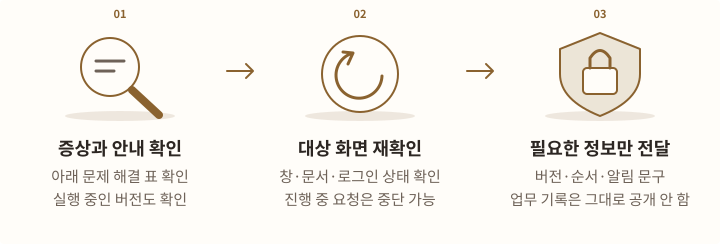

# 업무 책갈피 설치·사용

**업무 책갈피 / WorkBookmark 0.2.10** · 2026-10-06

다시 찾고 싶은 폴더, 문서의 작업 위치, 웹페이지를 기억합니다. **Ctrl+Alt+B**로 책갈피를 남기세요. **Ctrl+Alt+J**는 스티커 모드에서 전체 표시·숨기기를 바꾸고, 목록 모드에서 목록을 엽니다. 목록에서 **Enter**, 포스트잇 스티커에서 **오른쪽 화살표(바로가기)**를 누르면 저장한 작업을 엽니다.

0.2.9에서 **스티커 전체 표시·숨기기**, 가까운 스티커에 붙는 **자석 정렬**, **가로·세로·격자 정렬**을 추가했습니다. 0.2.10에서는 숨기기 전에 연 메모가 늦게 준비돼도 스티커가 다시 나타나지 않도록 고쳤습니다. 메모 편집 중 정렬한 뒤 저장하거나 취소해도 새 위치를 유지합니다.

**한 줄 메모와 오른쪽 화살표** 스티커, 제목 클릭·**Ctrl+E** 편집과 다른 창으로 이동할 때 자동 저장하는 방식은 그대로입니다. Edge·Chrome·**네이버 Whale**에서는 확장 없이 웹페이지 제목과 주소를 기록합니다.

!!! warning "업데이트 전 백업과 표시 변경을 확인하세요"
    **직접 선택한 목록/스티커 모드와 조절한 크기는 유지합니다.** 0.2.6에서 기본 내용 크기 260×88을 쓰던 항목만 한 줄 크기로 줄이며 위치·모니터·접힘 상태는 보존합니다. 다만 표시 규칙을 한 번도 적용하지 않은 옛 설정에는 기존 최초 적용 정책에 따라 스티커 모드와 새 기본 크기를 적용합니다. 먼저 [백업](#backup)하세요. 이전 버전으로 돌아가도 예전 크기가 자동 복구되지는 않습니다.

## 설치 파일 받기 {#download}

<!-- tool-figure:bookmark-guide-download:start -->
<figure class="tool-figure">
  <picture>
    <source media="(max-width: 760px)" srcset="../../assets/tool-guides/bookmark-guide-download-mobile.svg" width="320" height="432">
    
  </picture>
  <figcaption><span>설명용 도해</span> MSI 설치와 ZIP 실행 중 필요한 방식을 선택하세요. 전자 서명이 없는 0.2.10 배포이며, 이전 버전의 사용자 지정 설치 경로는 별도 업데이트 절차를 먼저 확인합니다.</figcaption>
</figure>
<!-- tool-figure:bookmark-guide-download:end -->

기본 대상은 **64비트 Windows 11 PC**입니다. Excel·Word·PowerPoint의 문서 위치를 기록하려면 PC에 설치된 해당 프로그램이 설치되어 있어야 합니다. 웹페이지 기록에는 Office나 브라우저 확장이 필요하지 않습니다. Windows 10과 ARM64 방식의 PC는 기본 지원 대상에 포함하지 않습니다.

이미 0.2.10을 사용 중이면 다시 설치할 필요가 없습니다. 설치 파일에는 **제작자를 확인하는 전자 서명이 없습니다.** 회사 PC에서는 허용된 설치 절차를 따르세요.

!!! warning "이전 버전에서 업데이트한다면 먼저 백업하세요"
    0.2.x는 책갈피를 저장하는 방식 v5를 사용합니다. **0.1.7은 새 방식으로 바꾼 기록을 읽을 수 없습니다.** 0.2.0~0.2.9에서 0.2.10으로 바꿀 때 저장된 기록의 형식을 다시 바꾸지 않습니다. [백업과 이전 버전으로 돌아가는 방법](#backup)을 확인하세요.

!!! warning "다른 폴더에 설치했다면 바꾸는 순서를 먼저 확인하세요"
    0.2.3 이하를 기본 위치가 아닌 폴더에 설치했다면 **기존 설치 파일과 원래 설치 경로를 지정해 제거한 뒤** 새로 설치해야 합니다. 아래 [다른 폴더에 설치한 이전 버전 바꾸기](#custom-path)을 먼저 확인하세요.

[0.2.10 설치 파일 받기 (MSI)](https://github.com/prozac0401/BookMark/releases/download/v0.2.10/WorkBookmark-0.2.10-win-x64.msi){ .md-button .md-button--primary }
[0.2.10 · 설치 없이 실행하기 (ZIP)](https://github.com/prozac0401/BookMark/releases/download/v0.2.10/WorkBookmark-0.2.10-win-x64.zip){ .md-button }

[0.2.10 배포 내용](https://github.com/prozac0401/BookMark/releases/tag/v0.2.10) · [파일이 바뀌지 않았는지 확인할 자료](https://github.com/prozac0401/BookMark/releases/download/v0.2.10/SHA256SUMS.txt)

## 설치하고 첫 책갈피 남기기 {#start}

<!-- tool-figure:bookmark-guide-start:start -->
<figure class="tool-figure">
  <picture>
    <source media="(max-width: 760px)" srcset="../../assets/tool-guides/bookmark-guide-start-mobile.svg" width="320" height="432">
    
  </picture>
  <figcaption><span>설명용 도해</span> 실제 폴더 하나로 연습하세요. 스티커의 오른쪽 화살표로 저장한 위치를 열고, 목록 모드에서는 항목을 고른 뒤 Enter를 누릅니다.</figcaption>
</figure>
<!-- tool-figure:bookmark-guide-start:end -->

1. 기존 ZIP판이 실행 중이면 시계 옆 업무 책갈피 아이콘을 우클릭하고 **종료**합니다.
2. **WorkBookmark-0.2.10-win-x64.msi**를 실행합니다. 기본 위치의 이전 설치판은 자동 교체하며 책갈피와 메모를 유지합니다. 표시 규칙을 처음 적용하는 옛 설정의 변경은 위 안내를 확인하세요. 관리자 권한이나 실행용 프로그램의 별도 설치는 필요하지 않습니다.
3. 완료 화면에서 **업무 책갈피 실행**을 선택한 채 마칩니다. 나중에 실행하려면 선택을 해제하고 시작 메뉴의 **WorkBookmark → WorkBookmark**에서 엽니다.
4. 탐색기에서 실제 폴더 하나를 열고 빈 곳을 눌러 파일 선택을 해제합니다.
5. **Ctrl+Alt+B**를 누르고 **책갈피를 남겼습니다** 알림을 확인합니다.
6. 다른 폴더로 이동한 뒤 **시계 옆 아이콘 → 책갈피 보기**를 누릅니다. 방금 남긴 스티커의 **오른쪽 화살표(바로가기)**를 누르면 원래 폴더를 엽니다. 목록 모드에서는 책갈피를 고르고 **Enter**를 누르세요.

화면 오른쪽 아래의 시계 옆에서 청록색 책갈피 아이콘을 찾으세요. 보이지 않으면 숨겨진 아이콘 영역을 펼치세요. 목록을 닫아도 프로그램은 계속 실행되며, 완전히 끝내려면 **시계 옆 아이콘 → 종료**를 누릅니다.

처음 설치 파일로 설치하면 Windows 로그인 시 자동으로 실행됩니다. 이전에 껐다면 그 선택을 유지합니다. 완료 화면의 실행 체크박스는 설치 직후 한 번 실행할지만 정합니다.

ZIP은 **폴더 전체를 압축 해제**한 뒤 맨 위의 `WorkBookmark.exe`를 실행합니다. 실행 파일 하나만 옮기지 마세요. 설치 없이 실행하는 ZIP도 기록은 이 PC의 [데이터 폴더](#backup)에 저장하므로 실행 폴더만 옮기면 책갈피는 따라가지 않습니다.

## 프로그램별로 위치 남기기 {#apps}

<!-- tool-figure:bookmark-guide-apps:start -->
<figure class="tool-figure">
  <picture>
    <source media="(max-width: 760px)" srcset="../../assets/tool-guides/bookmark-guide-apps-mobile.svg" width="320" height="432">
    
  </picture>
  <figcaption><span>설명용 도해</span> 기록할 창에서 위치를 고른 뒤 Ctrl+Alt+B를 누릅니다. 기록이 끝날 때까지 창·탭을 유지하고 Office 문서는 별도로 저장하세요.</figcaption>
</figure>
<!-- tool-figure:bookmark-guide-apps:end -->

기록할 창을 앞에 띄우고 아래처럼 위치를 고른 뒤 **Ctrl+Alt+B**를 누르세요. 기록이 끝날 때까지 다른 창이나 탭으로 이동하지 마세요.

| 기록할 대상 | 단축키를 누르기 전에 | 다시 열었을 때 |
|---|---|---|
| 탐색기 폴더 | 실제 폴더를 열고 파일 선택을 해제 | 폴더를 엽니다. |
| 탐색기 파일·하위 폴더 | 항목 **하나만** 선택 | 문서는 기본 프로그램으로, 폴더는 탐색기로 엽니다. 실행 파일·스크립트·바로가기는 있는 위치를 보여 줍니다. |
| Excel | 저장된 파일에서 시트와 셀 하나 선택, 셀 입력 마치기 | 기억한 시트와 셀로 이동합니다. |
| Word | 저장된 문서의 **본문**에 커서 놓기 | 본문의 문자 위치로 이동합니다. 선택 영역은 시작 위치만 기억합니다. |
| PowerPoint | 저장된 파일의 **편집 화면**에서 슬라이드 선택 | 같은 슬라이드를 찾습니다. 슬라이드 순서를 바꿔도 찾지만 삭제한 슬라이드는 열 수 없습니다. |
| 메모장 | 새 글·기존 글에서 커서를 놓거나 글 일부 선택 | 기록 당시 본문을 담은 **별도 복원 파일**을 엽니다. 커서·선택 위치도 보관합니다. |
| Edge·Chrome·네이버 Whale | 주소 입력과 페이지 이동을 마친 뒤 페이지 본문 클릭 | 제목·주소를 기억하고 Windows 기본 브라우저로 엽니다. |

탐색기의 홈·검색 결과·휴지통·ZIP 내부와 여러 파일 동시 선택은 지원하지 않습니다. 탐색기에서 Office 파일을 기록하면 파일만 기억합니다. 특정 셀·본문·슬라이드는 해당 Office 프로그램 안에서 기록하세요.

**Office 책갈피는 문서 내용을 저장하거나 백업하지 않습니다.** 새 문서는 먼저 저장하고, 수정한 내용도 각 프로그램에서 따로 저장하세요. 시트 이름·행·열이나 Word 앞부분을 바꾸면 기억한 위치의 내용이 달라질 수 있습니다. 원하는 위치에서 책갈피를 다시 남기세요. Word 머리글·바닥글·주석, PowerPoint 발표 진행 상태는 기록하지 않습니다.

### 메모장은 글 내용도 보관합니다

<!-- tool-figure:bookmark-guide-notepad:start -->
<figure class="tool-figure">
  <picture>
    <source media="(max-width: 760px)" srcset="../../assets/tool-guides/bookmark-guide-notepad-mobile.svg" width="320" height="432">
    
  </picture>
  <figcaption><span>설명용 도해</span> 메모장 책갈피는 기록 당시 글을 보관하고 열 때마다 새 복원 파일을 만듭니다. 기록 이후 수정한 글까지 보관하려면 책갈피를 다시 남기세요.</figcaption>
</figure>
<!-- tool-figure:bookmark-guide-notepad:end -->

파일로 저장하지 않은 새 글이나 빈 탭도 기록할 수 있습니다. 다시 열 때 원래 파일이나 탭을 덮어쓰지 않고 **매번 새 복원 파일**을 만듭니다. 기록한 뒤 바뀐 글까지 보관하려면 다시 책갈피를 남기세요. 같은 제목·내용·선택 위치면 기존 기록을 갱신하고, 내용이나 위치가 다르면 새 기록을 만듭니다.

복원 파일을 계속 편집했다면 메모장에서 저장하거나 **다른 이름으로 저장**하세요. 데이터 폴더의 `NotepadRecovery`에 만든 복원 파일은 자동으로 지우지 않습니다. 예전 버전에서 만든 메모장 책갈피는 본문 없이 기존 파일만 여는 방식일 수 있습니다.

### 웹 주소를 읽지 못하면 직접 추가하세요

<!-- tool-figure:bookmark-guide-url:start -->
<figure class="tool-figure">
  <picture>
    <source media="(max-width: 760px)" srcset="../../assets/tool-guides/bookmark-guide-url-mobile.svg" width="320" height="432">
    
  </picture>
  <figcaption><span>설명용 도해</span> 자동 기록이 안 되면 웹 주소를 직접 추가하세요. 페이지 제목과 주소만 기억하며 스크롤 위치·입력 중인 글·로그인 상태는 보관하지 않습니다.</figcaption>
</figure>
<!-- tool-figure:bookmark-guide-url:end -->

Edge·Chrome·Whale의 일반 웹페이지에서 주소 입력과 페이지 이동을 마친 뒤 본문을 눌러 **Ctrl+Alt+B**를 사용하세요. 확장은 필요하지 않습니다. 전체 화면·주소창이 없는 창·분할 화면·관리자 권한 브라우저 등에서는 주소를 읽지 못할 수 있습니다. 저장한 주소는 **Windows 기본 브라우저**로 열며 원래 브라우저나 그 브라우저의 사용자 설정, 같은 탭으로 돌아가는 것은 보장하지 않습니다.

자동 기록이 안 되면 주소창의 전체 주소를 복사한 뒤 **시계 옆 아이콘 → 웹페이지 URL로 추가…**에 붙여 넣습니다. 필요하면 **제목 (선택)**을 적고 **저장**을 누르세요. `http://` 또는 `https://`로 시작하는 주소만 사용할 수 있습니다. 다른 브라우저에서 복사한 주소도 이 방법으로 추가할 수 있습니다.

페이지의 스크롤 위치·입력 중인 글·로그인 상태는 보관하지 않습니다. 브라우저 안에서 편집하는 Office도 웹 주소만 기록합니다. PDF는 탐색기에서 파일을 기록해 여는 방식으로 사용하세요. PDF 페이지 위치는 SumatraPDF 대상의 실험 기능이며 Adobe Reader·Edge PDF의 페이지 복원은 지원하지 않습니다.

### 회사 사이트의 Office 문서 다시 열기

<!-- tool-figure:bookmark-guide-office-site:start -->
<figure class="tool-figure">
  <picture>
    <source media="(max-width: 760px)" srcset="../../assets/tool-guides/bookmark-guide-office-site-mobile.svg" width="320" height="432">
    
  </picture>
  <figcaption><span>설명용 도해</span> Office가 실제 웹 문서 주소를 제공할 때 사용할 수 있습니다. 문서 준비는 최대 45초 확인하며 회사 인증·보안 설정에 따라 동작이 달라집니다.</figcaption>
</figure>
<!-- tool-figure:bookmark-guide-office-site:end -->

셀·본문·슬라이드 위치가 필요하면 회사 문서를 **PC에 설치된 Office**로 열고 책갈피를 남깁니다. Office가 실제 웹 문서 주소를 알려 주는 경우에 사용할 수 있습니다.

다시 열 때는 문서 준비를 최대 **45초** 확인합니다. 로그인 안내가 나오면 **사이트 로그인**을 눌러 로그인하고, 문서가 열린 뒤 **같은 책갈피를 다시 실행**하세요. 열리는 동안 다른 창을 누르거나 입력하면 이후 위치 이동이 멈출 수 있습니다. 회사의 인증 방식과 보안 설정에 따라 동작이 달라집니다.

## 포스트잇 스티커로 보기 {#stickers}

<!-- tool-figure:bookmark-guide-stickers:start -->
<figure class="tool-figure">
  <picture>
    <source media="(max-width: 760px)" srcset="../../assets/tool-guides/bookmark-guide-stickers-mobile.svg" width="320" height="432">
    
  </picture>
  <figcaption><span>설명용 도해</span> 스티커는 한 줄 메모와 오른쪽 화살표를 표시합니다. 편집할 때만 필요한 높이로 늘고, 저장·취소 후 원래 크기로 돌아갑니다. 편집 중 직접 옮기거나 정렬한 위치는 유지합니다.</figcaption>
</figure>
<!-- tool-figure:bookmark-guide-stickers:end -->

새 설치는 스티커 모드로 시작하고, 업데이트는 직접 선택한 목록/스티커 모드를 유지합니다. 표시 규칙을 처음 적용하는 옛 설정만 위 안내의 최초 적용 정책을 따릅니다. 목록으로 바꾸려면 **시계 옆 아이콘 → 설정 → 목록으로 보기 → 적용**을 선택하세요. 다시 스티커를 쓰려면 **포스트잇 스티커로 보기 → 적용**을 선택합니다. 목록과 스티커는 같은 책갈피와 메모를 보여 줍니다. 지우지 않은 책갈피마다 스티커가 나타나며 최근 20개로 제한하지 않습니다. 기록이 많으면 **시계 옆 아이콘 → 목록에서 찾기**로 검색하세요.

스티커 모드를 선택하면 **다음 실행부터 단축키 없이 자동 표시**됩니다. 새 책갈피도 저장 후 나타납니다. 모든 스티커가 **다른 일반 창 위에 계속 표시**되며, 별도의 고정·해제 조작은 없습니다. 이전 버전에서 고정을 해제한 스티커에도 적용합니다. 평소에는 **메모 한 줄과 오른쪽 화살표만 표시**하며, 제목줄·파일 종류 아이콘·접기·지우기 버튼은 표시하지 않습니다. 나머지 기능은 스티커를 우클릭해 사용합니다.

| 하고 싶은 일 | 조작 방법 |
|---|---|
| 위치·크기 바꾸기 | 스티커 배경의 빈 곳을 끌어 이동하면 가까운 스티커에 맞춰집니다. **Alt**를 누른 채 끌면 자유롭게 옮깁니다. 가장자리나 모서리를 끌면 크기를 바꿉니다. 메모가 표시된 제목을 누르면 편집을 시작합니다. |
| 저장한 작업 열기 | **오른쪽 화살표(바로가기)**를 누릅니다. 누른 스티커에만 **처리 중…** 표시가 나옵니다. |
| 작게 접기·다시 펼치기 | 우클릭 → **스티커 접기 / 스티커 펼치기**, 또는 **Ctrl+Space**를 누릅니다. |
| 메모 붙이기·고치기 | **스티커 제목을 마우스 왼쪽 버튼으로 한 번** 누릅니다. **Ctrl+E**로도 시작할 수 있습니다. 같은 스티커 안에서 입력한 뒤 **다른 창이나 스티커로 이동하면 자동 저장**합니다. **Enter**로 바로 저장하거나 **취소 / Esc**로 편집을 취소할 수 있습니다. |
| 한 스티커 잠시 숨기기 | 우클릭 → **이 스티커 숨기기**, 또는 **Esc**를 누릅니다. 메모 편집 중 **Esc**는 편집을 먼저 취소합니다. |
| 모든 스티커 숨기기 | **시계 옆 아이콘 → 스티커 모두 숨기기**를 누릅니다. |
| 전체 표시·숨기기 | **Ctrl+Alt+J**를 누릅니다. 하나라도 보이면 모두 숨기고, 모두 숨겨져 있으면 모두 표시합니다. |
| 숨긴 스티커를 항상 모두 표시하기 | **시계 옆 아이콘 → 책갈피 보기**를 누르거나 아이콘을 두 번 누릅니다. |
| 흩어진 스티커 모으기 | **시계 옆 아이콘 → 스티커 위치 모으기 → 격자로 정렬 / 가로로 정렬 / 세로로 정렬** 중에서 고릅니다. |

메모가 있으면 메모를 제목으로, 없으면 웹페이지·웹 문서는 웹 주소, 폴더는 위치, 파일은 파일 이름을 표시합니다. 메모장 자동 보관본은 기존 보관 제목을 사용합니다. 제목은 한 줄이고 긴 내용은 생략합니다. 전체 내용은 마우스를 올렸을 때 나오는 설명이나 편집창, 기존 복사 메뉴에서 확인하세요. 메모가 표시되는 부분은 화면 배율 100%에서 가로·세로 **260×36픽셀**, 최소 **240×36픽셀**입니다. Windows 제목줄은 표시하지 않으며 크기 조절 테두리는 별도로 더해집니다.

**메모 편집 때는 폭을 유지합니다.** 메모 부분의 높이가 160픽셀보다 작으면 편집하는 동안만 170픽셀로 늘립니다. 이미 160픽셀 이상이면 현재 크기를 유지합니다. 저장 성공·취소·창 전환 자동 저장 성공 후에는 편집 직전 크기와 접힘 상태로 돌아갑니다. 화면 안쪽으로 잠시 옮긴 위치도 복구하지만, 편집 중 직접 옮기거나 일괄 정렬한 위치는 유지합니다. 저장에 실패하면 초안·실패 안내·편집 크기를 유지하며, **Enter** 또는 다른 창으로 이동해 다시 저장할 수 있습니다.

위치·직접 조절한 펼친 크기·접기 상태는 다음 실행에도 유지됩니다. 전체를 숨긴 동안은 새 책갈피를 저장해도 숨김을 유지합니다. **시계 옆 아이콘 → 책갈피 보기**로 다시 표시하거나 프로그램을 다시 실행하면 돌아옵니다. Windows 보안 화면·전체 화면 앱·모든 가상 데스크톱에서의 표시는 보장하지 않습니다.

다른 스티커의 버튼은 처리 중 표시로 바뀌지 않습니다. 문서 열기는 한 번에 하나씩 처리하므로, 다른 작업을 열려면 진행 중인 요청이 끝난 뒤 **오른쪽 화살표(바로가기)**를 누르세요.

우클릭 → **책갈피 지우기**는 같은 책갈피를 목록에서도 지웁니다. **이 스티커 숨기기 / Esc**는 화면에서만 숨깁니다. 원본 파일은 지우지 않습니다. 실수로 지웠다면 아래 방법으로 복원하세요.

### 스티커를 모두 숨기고 다시 표시하기 {#sticker-visibility}

<!-- tool-figure:bookmark-guide-sticker-visibility:start -->
<figure class="tool-figure">
  <picture>
    <source media="(max-width: 760px)" srcset="../../assets/tool-guides/bookmark-guide-sticker-visibility-mobile.svg" width="320" height="432">
    
  </picture>
  <figcaption><span>설명용 도해</span> 스티커 모드의 보기 단축키는 전체 표시·숨기기를 바꿉니다. 일부만 숨긴 상태에서 누르면 나머지도 숨깁니다. 트레이의 책갈피 보기와 아이콘 두 번 누르기는 항상 전체를 표시합니다.</figcaption>
</figure>
<!-- tool-figure:bookmark-guide-sticker-visibility:end -->

**Ctrl+Alt+J**는 스티커 전체 표시·숨기기를 바꾸는 키입니다. 하나라도 보이면 모두 숨기고, 모두 숨겨져 있으면 모두 표시합니다. 일부만 숨겼다면 첫 입력으로 나머지도 숨기고, 다음 입력으로 전체를 표시합니다. **설정 → 책갈피 보기**에 다른 키를 지정했다면 바꾼 키로 같은 동작을 합니다. 목록 모드에서는 이 키로 목록을 엽니다.

보이는 상태와 관계없이 전체를 표시하려면 **시계 옆 아이콘 → 책갈피 보기**를 누르거나 아이콘을 두 번 누르세요. 전체를 숨기기만 하려면 **스티커 모두 숨기기**를 선택합니다. 숨기기는 책갈피를 지우지 않으며 위치·크기·접힘·메모를 유지합니다.

0.2.10에서는 메모를 여는 도중 전체를 숨겼다면, 그 메모가 늦게 준비돼도 스티커가 다시 나타나거나 입력 위치를 가져오지 않습니다. 숨긴 뒤 사용자가 새로 **메모**를 열면 그 스티커는 정상적으로 표시됩니다.

### 가까운 스티커에 맞추거나 한꺼번에 정렬하기 {#sticker-arrangement}

<!-- tool-figure:bookmark-guide-sticker-arrangement:start -->
<figure class="tool-figure">
  <picture>
    <source media="(max-width: 760px)" srcset="../../assets/tool-guides/bookmark-guide-sticker-arrangement-mobile.svg" width="320" height="432">
    
  </picture>
  <figcaption><span>설명용 도해</span> 자석 정렬은 기본으로 켜져 있으며 설정에서 끌 수 있습니다. 일괄 정렬은 숨긴 스티커도 함께 모으고 새 위치를 저장합니다. 편집 중 정렬한 위치도 저장·취소 후 유지합니다.</figcaption>
</figure>
<!-- tool-figure:bookmark-guide-sticker-arrangement:end -->

**자석 정렬은 기본으로 켜져 있습니다.** 스티커 배경의 빈 곳을 끌어 가까이 옮기면 같은 모니터에서 보이는 스티커의 왼쪽·오른쪽·위·아래 가장자리에 맞춰집니다. 나란히 놓거나 행·열을 맞출 때 사용하세요. 화면 배율 100%에서는 **12픽셀 이내**로 가까워지면 붙고, 나란히 놓을 때는 **8픽셀 간격**을 둡니다. 이 범위와 간격은 화면 배율에 맞춰 바뀝니다.

**Alt를 누른 채 이동**하면 잠시 자유롭게 옮길 수 있습니다. 계속 자유롭게 배치하려면 **시계 옆 아이콘 → 설정 → 스티커 자석 정렬**을 끄고 **적용**을 누르세요. 이 선택은 다음 실행에도 유지됩니다.

전체 배치를 정리하려면 **시계 옆 아이콘 → 스티커 위치 모으기**에서 아래 방법을 고릅니다. **마우스가 있는 모니터**에 숨긴 스티커까지 모두 표시하고 최근 저장한 순서대로 배치합니다.

| 정렬 메뉴 | 배치 방법 |
|---|---|
| **격자로 정렬** | 가장 큰 스티커의 크기에 맞춰 일정한 행과 열로 놓습니다. |
| **가로로 정렬** | 왼쪽부터 놓고 공간이 부족하면 다음 행으로 이어집니다. |
| **세로로 정렬** | 위부터 놓고 공간이 부족하면 다음 열로 이어집니다. |

이동·정렬한 위치는 저장합니다. 일괄 정렬은 스티커 크기·메모·접힘 상태를 유지하며, 한 화면에 모두 들어가지 않으면 조금씩 어긋나게 겹쳐 놓습니다. 메모를 편집하다 정렬해도 저장을 강제하거나 초안을 버리지 않습니다. 저장 실패 후에도 초안과 편집 상태가 남습니다. **0.2.10에서는 정렬 후 저장에 성공하거나 Esc로 취소해도 새 정렬 위치를 유지**하며 편집 전 크기·접힘 상태로 돌아갑니다. Esc를 누르면 현재 편집을 취소하는 동작은 같습니다.

## 찾기·메모·삭제 복원 {#manage}

<!-- tool-figure:bookmark-guide-manage:start -->
<figure class="tool-figure">
  <picture>
    <source media="(max-width: 760px)" srcset="../../assets/tool-guides/bookmark-guide-manage-mobile.svg" width="320" height="432">
    
  </picture>
  <figcaption><span>설명용 도해</span> 검색과 메모로 작업을 찾고 이어가세요. 지운 책갈피는 10초 안에 되돌리거나 최근 삭제 100개에서 복원할 수 있으며 원본 파일은 지우지 않습니다.</figcaption>
</figure>
<!-- tool-figure:bookmark-guide-manage:end -->

**시계 옆 아이콘 → 목록에서 찾기**의 검색칸에 파일 이름·경로·웹 주소·시트 이름·메모를 입력하세요. 기본 목록에는 최근 책갈피 **20개**가 나옵니다. 검색 결과는 최대 **100개**입니다. 오래된 항목이 안 보이면 구체적인 말로 검색하세요. 메모장에 보관한 본문 전체는 검색하지 않습니다.

저장 알림의 **메모**, 목록 항목 우클릭 → **메모**, 스티커의 **제목 클릭**으로 다음 할 일을 **한 줄, 최대 500자**로 남길 수 있습니다. 같은 위치를 다시 기록해도 기존 메모는 유지됩니다.

**스티커 모드**에서는 제목을 한 번 누르면 해당 스티커 안에서 편집을 시작합니다. 별도의 메모 추가·편집 버튼은 없으며 **Ctrl+E**로도 시작할 수 있습니다. 입력한 뒤 **다른 창이나 스티커로 이동하면 자동 저장**합니다. **저장 버튼은 표시하지 않으며, Enter**로 바로 저장할 수도 있습니다. 저장에 실패하면 입력이 원래 스티커에 남고 실패 안내가 표시됩니다. 메모로 돌아와 **Enter**를 누르거나 다시 다른 창으로 이동하면 재시도합니다. 자동 저장은 작업 중인 다른 창에서 입력 위치를 빼앗지 않습니다. 저장 알림이나 임시 검색 목록에서 메모를 선택해도 같은 방식으로 입력합니다.

**목록 모드**에서는 별도 메모 창이 열리며 **저장 / Enter** 또는 창 밖 클릭으로 저장합니다. 두 방식 모두 **취소 / Esc**로 편집을 취소합니다. 한글 글자를 입력하는 도중 Enter를 누르면 입력 중인 글자만 완성합니다. 메모를 저장하려면 Enter를 다시 누르세요.

1. 지우려면 목록 항목 우클릭 → **목록에서 지우기**, 또는 스티커 우클릭 → **책갈피 지우기**를 누릅니다.
2. **10초 안에** 알림의 **되돌리기 · 10초**나 **시계 옆 아이콘 → 삭제 되돌리기**를 누르면 복원합니다. 연달아 지웠다면 각 삭제의 10초가 지나기 전까지 최근 항목부터 되돌립니다.
3. 시간이 지났거나 프로그램을 다시 실행했다면 **시계 옆 아이콘 → 최근 삭제…**를 엽니다. 최근 지운 **100개**에서 항목을 고르고 **선택한 책갈피 복원**을 누릅니다. 메모와 스티커 배치도 돌아옵니다.

목록에서 지우기는 보관 데이터를 완전히 삭제하는 기능이 아닙니다. 원본 파일과 메모장 복원 파일도 그대로 남습니다.

파일을 옮겨 열리지 않는다면 책갈피를 한 번 실행해 접근 실패를 확인한 뒤, 목록 항목 우클릭 → **위치 다시 지정**으로 새 파일·폴더를 고릅니다. **경로 변경 확인 → 적용**으로 마칩니다. 이 기능은 웹 주소와 메모장 글 보관 항목에는 제공하지 않습니다.

## 표시 방식·단축키·자동 실행 바꾸기 {#settings}

<!-- tool-figure:bookmark-guide-settings:start -->
<figure class="tool-figure">
  <picture>
    <source media="(max-width: 760px)" srcset="../../assets/tool-guides/bookmark-guide-settings-mobile.svg" width="320" height="432">
    
  </picture>
  <figcaption><span>설명용 도해</span> 시계 옆 아이콘의 설정에서 바꾼 뒤 적용을 누르세요. 종료는 현재 실행만 끝내며 다음 로그인 때의 자동 실행 선택은 바꾸지 않습니다.</figcaption>
</figure>
<!-- tool-figure:bookmark-guide-settings:end -->

**시계 옆 아이콘 → 설정**에서 바꾼 뒤 **적용**을 누릅니다.

| 설정 | 바뀌는 동작 |
|---|---|
| **목록으로 보기 / 포스트잇 스티커로 보기** | 책갈피를 목록 또는 스티커로 보여 줍니다. 스티커 모드는 시작할 때 자동 표시하고 다른 일반 창 위에 유지합니다. 보기 단축키는 스티커 전체 표시·숨기기를 바꾸며, 시계 옆 아이콘의 **책갈피 보기**와 아이콘 두 번 누르기는 항상 모두 표시합니다. 목록 모드에서는 모두 목록을 여는 동작입니다. |
| **현재 위치 남기기 / 책갈피 보기** | 입력칸에서 원하는 키 조합을 직접 누릅니다. Ctrl 또는 Alt를 포함하고 서로 다른 조합을 쓰세요. **사용 중**인지 확인합니다. **책갈피 보기**에 바꿔 지정한 키도 스티커 모드에서 전체 표시·숨기기를 바꿉니다. |
| **스티커 자석 정렬** | 가까운 스티커에 행·열을 맞추는 기능입니다. 기본으로 켜져 있으며, 끄고 적용하면 다음 실행에도 꺼진 상태를 유지합니다. **Alt**를 누른 채 이동하면 잠시만 끕니다. |
| **Windows 로그인 시 실행 · 이 사용자만** | 체크하면 다음 로그인부터 자동 실행합니다. 끄려면 체크를 해제하고 적용합니다. |

**등록 실패 · 비활성**이면 다른 프로그램과 단축키가 겹칠 수 있습니다. 다른 조합으로 바꾸세요. 시계 옆 아이콘의 **종료**는 현재 실행만 끝내며 다음 로그인의 자동 실행 선택은 바꾸지 않습니다.

## 기록 백업·복원하기 {#backup}

<!-- tool-figure:bookmark-guide-backup:start -->
<figure class="tool-figure">
  <picture>
    <source media="(max-width: 760px)" srcset="../../assets/tool-guides/bookmark-guide-backup-mobile.svg" width="320" height="432">
    
  </picture>
  <figcaption><span>설명용 도해</span> 설치 폴더가 아닌 WorkBookmark 데이터 폴더 전체를 백업하세요. 복원하면 백업 당시 상태로 돌아가며 현재 기록과 자동으로 합쳐지지 않습니다.</figcaption>
</figure>
<!-- tool-figure:bookmark-guide-backup:end -->

**시계 옆 아이콘 → 설정 → 데이터 폴더**를 열면 `%LOCALAPPDATA%\WorkBookmark`로 이동합니다. 책갈피·메모·문서 위치·웹 주소·메모장 본문·스티커 배치는 `bookmarks.db`, 표시 방식·단축키는 `settings.json`, 메모장 복원 파일은 `NotepadRecovery`에 있습니다.

백업하려면 데이터 폴더를 열어 둔 뒤 메모장 복원 파일을 저장하고 닫습니다. 업무 책갈피도 **종료**하고 **WorkBookmark 데이터 폴더 전체**를 다른 위치에 복사하세요. 설치 폴더만 복사하면 기록은 백업되지 않습니다. Office 원본 문서는 별도로 백업해야 합니다.

복원할 때도 업무 책갈피를 종료하고, 열어 둔 메모장 복원 파일을 저장하고 닫으세요. 현재 데이터 폴더를 먼저 보존합니다. 현재 폴더의 이름을 바꿔 둔 뒤 백업 폴더를 원래 위치에 `WorkBookmark`라는 이름으로 복사합니다. 바로 안에 `bookmarks.db`가 있는지 확인하고 실행하세요. **백업 당시 상태로 돌아가며 현재 기록과 자동으로 합쳐지지 않습니다.** 다른 PC라면 원본 문서 경로와 접근 권한, 자동 실행 설정도 확인하세요.

0.2.0부터 기록을 저장하는 방식 **v5**를 사용합니다. 이전 방식으로 저장된 기록은 처음 실행할 때 바꿉니다. 바꾸기 전 기록을 `bookmarks.db.pre-migration-….bak`에 남깁니다. **0.2.0~0.2.9에서 0.2.10으로 바꿀 때는 저장된 기록의 형식을 다시 바꾸지 않습니다.** 책갈피·메모·삭제 기록과 스티커 위치·모니터·접힘, 직접 조절한 크기와 선택한 모드는 보존합니다. 0.2.6 기본 크기 항목의 축소와 표시 규칙을 처음 적용하는 옛 설정의 변경은 위 안내를 따릅니다. 삭제된 책갈피의 배치는 보존하며 화면에 다시 표시하지 않습니다. 저장이 실패하면 다음 실행에 재시도합니다. 이전 버전으로 돌아가도 예전 크기는 자동 복구되지 않으므로 전체 백업을 보존하세요.

0.2.9 이전 설정에 **스티커 자석 정렬** 선택이 없으면 켜진 상태로 시작합니다. 설정에서 끈 뒤 적용하면 그 선택을 유지합니다. 일괄 정렬은 사용자가 실행할 때만 기존 배치를 바꿉니다.

**0.1.7로 돌아가려면 현재 데이터 폴더를 보존하고 업그레이드 전 백업을 복원해야 합니다.** 자동 `.bak`를 쓸 때도 원본을 보관하고 복사본을 `bookmarks.db`로 복원하세요. 업그레이드 이후의 기록은 이전 백업에 포함되지 않습니다. 설치 파일은 현재보다 오래된 버전으로 덮어쓰는 것을 막습니다. 따라서 구버전 설치 파일을 실행하는 것만으로는 돌아갈 수 없습니다.

기록을 외부 서비스로 자동으로 보내거나 다른 PC와 자동으로 맞추지 않습니다. 웹페이지·회사 웹 문서를 열 때는 해당 사이트에 연결합니다. 백업에는 메모장 글과 웹 주소의 로그인·공유용 정보가 들어 있을 수 있으므로 업무자료와 같은 기준으로 보관하세요.

## 업데이트·제거하기 {#maintenance}

<!-- tool-figure:bookmark-guide-maintenance:start -->
<figure class="tool-figure">
  <picture>
    <source media="(max-width: 760px)" srcset="../../assets/tool-guides/bookmark-guide-maintenance-mobile.svg" width="320" height="432">
    
  </picture>
  <figcaption><span>설명용 도해</span> 업데이트 전에 백업하고 설치 경로별 절차를 확인하세요. 프로그램 제거 후에도 데이터는 남으며, ZIP 실행 위치를 바꿨다면 자동 실행 설정도 적용합니다.</figcaption>
</figure>
<!-- tool-figure:bookmark-guide-maintenance:end -->

먼저 위 순서로 기록을 백업하세요. 기본 위치의 이전 설치판은 새 버전 설치 파일을 실행하면 자동 교체하며 기록을 유지합니다. 표시 규칙을 처음 적용하는 옛 설정과 기본 크기 항목의 변경은 위 안내를 확인하세요. 0.2.3 이하 사용자 지정 경로는 아래 이전 절차를 따르세요. ZIP은 새 폴더에 모두 풀고 기존 프로그램을 종료한 뒤 새 `WorkBookmark.exe`를 실행합니다. 실행 위치를 바꿨다면 설정에서 자동 실행을 확인하고 **적용**하세요. 같은 Windows 계정에서 ZIP판을 종료하고 설치판으로 바꿔도 기존 기록을 사용합니다.

설치 파일로 설치했다면 **Windows 설정 → 앱 → 설치된 앱 → WorkBookmark → 제거**를 사용합니다. ZIP판은 설정에서 자동 실행을 끄고 적용한 뒤 종료하고, 압축을 풀었던 실행 폴더를 삭제합니다.

**제거 후에도 책갈피와 메모는 남습니다.** 기록까지 지우려면 필요한 자료를 백업한 뒤 프로그램을 제거·종료하고 데이터 폴더를 별도로 삭제해야 합니다. 이때 메모장에 보관한 글과 복원 파일도 없어집니다. 다른 위치의 백업은 별도로 남습니다.

### 다른 폴더에 설치한 이전 버전 바꾸기 {#custom-path}

<!-- tool-figure:bookmark-guide-custom-path:start -->
<figure class="tool-figure">
  <picture>
    <source media="(max-width: 760px)" srcset="../../assets/tool-guides/bookmark-guide-custom-path-mobile.svg" width="320" height="432">
    
  </picture>
  <figcaption><span>설명용 도해</span> 0.2.3 이하를 기본 위치 밖에 설치했다면 기존 MSI와 원래 경로를 지정해 제거한 뒤 새로 설치합니다. 경로가 불명확하면 먼저 확인하고 남은 폴더를 일괄 삭제하지 마세요.</figcaption>
</figure>
<!-- tool-figure:bookmark-guide-custom-path:end -->

0.2.4부터 설치 위치를 기억하므로 복구·제거 시 원래 위치를 사용합니다. 위치를 바꾸려면 먼저 제거하고 원하는 경로에 새로 설치하세요.

**0.2.3 이하의 사용자 지정 경로는 자동으로 추측하지 않습니다.** 백업 후 앱을 정상 종료하고 기존 설치 파일과 원래 경로를 확인하세요. 아래는 기존 위치가 `D:\Apps\WorkBookmark`인 경우의 예입니다. 실제 경로로 바꾸고 한 단계씩 실행하세요.

```powershell
msiexec /x "WorkBookmark-0.2.3-win-x64.msi" INSTALLFOLDER="D:\Apps\WorkBookmark"
```

제거 성공을 확인한 다음 새 버전을 설치합니다.

```powershell
msiexec /i "WorkBookmark-0.2.10-win-x64.msi" INSTALLFOLDER="D:\Apps\WorkBookmark"
```

기존 설치 경로가 불명확하면 시작 메뉴 바로가기 대상이나 이전 설치 기록을 먼저 확인하세요. 기본 제거 후 파일이 남았더라도 폴더를 일괄 삭제하지 마세요. 데이터 폴더는 설치 위치와 별도로 보존됩니다.

## 문제가 생겼을 때 {#troubleshooting}

<!-- tool-figure:bookmark-guide-troubleshooting:start -->
<figure class="tool-figure">
  <picture>
    <source media="(max-width: 760px)" srcset="../../assets/tool-guides/bookmark-guide-troubleshooting-mobile.svg" width="320" height="432">
    
  </picture>
  <figcaption><span>설명용 도해</span> 열기 요청 알림이 나오더라도 실제 열린 화면을 확인하세요. 문의할 때는 버전·실행 순서·알림을 정리하고 업무 내용이 든 데이터와 백업은 보호합니다.</figcaption>
</figure>
<!-- tool-figure:bookmark-guide-troubleshooting:end -->

| 증상 | 확인할 일 |
|---|---|
| 실행했는데 창이 안 보여요 | 시계 옆 업무 책갈피 아이콘에서 **책갈피 보기**를 누르세요. |
| 업데이트 후 스티커 크기와 표시 방식이 바뀌었어요 | 0.2.6 기본 크기 항목만 한 줄 크기로 줄이며 직접 조절한 크기와 선택한 모드는 유지합니다. 표시 규칙을 처음 적용하는 옛 설정은 스티커 모드와 새 기본 크기를 적용합니다. 원하는 크기·모드를 선택하면 이후 유지됩니다. |
| 접기·지우기·닫기 버튼이 안 보여요 | 한 줄 메모와 오른쪽 화살표만 표시합니다. 스티커를 우클릭해 접기·책갈피 지우기·숨기기를 사용하세요. |
| 스티커 대신 목록이 떠요 | **설정 → 포스트잇 스티커로 보기 → 적용**을 선택하세요. |
| 스티커가 사라졌어요 | **시계 옆 아이콘 → 책갈피 보기**로 모두 표시하세요. 화면 밖에 있다면 **스티커 위치 모으기 → 격자로 정렬**을 선택하세요. 지웠다면 **최근 삭제…**에서 복원하세요. |
| 일부만 숨겼는데 Ctrl+Alt+J를 누르니 전부 사라졌어요 | 하나라도 보이면 모두 숨기는 동작입니다. 다시 누르면 전체를 표시합니다. 바로 전부 표시하려면 **시계 옆 아이콘 → 책갈피 보기**를 누르세요. |
| 스티커가 옆 스티커에 붙어서 움직여요 | 자석 정렬이 켜져 있습니다. **Alt**를 누른 채 옮기거나 **설정 → 스티커 자석 정렬**을 끄고 적용하세요. |
| 숨긴 스티커가 정렬 후 다시 나타났어요 | 일괄 정렬은 숨긴 스티커까지 마우스가 있는 모니터에 모읍니다. 필요하면 정렬 후 다시 숨기세요. |
| 모든 바로가기 버튼이 함께 바뀌거나 스티커 메모가 오른쪽 아래에서 열려요 | 이전 버전이 실행 중일 수 있습니다. 시계 옆 아이콘에서 **종료**하고 0.2.10의 설치 안내에 따라 업데이트한 뒤 다시 실행하세요. |
| 스티커 메모를 편집하고 싶어요 | 스티커 제목을 누르거나 **Ctrl+E**를 누르세요. 메모 추가·편집 버튼이 보인다면 시계 옆 아이콘에서 **종료**하고 0.2.10의 설치 안내에 따라 업데이트한 뒤 다시 실행하세요. |
| 다른 창으로 이동해도 메모가 저장되지 않아요 | 스티커에 실패 안내가 남아 있는지 확인하세요. 메모로 돌아와 **Enter**를 누르거나 다시 다른 창으로 이동하면 재시도합니다. 저장 버튼이 보인다면 0.2.10의 설치 안내에 따라 업데이트한 뒤 다시 실행하세요. |
| 단축키가 안 돼요 | 설정의 등록 상태를 보고 다른 키 조합을 지정하세요. |
| 새 Office 문서를 기록하지 못해요 | 문서를 먼저 저장하고 셀 입력·대화상자를 마치세요. 메모장 글은 저장 전에도 기록할 수 있습니다. |
| 웹 주소를 읽지 못해요 | 페이지 이동을 마친 뒤 본문에서 다시 시도하거나 **웹페이지 URL로 추가…**를 쓰세요. |
| 파일은 열렸는데 위치가 달라요 | 문서가 준비된 뒤 책갈피를 다시 실행하세요. 문서 구조가 바뀌었다면 원하는 위치에서 새 책갈피를 남기세요. |
| 회사 문서가 안 열려요 | 로그인과 문서 접근 권한을 확인하세요. 보안·보호 설정은 담당자의 안내를 따르세요. |

처리 중인 요청은 알림의 **요청 중단** 또는 **시계 옆 아이콘 → 진행 중 요청 중단**으로 멈출 수 있습니다. 이미 전달한 파일 열기는 나중에 실행될 수 있으므로 다시 시도하기 전에 대상 프로그램을 확인하세요. **열기를 요청했습니다**는 열기를 요청했다는 뜻이며, 실제로 열린 화면을 확인해야 합니다.

문의할 때는 프로그램·Windows 버전, 사용한 프로그램, 실행 순서와 알림 문구를 적어 주세요. **설정 → 진단 로그**로 로그 폴더를 열 수 있습니다. 책갈피 저장 파일·백업·메모장 복원 파일에는 업무 내용이 있으므로 그대로 공개하지 마세요.
