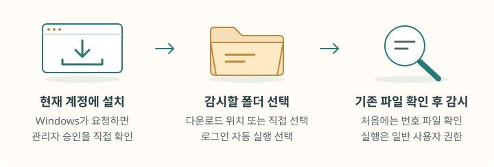
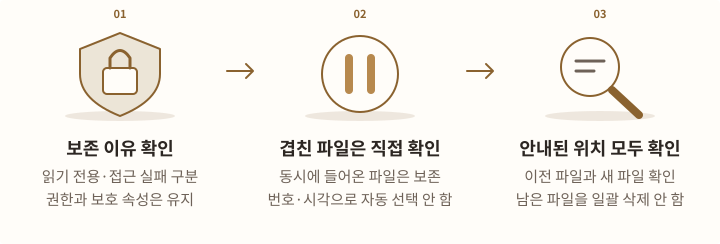
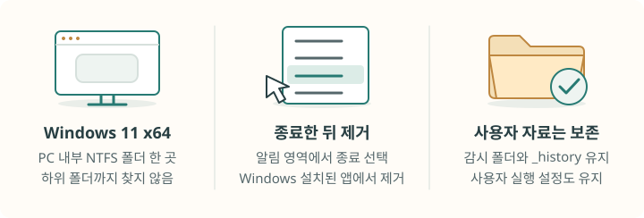
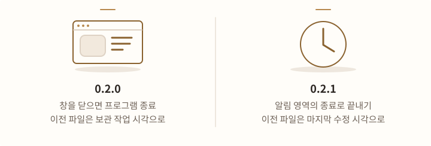

# 다시 받은 파일의 원래 이름 유지하기

DownloadVersionManager 0.2.1은 선택한 폴더의 새 파일을 감지해 원래 이름을 유지하고, 내용이 달라진 이전 파일만 `_history`에 보관하는 Windows 프로그램입니다. 브라우저 확장 설치는 필요하지 않습니다.

[0.2.1 설치 파일 받기](https://github.com/prozac0401/Workspace/releases/download/download-version-manager-v0.2.1/DownloadVersionManager-Watcher-0.2.1-x64.msi) · [0.2.1 배포 안내](https://github.com/prozac0401/Workspace/releases/tag/download-version-manager-v0.2.1) · [설치 파일이 바뀌지 않았는지 확인할 자료](https://github.com/prozac0401/Workspace/releases/download/download-version-manager-v0.2.1/SHA256SUMS.txt)

설치 파일은 `DownloadVersionManager-Watcher-0.2.1-x64.msi` 하나입니다. **제작자를 확인하는 전자 서명이 없습니다.**

## 설치와 감시 시작

<!-- tool-figure:download-manager-start:start -->
<figure class="tool-figure">
  <picture>
    <source media="(max-width: 600px)" srcset="../../assets/tool-guides/download-manager-start-mobile.svg" width="360" height="432">
    
  </picture>
  <figcaption>설명용 도해 기본 다운로드 위치를 따를지 폴더를 직접 선택할지 정합니다. 처음 사용하는 폴더의 기존 번호 파일을 확인한 뒤 감시를 시작합니다.</figcaption>
</figure>
<!-- tool-figure:download-manager-start:end -->

설치 파일 하나를 열어 지금 로그인한 Windows 계정에 설치합니다. 설치와 제거 중 Windows가 관리자 승인을 요청할 수 있으며 사용자가 직접 승인합니다. 설치 뒤 프로그램은 일반 사용자 권한으로 실행합니다. 실행에 필요한 프로그램을 따로 설치하지 않아도 됩니다.

회사 PC에서는 회사의 설치 기준을 따릅니다.

1. 설치 화면의 현재 Windows 다운로드 폴더를 확인합니다. 기본 설정은 Windows에서 다운로드 위치를 바꾸면 그 위치를 따릅니다.
2. 다른 폴더를 쓰려면 **찾아보기**로 폴더를 고릅니다. 직접 선택하면 Windows의 다운로드 위치가 바뀌어도 선택한 폴더를 계속 사용합니다.
3. **Windows 로그인 시 자동 실행**은 기본으로 켜져 있습니다. 자동 실행을 원하지 않으면 설치 화면에서 해제합니다.
4. 설치를 마치고 프로그램을 실행합니다. 처음 사용하는 폴더에 기존 번호 파일이 있으면 아래 확인 화면이 먼저 열립니다.

프로그램에서 **감시 시작**·**감시 중지**를 사용할 수 있습니다. 시작 메뉴의 **DownloadVersionManager Watcher**로 실행합니다. 창을 닫으면 알림 영역에 남으며, 프로그램을 끝내려면 아래의 **종료**를 사용합니다. 로그인 자동 실행을 선택했다면 다음 로그인에서 다시 시작합니다.

## 창을 닫고 다시 열기

<!-- tool-figure:download-manager-tray:start -->
<figure class="tool-figure">
  <picture>
    <source media="(max-width: 600px)" srcset="../../assets/tool-guides/download-manager-tray-mobile.svg" width="360" height="432">
    
  </picture>
  <figcaption>설명용 도해 0.2.1에서는 창을 닫아도 프로그램이 알림 영역에 남습니다. 감시 상태는 창에서 확인하고 완전히 끝낼 때는 종료를 사용하세요.</figcaption>
</figure>
<!-- tool-figure:download-manager-tray:end -->

감시 창의 **X** 또는 **Alt+F4**를 누르면 창이 숨겨지고 Windows 알림 영역에 아이콘이 남습니다. 알림 영역은 작업표시줄 오른쪽의 작은 아이콘이 모인 곳입니다. 감시 중이었다면 계속 감시하고, 감시를 중지했다면 중지 상태를 유지합니다.

- 창을 다시 보려면 아이콘을 더블클릭하거나 아이콘 메뉴의 **열기**를 누릅니다.
- 프로그램을 완전히 끝내려면 아이콘 메뉴의 **종료**를 누릅니다. 창의 X는 완전 종료가 아닙니다.
- 아이콘이 보이지 않으면 알림 영역의 숨겨진 아이콘도 확인합니다. 아이콘 모양만으로 감시 상태를 판단하지 말고 창을 열어 **감시 중** 또는 **감시 대기 중** 표시를 확인합니다.

0.2.1에는 전용 아이콘과 다듬은 화면, 긴 처리 기록을 볼 수 있는 가로 스크롤도 적용했습니다.

## 기존 번호 파일을 처음 정리할 때

<!-- tool-figure:download-manager-first-review:start -->
<figure class="tool-figure">
  <picture>
    <source media="(max-width: 600px)" srcset="../../assets/tool-guides/download-manager-first-review-mobile.svg" width="360" height="432">
    
  </picture>
  <figcaption>설명용 도해 처음부터 있던 번호 파일은 사용자가 남길 파일을 정합니다. 정리할 때 내용이 같은 이전 파일은 지우고 다른 내용은 보관하며, 보존을 선택하면 현재 이름을 유지합니다.</figcaption>
</figure>
<!-- tool-figure:download-manager-first-review:end -->

예를 들어 `보고서.xlsx`, `보고서 (1).xlsx`, `보고서 (2).xlsx`가 이미 있으면 목록의 이름·수정 시각·크기를 보고 최신으로 남길 파일을 직접 선택합니다. 번호나 시각만으로 최신을 정하지 않습니다.

- 번호 파일을 선택하면 전체 그룹의 처리 순서가 표시됩니다. 확인하고 **선택대로 정리**를 누릅니다. 선택 파일을 마지막에 원래 이름으로 옮깁니다.
- 원래 이름의 파일을 선택하거나 **이 그룹 보존**을 누르면 모든 파일을 현재 이름 그대로 둡니다.
- **남은 그룹 모두 보존**으로 나머지 목록을 그대로 둘 수 있습니다. 창을 닫으면 확인을 취소하고 감시를 시작하지 않습니다.

각 파일을 옮길 때 직전의 원래 파일과 새 파일의 내용을 비교합니다. 내용이 완전히 같으면 이전 파일을 지웁니다. 다르면 `_history` 폴더에 이전 파일을 보관합니다. 확인 뒤 파일이 바뀌거나 안전하게 이동할 수 없으면 남은 파일을 보존합니다. 이 확인은 폴더를 처음 사용할 때 진행합니다.

## 이후 같은 파일이 다시 들어오면

<!-- tool-figure:download-manager-new-file:start -->
<figure class="tool-figure">
  <picture>
    <source media="(max-width: 600px)" srcset="../../assets/tool-guides/download-manager-new-file-mobile.svg" width="360" height="432">
    
  </picture>
  <figcaption>설명용 도해 감시 폴더에 번호 파일이 생기면 원래 파일과 내용을 비교합니다. 보관 이름의 시각은 작업 시각이 아니라 보관하는 파일의 마지막 수정 시각입니다.</figcaption>
</figure>
<!-- tool-figure:download-manager-new-file:end -->

감시 중 `보고서 (1).xlsx`처럼 번호가 붙은 새 파일이 들어오고 같은 폴더에 `보고서.xlsx`가 있으면 두 파일을 비교합니다.

- **파일 내용이 완전히 같으면:** 방금 들어온 파일 자체가 `보고서.xlsx`가 됩니다. 이전 파일은 지우며 `_history`에 넣지 않습니다.
- **파일 내용이 다르면:** 이전 파일은 `_history/보고서_20261004_203000.xlsx`처럼 보관하고 새 파일이 `보고서.xlsx`가 됩니다.

**보관하는 파일의 마지막 수정 시각**을 이 PC의 시간 표시에 맞춰 이름에 붙입니다. 같은 이름이 이미 있으면 `_001`, `_002`를 붙여 기존 파일을 덮어쓰지 않고 확장자를 유지합니다. 이미 보관한 파일의 이름이나 파일 자체의 수정 시각은 바꾸지 않습니다. 파일 내용은 외부에 보내지 않습니다.

탐색기의 같은 이름 복사 선택 창은 Windows 기본 화면입니다. 이 프로그램은 `보고서 (1).xlsx`처럼 번호 파일이 만들어진 뒤 감지합니다. 탐색기에서 바로 덮어써 사라진 이전 내용은 나중에 보관할 수 없습니다.

3초 동안 파일 정보가 바뀌지 않고 안전하게 열 수 있을 때 처리합니다. **앱의 다운로드 완료를 직접 확인하는 방식은 아닙니다.** 쓰기를 길게 멈췄다가 재개하는 앱이나 기존 파일을 직접 덮어쓰는 방식은 보장하지 않습니다.

파일 이름 끝의 번호를 보고 같은 파일로 묶는 방식입니다. 처음부터 `보고서 (1).xlsx`라는 이름인 별개 파일도 `보고서.xlsx`가 있으면 새 버전으로 처리될 수 있습니다. 이런 이름을 별개 문서로 쓰는 폴더에는 감시를 적용하지 마세요. 원래 대상이 없으면 번호 파일을 그대로 둡니다.

## 파일을 보존했다는 안내가 나오면

<!-- tool-figure:download-manager-preserve:start -->
<figure class="tool-figure">
  <picture>
    <source media="(max-width: 600px)" srcset="../../assets/tool-guides/download-manager-preserve-mobile.svg" width="360" height="432">
    
  </picture>
  <figcaption>설명용 도해 처리 중 멈추면 이전 파일이 보관 폴더나 임시 이름에 남을 수 있습니다. 자동 복원 화면은 없으므로 안내된 두 파일의 위치를 확인하세요.</figcaption>
</figure>
<!-- tool-figure:download-manager-preserve:end -->

0.2.1은 읽기 전용 속성으로 보호된 파일을 확인하면 **읽기 전용 보호: 파일 보존**이라고 안내합니다. 다른 접근 실패는 **접근 실패: 파일 보존**으로 구분합니다. 파일의 읽기 전용 속성이나 권한을 자동으로 바꾸지 않습니다.

파일이 사용 중이거나 같은 원래 이름으로 갈 새 파일이 동시에 들어오면 파일을 그대로 두고 안내합니다. 앱을 강제로 닫지 않습니다. 동시에 들어온 파일의 번호나 수정 시각만으로 최신을 고르지 않습니다. 감시를 끝낼 때까지 해당 이름의 파일은 자동으로 정리하지 않습니다. 폴더에서 최신 파일을 직접 확인하세요.

파일을 정리하는 도중 문제가 생기면 이전 파일을 원래 위치로 돌려놓으려 합니다. 이 과정도 실패하거나 PC가 꺼지면 이전 파일이 `_history` 또는 `.dvm-…pending`이라는 임시 이름에 남을 수 있습니다. 새 파일도 번호가 붙은 이름에 남을 수 있습니다.

위 내용은 파일을 정리하다가 멈췄을 때 생길 수 있는 상황입니다. **안내에 나온 이전 파일과 새 파일의 위치를 모두 확인하세요.** 남은 파일을 한꺼번에 지우지 마세요. 자동으로 복원하는 화면은 없습니다.

## 제거와 지원 범위

<!-- tool-figure:download-manager-support:start -->
<figure class="tool-figure">
  <picture>
    <source media="(max-width: 600px)" srcset="../../assets/tool-guides/download-manager-support-mobile.svg" width="360" height="432">
    
  </picture>
  <figcaption>설명용 도해 지원하는 로컬 폴더 한 곳에 저장된 파일을 처리합니다. 제거해도 자료는 남으며, 구버전 확장과 같은 폴더에서 함께 실행하지 마세요.</figcaption>
</figure>
<!-- tool-figure:download-manager-support:end -->

알림 영역 아이콘 메뉴의 **종료**로 프로그램을 완전히 끝낸 뒤 Windows의 설치된 앱에서 **DownloadVersionManager Watcher**를 제거합니다. 감시 폴더의 파일·`_history`와 사용자 실행 설정은 보존합니다. 새 버전은 구버전 0.1.0 설치와 브라우저 등록을 자동으로 바꾸지 않습니다. 구버전 확장이 활성화돼 있으면 같은 폴더에서 함께 실행하지 마세요.

64비트 Windows 11에서 PC 내부 저장장치의 폴더 한 곳을 대상으로 합니다. Windows가 파일을 저장하는 방식은 NTFS여야 합니다. 하위 폴더까지 찾지는 않습니다. 네트워크 폴더, 온라인 저장소에 연결된 폴더, ARM64 방식의 PC와 모든 회사 보안 설정에서의 동작은 지원하지 않습니다. 브라우저나 웹 프로그램이 해당 폴더에 저장한 파일만 처리하며 모든 앱의 모든 저장 위치를 감지하지 않습니다.

브라우저 다운로드 목록에는 이름을 바꾸기 전 위치가 남을 수 있습니다. 최종 파일은 감시 폴더에서 확인하세요.

감시하는 동안 이 프로그램 한 개가 켜져 있습니다. Windows가 뒤에서 관리하는 별도 프로그램을 설치하지 않습니다. 자동으로 새 버전을 설치하거나 파일을 온라인 저장소로 보내지 않습니다. 회사 PC에서는 회사의 설치 기준을 따르세요.

## 이전 버전에서 바뀐 점

<!-- tool-figure:download-manager-versions:start -->
<figure class="tool-figure">
  <picture>
    <source media="(max-width: 600px)" srcset="../../assets/tool-guides/download-manager-versions-mobile.svg" width="360" height="288">
    
  </picture>
  <figcaption>설명용 도해 버전에 따라 창을 닫는 동작과 보관 파일 이름의 기준이 다릅니다. 0.2.1은 설치 실패 뒤 설치 정보가 남는 문제도 고쳤습니다.</figcaption>
</figure>
<!-- tool-figure:download-manager-versions:end -->

[0.2.0 배포 안내](https://github.com/prozac0401/Workspace/releases/tag/download-version-manager-v0.2.0)에서 이전 버전의 파일을 찾을 수 있습니다. 0.2.0은 창을 닫으면 프로그램을 끝내며 보관 파일 이름에는 보관 작업 시각을 사용합니다. 0.2.1은 알림 영역의 **종료**로 끝내며, 보관 파일 이름에는 파일의 마지막 수정 시각을 사용합니다. 설치 실패 뒤 설치됐다는 정보가 남는 문제의 수정도 포함합니다.
