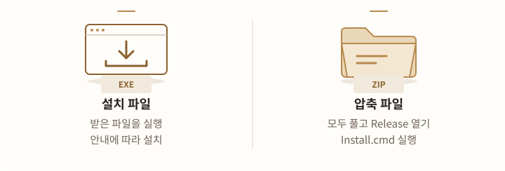
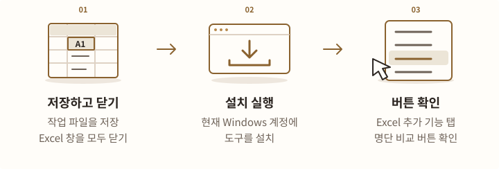
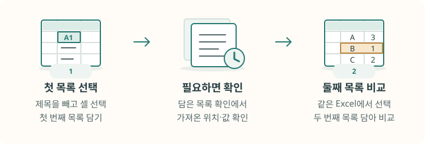
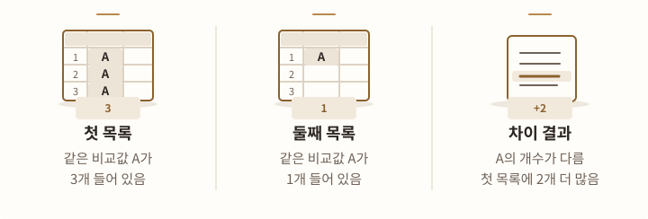
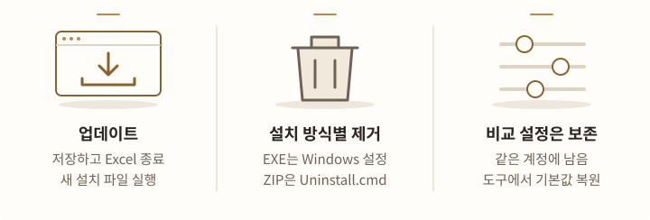

# Excel 명단 비교 설치·사용

버전 0.2.1 · 64비트 Windows에서 쓰는 PC용 Excel 프로그램입니다.

두 목록의 값과 개수를 비교합니다. 같으면 짧게 알려주고 차이가 있으면 새 Excel 파일에 표시합니다. 진행 상황과 취소 결과는 명단 비교 버튼이 모인 곳에 표시합니다. Excel 창 아래의 상태표시줄은 바꾸지 않습니다.

## 설치 파일 받기

<!-- tool-figure:excel-download:start -->
<figure class="tool-figure">
  <picture>
    <source media="(max-width: 760px)" srcset="../../assets/tool-guides/excel-download-mobile.svg" width="320" height="288">
    
  </picture>
  <figcaption>설치 파일을 실행하거나 ZIP을 모두 풀고 Release 폴더의 Install.cmd를 실행합니다.</figcaption>
</figure>
<!-- tool-figure:excel-download:end -->

[0.2.1 받기 (EXE)](https://github.com/prozac0401/Workspace/releases/download/excel-smart-list-compare-v0.2.1/ExcelSmartListCompare-0.2.1-Setup.exe){ .md-button .md-button--primary }
[ZIP으로 받기](https://github.com/prozac0401/Workspace/releases/download/excel-smart-list-compare-v0.2.1/ExcelSmartListCompare-0.2.1-win-x64.zip){ .md-button }

수정일: 2026-10-05 · [배포 내용](https://github.com/prozac0401/Workspace/releases/tag/excel-smart-list-compare-v0.2.1)

## 설치하기

<!-- tool-figure:excel-install:start -->
<figure class="tool-figure">
  <picture>
    <source media="(max-width: 760px)" srcset="../../assets/tool-guides/excel-install-mobile.svg" width="320" height="432">
    
  </picture>
  <figcaption>64비트 Windows와 설치된 데스크톱 Excel에서 사용합니다. 설치 후 추가 기능 탭이나 셀 우클릭 메뉴로 시작하세요.</figcaption>
</figure>
<!-- tool-figure:excel-install:end -->

1. 작업 중인 파일을 저장하고 Excel 창을 모두 닫습니다.
2. **ExcelSmartListCompare-0.2.1-Setup.exe**를 실행하고 **설치**를 누릅니다.
3. Excel의 **추가 기능** 탭에서 명단 비교 버튼을 확인합니다. 셀을 마우스 오른쪽 버튼으로 눌러도 사용할 수 있습니다.

ZIP은 모두 푼 뒤 `Release` 폴더의 **Install.cmd**를 실행합니다. 지금 로그인한 Windows 계정에 설치합니다. 관리자 권한이나 개발용 프로그램은 필요하지 않습니다. 설치 폴더는 Excel이 실행을 허용하는 위치로 등록합니다. 이 폴더에는 명단 비교 프로그램 파일만 보관하세요.

Mac용 Excel과 웹페이지에서 쓰는 Excel은 지원하지 않습니다.

## 두 목록 비교하기

<!-- tool-figure:excel-compare:start -->
<figure class="tool-figure">
  <picture>
    <source media="(max-width: 760px)" srcset="../../assets/tool-guides/excel-compare-mobile.svg" width="320" height="432">
    
  </picture>
  <figcaption>셀 순서와 가로·세로 방향은 달라도 됩니다. 같은 값이 각 목록에 몇 개씩 있는지를 비교합니다.</figcaption>
</figure>
<!-- tool-figure:excel-compare:end -->

1. 제목을 빼고 첫 목록의 셀을 선택한 뒤 **첫 번째 목록 담기**를 누릅니다.
2. 필요한 경우 **담은 목록 확인**으로 가져온 위치와 값의 일부를 확인합니다.
3. 같은 Excel에서 두 번째 목록을 선택하고 **두 번째 목록 담아 비교**를 누릅니다.

순서와 가로·세로 방향은 상관없습니다. 같은 값이 양쪽에 두 번씩 있으면 같고, 한쪽에 두 번·다른 쪽에 한 번 있으면 개수가 다릅니다. Ctrl 키를 누른 채 떨어진 셀 범위를 여러 개 선택해도 목록 하나로 비교합니다.

## 차이 결과 읽기

<!-- tool-figure:excel-results:start -->
<figure class="tool-figure">
  <picture>
    <source media="(max-width: 760px)" srcset="../../assets/tool-guides/excel-results-mobile.svg" width="320" height="432">
    
  </picture>
  <figcaption>차이 결과는 값별 개수 차이를 보여줍니다. 원본 값과 셀 위치는 예시 하나이며, 그 셀이 잘못됐다는 뜻은 아닙니다.</figcaption>
</figure>
<!-- tool-figure:excel-results:end -->

**명단비교_결과** 시트에는 값이나 개수가 다른 항목만 나옵니다. 위쪽에서 두 목록의 출처·시각·비교 개수·제외 개수·설정을 확인하세요. 8행은 열 제목이고 9행부터 차이가 표시됩니다.

- **차이**: 첫 목록에만 있음, 둘째 목록에만 있음, 개수가 다름 중 하나입니다.
- **비교한 값**: 메일 주소나 대소문자 설정 등을 적용해 비교한 값입니다.
- **첫/둘째 목록 원본 값 (예)**: 각 목록에서 처음 발견한 셀의 값입니다.
- **첫/둘째 목록 개수**: 해당 값이 각 목록에 몇 개 있는지 보여줍니다.

추가 개수와 원본 셀 위치는 G:J열에 보관합니다. 필요하면 **F~K열 머리글 선택 → 우클릭 → 숨기기 취소**로 펼치세요. ‘더 많은 개수’는 두 목록의 개수 차이입니다. 예를 들어 첫 목록 3개·둘째 목록 1개이면 첫 목록이 2개 더 많습니다. 원본 값과 셀 위치는 예시 하나이며, 그 셀이 잘못됐다는 뜻은 아닙니다.

결과 파일은 원하는 위치에 직접 저장하세요. 원본과 이전 결과는 바뀌지 않습니다. 기본 설정에서는 비교가 끝나면 기억한 첫 목록을 비웁니다. 실패하거나 진행 확인에서 취소하면 유지합니다.

## 담은 목록 확인하기

<!-- tool-figure:excel-snapshot:start -->
<figure class="tool-figure">
  <picture>
    <source media="(max-width: 760px)" srcset="../../assets/tool-guides/excel-snapshot-mobile.svg" width="320" height="432">
    
  </picture>
  <figcaption>담은 목록 확인은 현재 선택을 다시 읽지 않습니다. 화면에 일부 위치만 표시해도 비교할 때는 전체 개수를 셉니다.</figcaption>
</figure>
<!-- tool-figure:excel-snapshot:end -->

**담은 목록 확인**은 **이미 담아 둔 첫 번째 목록**을 보여줍니다. 지금 선택한 셀을 새로 읽는 기능은 아닙니다.

**요약**에서 출처·담은 시각·전체 개수·제외 개수·설정을 확인하고, **값과 위치**에서 값의 일부와 원본 셀 위치를 확인하세요. 위치는 최대 1,200개·같은 비교값당 5개, 오류 위치는 최대 200개를 표시합니다. 표시하지 않은 개수도 안내합니다. 비교할 때는 표시 한도와 관계없이 전체 개수를 셉니다.

원본을 수정해도 담은 값은 자동으로 바뀌지 않습니다. 수정한 범위를 선택하고 **첫 번째 목록 바꾸기**를 누르세요. **첫 번째 목록 비우기**는 기억한 목록만 지웁니다. Excel을 완전히 종료해도 기억한 목록은 사라집니다.

## 비교 설정 바꾸기

<!-- tool-figure:excel-settings:start -->
<figure class="tool-figure">
  <picture>
    <source media="(max-width: 760px)" srcset="../../assets/tool-guides/excel-settings-mobile.svg" width="320" height="432">
    
  </picture>
  <figcaption>처음에는 세 설정 모두 꺼져 있습니다. 메일·대소문자 기준을 바꾸려면 첫 목록을 비운 뒤 설정하고 다시 담으세요.</figcaption>
</figure>
<!-- tool-figure:excel-settings:end -->

**추가 기능 탭 → 비교 설정** 또는 **셀 우클릭 → 명단 비교 → 비교 설정**을 엽니다. 체크하면 켜집니다. 처음에는 세 항목 모두 꺼져 있습니다.

| 설정 | 체크했을 때 |
|---|---|
| 메일 전체 주소 비교 (@ 뒤 포함) | `@` 뒤까지 비교합니다. 꺼져 있으면 앞부분만 비교합니다. |
| 대소문자 무시 | `ABC`와 `abc`를 같게 봅니다. 꺼져 있으면 구분합니다. |
| 비교 후 첫 목록 유지 | 첫 목록을 남겨 다른 목록과 이어서 비교합니다. |

첫 목록을 담은 동안에는 메일·대소문자 설정을 바꿀 수 없습니다. 먼저 목록을 비운 뒤 바꾸고 다시 담으세요. 작업 중에는 모든 설정이 잠깁니다.

마지막 설정은 다음 실행에도 기억합니다. **기본값으로 되돌리기**는 세 항목을 모두 끕니다. 먼저 첫 목록을 비워야 합니다.

## 비교할 때 알아둘 점

<!-- tool-figure:excel-limits:start -->
<figure class="tool-figure">
  <picture>
    <source media="(max-width: 760px)" srcset="../../assets/tool-guides/excel-limits-mobile.svg" width="320" height="432">
    
  </picture>
  <figcaption>두 목록을 같은 행 수로 나누면 잘못된 차이가 생길 수 있습니다. 입력 상한 이내라도 시간 제한으로 중단될 수 있습니다.</figcaption>
</figure>
<!-- tool-figure:excel-limits:end -->

- 숨긴 셀·필터로 가려진 셀·빈칸·오류·표 제목과 합계는 뺍니다. 일반 범위의 제목은 직접 빼고 선택하세요. 오류를 제외하고 같으면 제외 개수를 함께 알립니다.
- 숫자 `123`과 문자 `123.0`·`1.23e2`는 같습니다. 문자 `00123`은 다르게 봅니다. 합쳐진 칸은 비교할 수 없으며 계산 중이면 끝날 때까지 기다리세요.
- 한 목록은 보이는 선택 셀 **100,000개**, 한 셀 **4,096자**, 선택한 셀의 글자 수 합계 **5,000,000자**까지입니다. 입력 한도까지 항상 완료된다는 뜻은 아닙니다. 값 길이·서로 다른 값의 수·PC 부하에 따라 시간 제한으로 중단될 수 있습니다.
- **작업 취소**나 작업 중인 Excel 창의 Esc로 취소를 요청하고 도구 모음의 **취소 완료**를 확인하세요. 두 목록을 같은 행 수로 나누면 잘못된 차이가 생길 수 있습니다. 나누려면 같은 비교값이 양쪽에서 같은 묶음에 들어가야 합니다.
- 따로 실행된 Excel끼리는 담은 목록을 공유하지 않습니다. 이 도구를 사용하면 Excel의 기존 실행 취소 기록이 사라질 수 있습니다. 명단을 외부 서비스로 보내지 않지만, 결과 파일을 공유할 때는 담긴 원본 값을 확인하세요.

## 업데이트·제거하기

<!-- tool-figure:excel-maintenance:start -->
<figure class="tool-figure">
  <picture>
    <source media="(max-width: 760px)" srcset="../../assets/tool-guides/excel-maintenance-mobile.svg" width="320" height="432">
    
  </picture>
  <figcaption>업데이트·제거 전에는 파일을 저장하고 Excel을 닫으세요. 비교 설정을 초기화하려면 설치된 도구의 기본값으로 되돌리기를 사용합니다.</figcaption>
</figure>
<!-- tool-figure:excel-maintenance:end -->

파일을 저장하고 Excel을 닫은 뒤 새 설치 파일을 실행합니다. EXE로 설치했다면 **Windows 설정 → 앱 → 설치된 앱 → Excel 명단 비교 → 제거**, ZIP으로 설치했다면 **Uninstall.cmd**로 제거합니다.

비교 설정은 업데이트·제거 후에도 같은 계정에 남습니다. 초기화하려면 설치된 도구의 **비교 설정 → 기본값으로 되돌리기**를 사용하세요. 설치 오류를 문의할 때는 프로그램·Excel 버전과 실행 순서, 오류 문구를 적어 주세요.

[0.2.1 배포 파일](https://github.com/prozac0401/Workspace/releases/tag/excel-smart-list-compare-v0.2.1)
