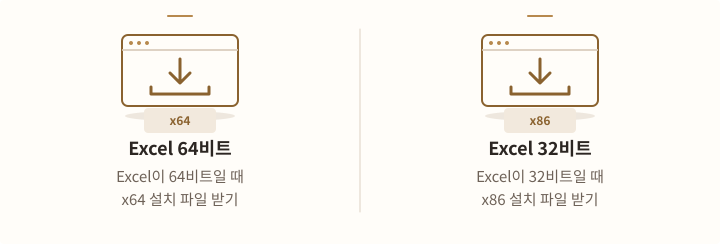
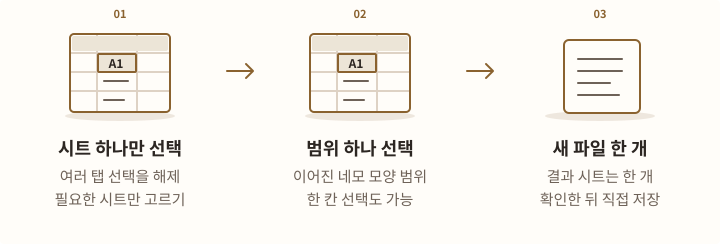
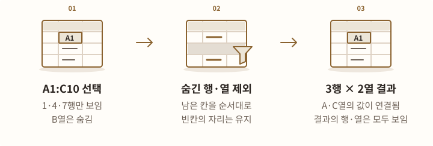
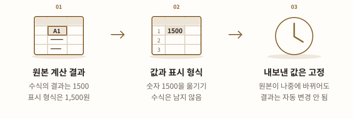

# 선택범위 내보내기 설치·사용

**선택범위 내보내기 0.1.0-rc.11** · 2026-10-03

Excel에서 선택한 범위의 **숨기지 않은 행과 열만 새 Excel 파일**로 만듭니다. 결과는 아직 저장하지 않은 상태로 열립니다. 필터와 숨김을 반영하고, 남은 칸의 순서·빈칸·기본 모양을 유지합니다. 수식은 현재 계산 결과로 내보냅니다. 명단 비교와 설치·메뉴·제거 항목이 별도인 제품입니다.

한 번 설치하면 Excel을 평소처럼 시작할 때 메뉴가 준비됩니다. 자동으로 준비하는 것은 메뉴뿐입니다. **사용자가 메뉴를 눌렀을 때만** 내보냅니다.

[자주 묻는 질문 바로 보기](#faq) · [선택한 범위를 내보내는 순서](#export)

## 사용 전에 확인하세요 {#limits-before-download}

<!-- tool-figure:selection-export-before-download:start -->
<figure class="tool-figure">
  <picture>
    <source media="(max-width: 600px)" srcset="../../assets/tool-guides/selection-export-before-download-mobile.svg" width="360" height="432">
    
  </picture>
  <figcaption>설명용 도해 처리할 수 없는 모양이 있으면 원본의 행·열을 알려 줍니다. 해당 칸을 자동으로 빼거나 원본을 고치지 않습니다.</figcaption>
</figure>
<!-- tool-figure:selection-export-before-download:end -->

처리할 수 없는 서식이 있으면 **원본의 몇 행·몇 열인지** 알려 줍니다.

- **선택할 범위:** 한 시트에서 이어진 네모 모양 범위 하나만 고르세요. 보이는 행·열의 현재 값을 새 파일로 만듭니다. 결과는 직접 저장합니다.
- **처리할 수 없는 서식:** 한 칸 안에 여러 글꼴이나 위·아래 작은 글자가 섞이거나, 배경색이 차츰 바뀌면 중단합니다. 처음 발견한 칸의 원본 행·열을 알려 줍니다. 그 칸을 자동으로 빼거나 원본을 고치지 않습니다.
- **설치와 원본 보호:** 제작자를 확인하는 전자 서명이 없습니다. 회사가 허용한 설치 절차를 따르세요. 중요한 편집은 먼저 저장합니다.

예를 들어 “원본 27행 5열”은 원본의 E27입니다. 숨긴 행·열을 제외하고 만든 결과의 위치가 아닙니다. 한글을 입력할 때 Excel이 글꼴을 자동으로 바꾸어 한 칸 안에 다른 글꼴이 섞일 수도 있습니다. [모양·선택 범위와 처리 한도](#supported-range)를 더 읽어 보세요.

## 설치 파일 받기 {#download}

<!-- tool-figure:selection-export-download:start -->
<figure class="tool-figure">
  <picture>
    <source media="(max-width: 600px)" srcset="../../assets/tool-guides/selection-export-download-mobile.svg" width="360" height="288">
    
  </picture>
  <figcaption>설명용 도해 Excel의 파일 → 계정 → Excel 정보에서 비트수를 확인하세요. Excel 비트수에 맞는 설치 파일을 고릅니다.</figcaption>
</figure>
<!-- tool-figure:selection-export-download:end -->

Windows 11의 PC용 Excel 프로그램입니다. 실행에 필요한 **.NET Framework 4.8 이상**을 사용합니다. Mac·브라우저용 Excel은 지원하지 않습니다.

Excel의 **파일 → 계정 → Excel 정보**에서 비트수를 확인한 뒤 해당 설치 파일을 받으세요. Windows 비트수 대신 **Excel 비트수**를 기준으로 고릅니다.

[0.1.0-rc.11 · Excel 64비트용 받기 (EXE)](https://github.com/prozac0401/Workspace/releases/download/excel-selection-export-v0.1.0-rc.11/ExcelSelectionExport-0.1.0-rc.11-x64-Setup.exe){ .md-button .md-button--primary }
[0.1.0-rc.11 · Excel 32비트용 받기 (EXE)](https://github.com/prozac0401/Workspace/releases/download/excel-selection-export-v0.1.0-rc.11/ExcelSelectionExport-0.1.0-rc.11-x86-Setup.exe){ .md-button }

[0.1.0-rc.11 배포 내용](https://github.com/prozac0401/Workspace/releases/tag/excel-selection-export-v0.1.0-rc.11)

## 한 번 설치하고 메뉴 사용하기 {#install}

<!-- tool-figure:selection-export-install:start -->
<figure class="tool-figure">
  <picture>
    <source media="(max-width: 600px)" srcset="../../assets/tool-guides/selection-export-install-mobile.svg" width="360" height="432">
    
  </picture>
  <figcaption>설명용 도해 한 번 설치하면 Excel 시작 시 메뉴가 준비됩니다. 내보내기는 선택범위 내보내기 → 새 Excel로를 눌렀을 때만 실행합니다.</figcaption>
</figure>
<!-- tool-figure:selection-export-install:end -->

1. 필요한 작업을 저장하고 Excel 창을 모두 닫습니다.
2. Excel 비트수에 맞는 **ExcelSelectionExport-0.1.0-rc.11-x64-Setup.exe** 또는 **ExcelSelectionExport-0.1.0-rc.11-x86-Setup.exe**를 실행합니다.
3. 설치를 마친 뒤 Excel을 평소처럼 엽니다.
4. 칸에서 마우스 오른쪽 버튼을 눌러 **선택범위 내보내기 → 새 Excel로** 메뉴를 확인합니다.

지금 로그인한 Windows 계정에 설치합니다. 관리자 권한이나 개발용 프로그램은 필요하지 않습니다. 이후 Excel을 시작할 때 메뉴가 자동으로 준비됩니다. **명령을 직접 써 넣거나 따로 실행할 필요가 없습니다. Alt+F8·Alt+F11을 누르거나 추가 기능을 따로 찾아 켜지 않아도 됩니다.**

회사 정책이 설치나 추가 기능 실행을 막으면 회사의 승인된 설치 절차를 따르세요. 설치 프로그램은 회사 정책이나 Excel 보안 설정을 낮추지 않습니다. Office가 문제 때문에 꺼 둔 추가 기능을 강제로 켜지 않습니다.

## 선택한 범위를 새 Excel로 만들기 {#export}

<!-- tool-figure:selection-export-export:start -->
<figure class="tool-figure">
  <picture>
    <source media="(max-width: 600px)" srcset="../../assets/tool-guides/selection-export-export-mobile.svg" width="360" height="432">
    
  </picture>
  <figcaption>설명용 도해 남은 셀의 순서와 빈칸을 유지하고 수식은 현재 계산 결과로 옮깁니다. 결과를 보관하려면 Excel에서 직접 저장하세요.</figcaption>
</figure>
<!-- tool-figure:selection-export-export:end -->

1. 한 시트에서 필요한 **이어진 네모 모양 범위 하나**를 선택합니다. 제목이나 합계가 필요하면 함께 선택하세요.
2. 선택한 칸 안에서 마우스 오른쪽 버튼을 누릅니다.
3. **선택범위 내보내기 → 새 Excel로**를 누릅니다.
4. 자동으로 열린 새 Excel 파일을 확인합니다.
5. 보관하려면 Excel의 **저장**을 사용해 위치와 파일 이름을 정합니다.

한 칸과 가로·세로 목록도 선택할 수 있습니다. 결과는 지금 사용하는 Excel에 **아직 저장하지 않은 새 파일**로 열립니다. 그 안에는 시트 한 개가 있습니다. 최종 결과의 저장 위치는 사용자가 정하며 원본 파일은 자동 저장하지 않습니다.

처리하는 동안 별도의 작업용 Excel을 사용합니다. Windows의 임시 폴더 안에 이 도구만 쓰는 Excel 파일도 만듭니다. 정상 완료와 취소 시에는 정리하도록 만들었지만, 강제 종료하면 중간 파일이 남을 수 있습니다. 이 파일은 사용자가 저장한 최종 결과가 아닙니다.

필터와 수동 숨김으로 가려진 행·열은 제외하고 나머지를 원래 순서대로 연결합니다. 포함된 빈칸·빈 행·빈 열은 유지하며, 제목을 추정하거나 내용을 정렬하지 않습니다. 화면 밖으로 스크롤된 칸은 숨긴 칸이 아니므로 포함됩니다.

수식은 Excel이 보유한 계산 결과로 바뀝니다. 수식을 다시 계산하거나 다른 파일이나 사이트에서 값을 새로 가져오도록 강제로 요청하지 않습니다. 필요할 때만 직접 계산하도록 한 설정에서는 아직 재계산하지 않은 이전 결과가 나올 수 있으므로 결과가 최신인지 확인하세요. 다른 시트·자동 작업 명령·다른 파일이나 사이트로 이어지는 연결·칸이나 범위에 붙인 이름·메모·댓글·누르면 다른 곳으로 이어지는 링크·넣을 수 있는 값을 제한하는 규칙은 가져오지 않습니다.

## 자주 묻는 질문 {#faq}

<!-- tool-figure:selection-export-faq:start -->
<figure class="tool-figure">
  <picture>
    <source media="(max-width: 600px)" srcset="../../assets/tool-guides/selection-export-faq-mobile.svg" width="360" height="432">
    
  </picture>
  <figcaption>설명용 도해 선택 범위, 내보내는 내용, 저장 방법을 아래 질문에서 확인하세요.</figcaption>
</figure>
<!-- tool-figure:selection-export-faq:end -->

아래 답변은 **0.1.0-rc.11** 기준입니다. [사용 전 안내](#limits-before-download)와 [모양·선택 범위와 처리 한도](#supported-range)도 함께 보세요.

### 여러 시트 탭을 선택해도 새 파일로 만들어 주나요? {#faq-tabs}

<!-- tool-figure:selection-export-faq-tabs:start -->
<figure class="tool-figure">
  <picture>
    <source media="(max-width: 600px)" srcset="../../assets/tool-guides/selection-export-faq-tabs-mobile.svg" width="360" height="432">
    
  </picture>
  <figcaption>설명용 도해 이 도구는 한 시트의 선택 범위를 새 시트 하나로 만듭니다. 여러 시트 탭을 함께 선택하면 중단합니다.</figcaption>
</figure>
<!-- tool-figure:selection-export-faq-tabs:end -->

현재는 **한 시트에서 선택한 이어진 네모 모양 범위 하나**만 지원합니다. 여러 탭을 함께 선택하면 “시트를 하나만 선택한 뒤 내보내 주세요.”라는 안내와 함께 중단합니다. 결과에도 시트 한 개만 만들어집니다.

### 시트 탭 자체를 별도 파일로 저장하는 기능은 Excel에도 있나요? {#faq-excel-copy}

<!-- tool-figure:selection-export-faq-excel-copy:start -->
<figure class="tool-figure">
  <picture>
    <source media="(max-width: 600px)" srcset="../../assets/tool-guides/selection-export-faq-excel-copy-mobile.svg" width="360" height="432">
    
  </picture>
  <figcaption>설명용 도해 Excel 기본 이동/복사는 시트 전체를 복사합니다. 원본을 남기려면 복사본 만들기를 체크하세요.</figcaption>
</figure>
<!-- tool-figure:selection-export-faq-excel-copy:end -->

네. PC에 설치한 Windows용 Excel의 기본 **이동/복사** 기능을 사용할 수 있습니다.

1. 복사할 탭을 선택합니다. 여러 탭은 **Ctrl을 누른 채 클릭**합니다.
2. 선택한 탭에서 마우스 오른쪽 버튼을 누르고 **이동/복사**를 누릅니다.
3. 옮길 파일을 고르는 칸에서 **(새 통합 문서)**를 고릅니다.
4. 원본 시트를 유지하도록 **복사본 만들기**를 체크한 뒤 확인합니다. 체크하지 않으면 원본에서 시트가 이동합니다.
5. 열린 새 Excel 파일을 확인하고 저장합니다.

여러 탭을 고르면 **하나의 새 파일 안에 여러 시트**로 들어갑니다. 탭마다 각각 다른 파일이 필요하면 한 탭씩 이 작업을 반복하세요. [Microsoft의 시트 별도 저장 안내](https://support.microsoft.com/en-us/excel/save-a-worksheet)

Excel 기본 기능은 수식과 숨긴 행·열을 포함한 **시트 전체**를 복사합니다. 선택범위 내보내기는 **지정한 범위의 보이는 행·열과 현재 값, 지원하는 기본 모양**을 새 시트 하나로 만듭니다.

### 필터를 걸거나 행·열을 숨긴 상태에서도 내보낼 수 있나요? {#faq-visible}

<!-- tool-figure:selection-export-faq-visible:start -->
<figure class="tool-figure">
  <picture>
    <source media="(max-width: 600px)" srcset="../../assets/tool-guides/selection-export-faq-visible-mobile.svg" width="360" height="432">
    
  </picture>
  <figcaption>설명용 도해 선택한 범위에서 숨긴 행·열을 빼고 남은 칸을 원래 순서대로 이어 붙입니다.</figcaption>
</figure>
<!-- tool-figure:selection-export-faq-visible:end -->

네. 필터로 제외된 행과 수동으로 숨긴 행·열을 빼고, 남은 칸을 원래 순서대로 이어 붙입니다. 예를 들어 선택한 A1:C10에서 1·4·7행만 보이고 B열을 숨겼다면 결과는 **3행 × 2열**이 됩니다. 숨김으로 빠진 자리는 이어 붙이지만, 남은 칸 안의 빈칸은 유지됩니다.

원본의 필터 조건이나 숨김 설정을 결과에 복사하지는 않습니다. 결과에는 내보낸 행·열이 모두 보입니다. 필요한 제목·합계도 직접 선택 범위에 포함하세요.

### 화면 밖으로 스크롤된 칸은 제외되나요? {#faq-scroll}

<!-- tool-figure:selection-export-faq-scroll:start -->
<figure class="tool-figure">
  <picture>
    <source media="(max-width: 600px)" srcset="../../assets/tool-guides/selection-export-faq-scroll-mobile.svg" width="360" height="288">
    
  </picture>
  <figcaption>설명용 도해 보이는 칸은 필터나 행·열 숨김으로 가려지지 않은 칸입니다. 화면 밖으로 스크롤되었다는 이유로 빠지지 않습니다.</figcaption>
</figure>
<!-- tool-figure:selection-export-faq-scroll:end -->

아닙니다. 여기서 ‘보이는 칸’은 **필터나 행·열 숨김으로 가려지지 않은 칸**을 뜻합니다. 선택 범위에 포함돼 있다면 스크롤 때문에 화면 밖에 있는 칸도 내보냅니다. 현재 화면에 보이는 부분만 필요하면 그 칸들로 선택 범위를 줄이세요.

### 수식은 값으로 복사하나요? 수식을 유지하는 옵션도 있나요? {#faq-values}

<!-- tool-figure:selection-export-faq-values:start -->
<figure class="tool-figure">
  <picture>
    <source media="(max-width: 600px)" srcset="../../assets/tool-guides/selection-export-faq-values-mobile.svg" width="360" height="432">
    
  </picture>
  <figcaption>설명용 도해 수식은 현재 계산 결과 값으로 내보냅니다. 최신 값이 필요하면 원본의 계산이 끝났는지 먼저 확인하세요.</figcaption>
</figure>
<!-- tool-figure:selection-export-faq-values:end -->

**항상 현재 계산 결과 값으로 내보냅니다. 수식 유지 옵션은 없습니다.** 숫자·날짜·백분율 등의 표시 형식과 칸의 기본 모양은 유지합니다.

예를 들어 **수식의 숫자 결과 1500이 표시 형식 때문에 `1,500원`으로 보인다면**, 결과에는 숫자 1500과 해당 표시 형식이 들어갑니다. `TEXT` 함수나 문자 결합으로 만든 `1,500원`은 글자로 유지합니다. 수식은 남지 않으므로 원본의 값이 나중에 바뀌어도 내보낸 결과는 자동으로 바뀌지 않습니다.

수식을 다시 계산하거나 다른 파일이나 사이트에서 값을 새로 가져오도록 강제로 요청하지 않습니다. **필요할 때만 직접 계산하도록 한 설정에서는 이전 계산 결과가 나올 수 있으므로**, 최신 값이 필요하면 원본에서 계산이 완료된 상태인지 확인한 뒤 내보내세요.

### 원본과 똑같은 모양으로 나오나요? {#faq-format}

<!-- tool-figure:selection-export-faq-format:start -->
<figure class="tool-figure">
  <picture>
    <source media="(max-width: 600px)" srcset="../../assets/tool-guides/selection-export-faq-format-mobile.svg" width="360" height="432">
    
  </picture>
  <figcaption>설명용 도해 지원하는 기본 모양을 옮깁니다. 그림·그래프는 대상이 아니며 처리할 수 없는 모양은 원본 행·열과 함께 알립니다.</figcaption>
</figure>
<!-- tool-figure:selection-export-faq-format:end -->

글꼴·크기·색·배경·테두리·정렬·줄바꿈·숫자 표시 형식·행 높이·열 너비 같은 **기본 모양이 보존 대상**입니다. 화면을 그림처럼 완전히 복제하는 기능은 아닙니다.

조건에 따라 글자색·배경색 등을 바꾸는 설정은 현재 보이는 글자색·배경색 등의 효과를 고정된 모양으로 옮기며, 그 조건과 규칙은 가져오지 않습니다. 상태를 나타내는 작은 그림·값을 막대 길이로 표시한 부분은 제외 안내 후 진행할 수 있습니다. 도형·그래프·그림·칸 안의 작은 그래프도 내보내는 대상이 아닙니다.

**칸 전체에 같은 상태로 적용된 위·아래 작은 글자는 지원합니다.** 칸 안에서 글꼴이나 위·아래 작은 글자의 모양이 섞인 경우와 색이 차츰 바뀌는 배경은 지원하지 않아 중단하며, 처음 발견한 칸의 원본 행·열 번호를 함께 안내합니다. Excel이 한글 글꼴을 자동으로 바꾸는 기능 때문에 서로 다른 글꼴이 섞인 것으로 확인되는 경우도 있습니다.

### 떨어진 칸들을 Ctrl로 고르거나 전체 행·열을 선택해도 되나요? {#faq-selection}

<!-- tool-figure:selection-export-faq-selection:start -->
<figure class="tool-figure">
  <picture>
    <source media="(max-width: 600px)" srcset="../../assets/tool-guides/selection-export-faq-selection-mobile.svg" width="360" height="288">
    
  </picture>
  <figcaption>설명용 도해 필요한 칸만 이어진 네모 모양으로 선택하세요. 숨기지 않은 칸을 따로 골라 둘 필요는 없습니다.</figcaption>
</figure>
<!-- tool-figure:selection-export-faq-selection:end -->

한 칸이나 이어진 네모 모양 범위는 가능합니다. **Ctrl로 고른 떨어진 여러 범위, 전체 행·열·시트 선택은 지원하지 않습니다.** 필요한 칸 범위를 한정해 선택하세요.

필터나 숨김이 적용돼 있어도 필요한 이어진 네모 모양 범위를 그대로 선택하면 됩니다. 도구가 숨긴 행·열을 판별하므로 숨기지 않은 칸만 따로 골라 둘 필요는 없습니다.

### 빈칸·제목·합계·합쳐진 칸은 어떻게 되나요? {#faq-layout}

<!-- tool-figure:selection-export-faq-layout:start -->
<figure class="tool-figure">
  <picture>
    <source media="(max-width: 600px)" srcset="../../assets/tool-guides/selection-export-faq-layout-mobile.svg" width="360" height="432">
    
  </picture>
  <figcaption>설명용 도해 제목과 합계를 자동으로 추가하지 않습니다. 합쳐진 칸이 일부만 포함되거나 숨김으로 잘리면 중단합니다.</figcaption>
</figure>
<!-- tool-figure:selection-export-faq-layout:end -->

선택 범위에 포함되고 숨기지 않은 빈칸·빈 행·빈 열은 유지합니다. 제목과 합계는 사용자가 포함한 경우에만 가져오며 자동으로 추가하거나 정렬하지 않습니다.

합쳐진 칸은 **합쳐진 칸의 전체 범위가 선택되고 그 행·열이 모두 보일 때** 다시 합칩니다. 일부만 포함하거나 숨김 때문에 잘리면 중단합니다. 필요한 합쳐진 칸의 전체 범위가 들어가도록 선택 범위를 확인하세요.

### 결과 파일은 어디에 저장되나요? 원본 파일을 덮어쓰나요? {#faq-save}

<!-- tool-figure:selection-export-faq-save:start -->
<figure class="tool-figure">
  <picture>
    <source media="(max-width: 600px)" srcset="../../assets/tool-guides/selection-export-faq-save-mobile.svg" width="360" height="432">
    
  </picture>
  <figcaption>설명용 도해 새 파일의 저장 위치와 이름은 사용자가 정합니다. 보관하지 않을 결과는 저장하지 않고 닫을 수 있습니다.</figcaption>
</figure>
<!-- tool-figure:selection-export-faq-save:end -->

메뉴를 누르면 지금 사용하는 Excel에 **아직 저장하지 않은 새 파일**이 열립니다. 저장 위치를 자동으로 정하거나 원본 파일을 덮어쓰지 않습니다.

결과를 확인한 뒤 **Ctrl+S 또는 파일 → 저장**에서 원하는 위치와 이름으로 저장하세요. 보관하지 않을 결과라면 저장하지 않고 닫으면 됩니다.

### 원본의 수식이나 필터가 바뀌나요? {#faq-original}

<!-- tool-figure:selection-export-faq-original:start -->
<figure class="tool-figure">
  <picture>
    <source media="(max-width: 600px)" srcset="../../assets/tool-guides/selection-export-faq-original-mobile.svg" width="360" height="288">
    
  </picture>
  <figcaption>설명용 도해 원본을 자동 저장하거나 바꾸지 않도록 만들었습니다. 중요한 편집은 먼저 저장하고 결과를 확인하세요.</figcaption>
</figure>
<!-- tool-figure:selection-export-faq-original:end -->

원본의 값·수식·기본 모양·필터·숨김 상태를 바꾸거나 원본을 자동 저장하지 않도록 만들었습니다.

내보낸 결과의 값은 원본을 되돌려도 바뀌지 않습니다. 중요한 편집은 먼저 저장해 두세요.

### 큰 범위는 어디까지 처리하나요? 중간에 취소할 수 있나요? {#faq-limits}

<!-- tool-figure:selection-export-faq-limits:start -->
<figure class="tool-figure">
  <picture>
    <source media="(max-width: 600px)" srcset="../../assets/tool-guides/selection-export-faq-limits-mobile.svg" width="360" height="432">
    
  </picture>
  <figcaption>설명용 도해 보이는 칸이 20,000개를 넘으면 시작 전에 확인합니다. 취소 뒤에는 이번 작업의 미완성 결과를 정리할 때까지 기다리세요.</figcaption>
</figure>
<!-- tool-figure:selection-export-faq-limits:end -->

입력은 숨긴 칸을 포함해 **1,000,000칸**, 결과는 보이는 칸 **100,000칸**, 선택한 칸의 글자 수 합계는 **10,000,000자**까지입니다. 숨긴 칸이 많아 결과가 작더라도 입력 한도를 넘으면 중단합니다. 한도를 넘는 자료를 조용히 잘라내지 않으므로 범위를 나누어 실행하세요.

보이는 칸이 20,000개를 넘으면 시작 전에 확인합니다. 오래 걸리는 작업은 진행 창의 **취소**를 누른 뒤 종료될 때까지 기다리세요. 이번 작업에서 만든 미완성 결과만 정리하도록 만들었습니다.

### Excel을 열 때마다 따로 실행하거나 켜야 하나요? {#faq-startup}

<!-- tool-figure:selection-export-faq-startup:start -->
<figure class="tool-figure">
  <picture>
    <source media="(max-width: 600px)" srcset="../../assets/tool-guides/selection-export-faq-startup-mobile.svg" width="360" height="432">
    
  </picture>
  <figcaption>설명용 도해 Excel 시작 시 메뉴가 준비됩니다. 실제 내보내기는 사용자가 메뉴를 눌렀을 때만 실행합니다.</figcaption>
</figure>
<!-- tool-figure:selection-export-faq-startup:end -->

아니요. 한 번 설치하면 Excel 시작 시 메뉴가 자동으로 준비됩니다. **내보내기는 사용자가 메뉴를 눌렀을 때만** 실행합니다. Alt+F8·Alt+F11을 누르거나 명령을 써 넣어 따로 실행하거나 추가 기능을 직접 켤 필요가 없습니다.

설치 파일은 Windows가 아닌 **Excel의 32/64비트**에 맞춰 고르세요. 메뉴가 없거나 회사 정책에 의해 차단된 경우에는 [설치 안내](#install)와 [문제 해결](#troubleshooting)을 확인하세요. 보안 설정을 낮추는 방식으로 해결하지 않습니다.

## 모양·선택 범위와 처리 한도 {#supported-range}

<!-- tool-figure:selection-export-supported-range:start -->
<figure class="tool-figure">
  <picture>
    <source media="(max-width: 600px)" srcset="../../assets/tool-guides/selection-export-supported-range-mobile.svg" width="360" height="432">
    
  </picture>
  <figcaption>설명용 도해 선택 범위와 결과 범위의 한도를 따로 확인하세요. 처리할 수 없는 모양이나 범위가 있으면 안내 후 중단합니다.</figcaption>
</figure>
<!-- tool-figure:selection-export-supported-range:end -->

| 항목 | 처리 방식 |
|---|---|
| 값과 기본 모양 | 글자 값의 앞자리 0, 숫자·날짜 기준·표시 형식, 글꼴·색·배경·테두리·정렬·줄바꿈·행 높이·열 너비를 유지하도록 만들었습니다. |
| 위·아래 작은 글자 | 칸 전체에 같은 상태로 적용된 위·아래 작은 글자는 유지합니다. 칸 안에서 상태가 섞이면 중단합니다. |
| 조건에 따라 모양 바꾸기 | 현재 보이는 글자색·배경색 등의 효과를 고정된 모양으로 옮기고 규칙은 옮기지 않습니다. 값을 막대 길이로 표시한 부분·상태를 나타내는 작은 그림은 제외 안내를 확인한 뒤 진행할 수 있습니다. |
| 합쳐진 칸 | 합쳐진 칸의 전체 범위가 선택되어 있고 해당 행·열이 모두 보일 때 다시 합칩니다. 일부만 포함되거나 숨김으로 잘리면 중단합니다. |
| 선택할 수 없는 대상 | Ctrl로 떨어진 여러 범위, 전체 행·열·시트, 여러 시트 동시 선택, 그래프·그 밖의 그림이나 도형, 보호된 보기입니다. 필요한 칸 범위 하나를 선택하세요. |
| 입력 범위 | 숨긴 칸을 포함해 **1,000,000칸**까지입니다. |
| 결과 범위 | 보이는 칸 **100,000칸**, 선택한 칸의 글자 수 합계 **10,000,000자**까지입니다. |

한도를 넘으면 범위를 나누어 다시 선택해야 합니다. 자료를 조용히 잘라내지 않습니다.

보이는 칸이 20,000개를 넘으면 시작 전에 한 번 확인합니다. 오래 걸리는 작업에는 진행 단계와 **취소** 버튼이 나타납니다. 취소를 누른 뒤 종료될 때까지 기다리세요. 실패·취소 시에는 이번에 만든 미완성 결과만 정리하도록 구현했습니다.

## 업데이트·제거하기 {#maintenance}

<!-- tool-figure:selection-export-maintenance:start -->
<figure class="tool-figure">
  <picture>
    <source media="(max-width: 600px)" srcset="../../assets/tool-guides/selection-export-maintenance-mobile.svg" width="360" height="432">
    
  </picture>
  <figcaption>설명용 도해 열려 있던 Excel에는 다시 시작한 뒤 새 버전이 적용됩니다. 같은 버전 재설치·제거 전에는 모든 Excel 창을 닫으세요.</figcaption>
</figure>
<!-- tool-figure:selection-export-maintenance:end -->

새 버전 설치 파일을 실행하면 별도 버전 폴더에 설치됩니다. 이미 열린 Excel은 이전 프로그램을 계속 사용하므로 작업을 저장하고 Excel을 모두 닫았다가 다시 열어야 새 버전이 적용됩니다.

같은 버전을 다시 설치하거나 제거하려면 먼저 모든 Excel 창을 닫으세요. Excel 실행이 감지되면 설치·제거를 중단하고 종료 안내를 표시합니다. 설치기가 열린 문서를 강제로 닫거나 저장하지 않습니다.

제거는 **Windows 설정 → 앱 → 설치된 앱 → 선택범위 내보내기 → 제거**를 사용합니다. 원본과 사용자가 저장한 결과 파일은 제거 대상이 아닙니다. 명단 비교의 메뉴·설치·제거 항목도 별도입니다.

## 메뉴가 없거나 작업이 중단될 때 {#troubleshooting}

<!-- tool-figure:selection-export-troubleshooting:start -->
<figure class="tool-figure">
  <picture>
    <source media="(max-width: 600px)" srcset="../../assets/tool-guides/selection-export-troubleshooting-mobile.svg" width="360" height="432">
    
  </picture>
  <figcaption>설명용 도해 먼저 안내 문구에 맞는 항목을 확인하세요. 문의할 때 원본 문서·개인 경로·설치 로그를 그대로 공개하지 마세요.</figcaption>
</figure>
<!-- tool-figure:selection-export-troubleshooting:end -->

| 증상 | 확인할 일 |
|---|---|
| 설치 후 메뉴가 없어요 | Excel 비트수에 맞는 파일인지 확인하고, 작업을 저장한 뒤 모든 Excel 창을 닫았다가 다시 여세요. 정책 차단 안내가 있으면 회사 담당자에게 승인 절차를 확인하세요. |
| 범위를 다시 선택하라고 해요 | 한 시트의 이어진 네모 모양 범위 하나로 줄이세요. 합쳐진 칸이 있으면 합쳐진 칸의 전체 범위와 그 행·열이 모두 보이는지 확인하세요. |
| 한 칸에 섞인 글꼴·모양을 처리할 수 없다고 해요 | 안내에 표시된 원본 행·열의 칸을 확인하세요. 칸 안에 서로 다른 글꼴이나 위·아래 작은 글자가 섞였거나 색이 차츰 바뀌는 배경이 포함됐을 수 있습니다. 지원하지 않는 칸을 제외한 범위로 다시 선택하세요. Excel이 한글 글꼴을 자동으로 바꾼 경우도 해당할 수 있습니다. |
| 계산 중이거나 Excel이 작업에 반응하는 기능이 꺼졌다고 해요 | 계산이 끝난 뒤 시도하세요. 이 기능에 관한 안내가 계속되면 작업을 저장하고 Excel을 정상 종료한 뒤 다시 여세요. |
| Excel 창을 닫았는데 설치·제거가 계속 막혀요 | 화면에 창이 없어도 Excel이 뒤에서 실행 중일 수 있습니다. 다른 작업이 진행 중인지 확인하고 담당자에게 문의하세요. 열려 있는 업무 문서나 누구의 작업인지 알 수 없는 프로그램을 강제로 닫지 마세요. |

문의할 때는 제품 버전, Excel 버전·비트수, 실행 순서와 안내 문구를 적어 주세요. 원본 문서·개인 경로·설치 과정의 기록을 그대로 공개하지 마세요.
