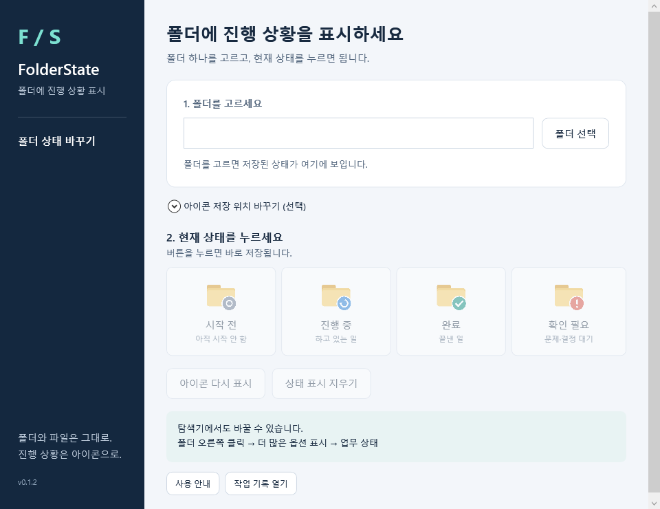

# FolderState 사용 안내

**폴더를 고르고 현재 상태를 누르세요.** 폴더 아이콘으로 진행 상황을 표시합니다. 폴더 이름과 업무 파일은 그대로입니다.

| 누를 상태 | 이런 때 고르세요 | 아이콘 |
|---|---|---|
| 시작 전 | 아직 일을 시작하지 않았습니다. | 회색 원 |
| 진행 중 | 일을 하고 있거나 예정된 답변을 기다립니다. | 파란 진행 표시 |
| 완료 | 필요한 결과물과 승인·전달을 확인했습니다. | 초록 체크 |
| 확인 필요 | 문제가 있거나 확인·결정이 필요합니다. | 빨간 느낌표 |

어떤 상태든 바로 선택할 수 있습니다. 상태는 담당자가 판단합니다. 프로그램이 일을 끝냈는지 자동으로 확인하지는 않습니다. 색을 구별하기 어려워도 기호로 상태를 볼 수 있습니다.

## 처음 사용하기

1. [설치 안내](installation.md)에 따라 FolderState를 설치합니다.
2. Windows 시작 메뉴에서 **FolderState**를 엽니다.
3. **폴더 선택**을 눌러 진행 상황을 표시할 폴더 하나를 고릅니다.
4. **시작 전 / 진행 중 / 완료 / 확인 필요** 중 하나를 누릅니다. 바로 저장됩니다.
5. 탐색기에서 아이콘을 확인합니다. 아직 안 바뀌면 **F5**를 누르거나 폴더 창을 다시 엽니다.

폴더 위치를 이미 알고 있으면 입력란에 전체 경로를 붙여 넣고 **Enter**를 눌러도 됩니다.

## 탐색기에서 바로 바꾸기

1. 업무 폴더 하나를 **마우스 오른쪽 버튼으로 클릭**합니다.
2. **더 많은 옵션 표시 → 업무 상태**를 엽니다.
3. 원하는 상태를 누릅니다.

저장되면 별도 창을 띄우지 않습니다. 실패하거나 확인할 일이 있으면 안내 창을 보여 줍니다. Windows 11에서는 첫 번째 오른쪽 클릭 메뉴에 바로 나오지 않을 수 있습니다.

## 표시를 지우거나 아이콘을 다시 보이게 하기

| 하고 싶은 일 | 누를 버튼 | 결과 |
|---|---|---|
| 아직 시작하지 않은 일로 표시 | **시작 전** | ‘시작 전’ 상태를 저장합니다. |
| 이 폴더에서 상태 표시를 없애기 | **상태 표시 지우기** | 저장된 상태를 지우고 이전 아이콘 설정으로 되돌립니다. FolderState 밖에서 바뀐 설정은 그대로 둡니다. |
| 저장된 상태의 아이콘 다시 보기 | **아이콘 다시 표시** | 저장된 상태에 맞게 아이콘을 다시 설정합니다. 상태와 마지막 변경 시각은 그대로입니다. |

**‘시작 전’과 ‘상태 표시 지우기’는 다릅니다.** 일을 다시 시작하려면 ‘시작 전’을 고르세요. 상태 표시 자체가 필요 없어졌을 때 ‘상태 표시 지우기’를 누릅니다.

예전 화면에서는 ‘시작 전’을 **미착수**, ‘확인 필요’를 **이슈**, ‘상태 표시 지우기’를 **상태 초기화**, ‘아이콘 다시 표시’를 **상태 아이콘 복구**로 표시합니다. 같은 기능입니다.

## 다른 PC로 폴더를 옮길 때

보통은 기본 설정인 **이 PC**를 쓰면 됩니다. 다른 PC에서 아이콘이 안 보이면 그 PC에도 FolderState를 설치한 뒤 **아이콘 다시 표시**를 누릅니다.

아이콘 파일을 폴더와 함께 복사하려면 다음과 같이 설정합니다.

1. FolderState에서 폴더를 고릅니다.
2. **아이콘 저장 위치 바꾸기 (선택)**을 펼칩니다.
3. **선택한 폴더 안**을 고릅니다.
4. 현재 상태 버튼을 누릅니다. 이때 저장 위치도 함께 적용됩니다.

아이콘 파일을 함께 옮겨도 공유 폴더, 동기화 프로그램, 회사 보안 설정에 따라 표시가 달라질 수 있습니다.

## 반복 업무의 기본 폴더를 복사할 때

반복 업무에서 복사해서 쓰는 기본 폴더를 `MASTER`라고 합니다. 상태를 표시한다면 그 안의 단계 폴더는 **시작 전**으로 두세요. 진행 중·완료·확인 필요는 복사해서 실제 일을 하는 폴더에서만 사용합니다. 시험도 복사본에서 합니다.

기본 폴더가 이미 시작 전이면 복사할 때마다 상태를 지울 필요는 없습니다. FolderState를 사용하지 않는 기본 폴더에는 상태 파일이 없어도 됩니다. 상태가 없는 폴더를 프로그램이 자동으로 ‘시작 전’으로 바꾸지는 않습니다.

하위 폴더를 찾아 한꺼번에 상태를 바꾸는 기능은 없습니다. 이전 상태가 남았을 때는 [반복 업무 시작과 일정 관리](../../policies/kits.md#events)를 참고하세요.

## 상태를 고르기 어려울 때

예정된 답변을 기다리는 동안은 **진행 중**, 기한을 넘겼거나 결정 없이는 일을 계속할 수 없으면 **확인 필요**로 표시하는 안을 제안합니다. **완료**는 필요한 결과물과 해당 업무의 승인·전달을 확인한 뒤 고릅니다. 회사에서 정한 기준이 있다면 그 기준을 따릅니다.

기본 예시는 [지금 할 일 찾기](../../quick-reference.md#work)에 있습니다. 답변 누락이나 인수인계 문제가 반복된다면 [일을 이어서 하고 다른 사람에게 넘기기](../../policies/folder-workflow.md)에서 필요한 방법만 골라 쓰세요. 프로그램이 마감이나 승인을 확인해 자동으로 상태를 바꾸지는 않습니다.

## 폴더와 파일은 어떻게 되나요?

폴더 이름을 바꾸지 않으므로 문서 링크와 바로가기의 경로가 그대로입니다. 선택한 폴더의 상태·아이콘 설정 파일만 다룹니다. 폴더 안의 업무 파일이나 하위 폴더 목록을 읽거나 바꾸지 않습니다.

2026-09-12 시험에서는 업무 파일 10,000개가 있는 폴더의 파일 수와 확인한 표본 파일 내용이 유지되었습니다. 다른 저장 환경의 속도나 아이콘 표시까지 확인한 결과는 아닙니다.

[문제가 생겼을 때](troubleshooting.md) · [설치·업데이트·제거](installation.md)
