# FolderState 설치·사용 {#folderstate}

**FolderState 0.1.3** · 폴더 아이콘으로 업무 진행 상태를 표시합니다. 폴더 이름과 업무 파일은 그대로 둡니다.

[설치 파일](#download) · [설치하기](#installation) · [사용하기](#use) · [문제 해결](#troubleshooting) · [업데이트·제거](#maintenance)

## 설치 파일 받기 {#download}

<!-- tool-figure:folderstate-guide-download:start -->
<figure class="tool-figure">
  <picture>
    <source media="(max-width: 760px)" srcset="../../assets/tool-guides/folderstate-guide-download-mobile.svg" width="320" height="432">
    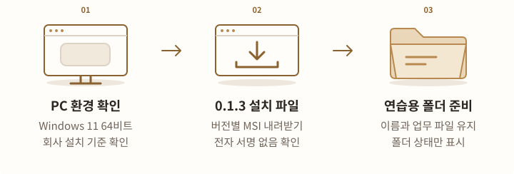
  </picture>
  <figcaption>Windows 11 x64용 FolderState 0.1.3을 받으세요. 기존 0.1.3 RC1과 같은 설치 파일이며, 사용 중이라면 다시 설치할 필요가 없습니다.</figcaption>
</figure>
<!-- tool-figure:folderstate-guide-download:end -->

**64비트 Windows 11 PC용 프로그램입니다.** 설치 파일 이름의 `x64`는 64비트를 뜻합니다.

[FolderState 0.1.3 설치 파일 받기](https://github.com/prozac0401/Workspace/releases/download/folderstate-v0.1.3/FolderState-0.1.3-win-x64.msi){ .md-button .md-button--primary }
[배포 내용 확인](https://github.com/prozac0401/Workspace/releases/tag/folderstate-v0.1.3){ .md-button }

파일 이름: `FolderState-0.1.3-win-x64.msi`

0.1.3에는 **폴더 확인**, 현재 상태 강조, 대상별 결과 안내와 별도의 **아이콘 저장 위치 적용**이 포함됩니다. [현재 화면의 사용 순서](#use)를 확인하세요. [설치 파일이 바뀌지 않았는지 확인할 자료](https://github.com/prozac0401/Workspace/releases/download/folderstate-v0.1.3/FolderState-0.1.3-win-x64.msi.sha256)로 내려받은 파일을 확인할 수 있습니다.

### 설치 전에 확인하세요 {#requirements}

<!-- tool-figure:folderstate-guide-requirements:start -->
<figure class="tool-figure">
  <picture>
    <source media="(max-width: 760px)" srcset="../../assets/tool-guides/folderstate-guide-requirements-mobile.svg" width="320" height="432">
    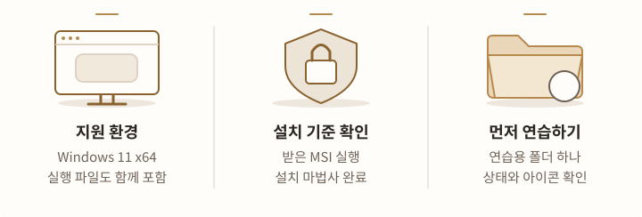
  </picture>
  <figcaption>Windows 10과 ARM64용 설치 파일은 지원하지 않습니다. 회사 PC에서는 설치 기준을 확인하고 연습용 폴더에서 시작하세요.</figcaption>
</figure>
<!-- tool-figure:folderstate-guide-requirements:end -->

실행에 필요한 파일도 설치 파일에 함께 들어 있습니다. ARM64 방식의 PC용 설치 파일은 제공하지 않습니다. Windows 10에는 설치할 수 없습니다.

기존 0.1.3 RC1과 설치 파일이 같으므로 이미 사용 중이면 다시 설치할 필요가 없습니다.

처음 사용할 때는 폴더 하나를 골라 상태를 바꾸고 아이콘을 확인하세요.

## 설치하기 {#installation}

<!-- tool-figure:folderstate-guide-installation:start -->
<figure class="tool-figure">
  <picture>
    <source media="(max-width: 760px)" srcset="../../assets/tool-guides/folderstate-guide-installation-mobile.svg" width="320" height="432">
    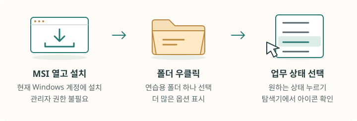
  </picture>
  <figcaption>설치 후 폴더의 오른쪽 클릭 메뉴에서 바로 상태를 바꿀 수 있습니다. 메뉴가 없으면 탐색기 창을 다시 여세요.</figcaption>
</figure>
<!-- tool-figure:folderstate-guide-installation:end -->

1. 위에서 설치 파일 `FolderState-0.1.3-win-x64.msi`를 받습니다.
2. 파일을 열고 **설치**를 누릅니다. 지금 로그인한 Windows 계정에만 설치됩니다. 관리자 권한은 필요하지 않습니다.
3. 연습용 폴더 하나를 마우스 오른쪽 버튼으로 클릭합니다.
4. **더 많은 옵션 표시 → 업무 상태**에서 원하는 상태를 고릅니다. [상태별 뜻](#states)을 참고하세요.

설치한 뒤 관리 화면을 먼저 열 필요는 없습니다. 시작 메뉴의 **FolderState**에서 폴더를 골라 상태를 바꿔도 됩니다.

메뉴가 안 보이면 탐색기 창을 다시 여세요. 메뉴는 현재 Windows 계정에 등록되며 PC를 다시 시작해도 남습니다. 프로그램은 상태를 바꿀 때 실행되므로 항상 켜 두거나 로그인할 때 자동으로 실행하도록 설정할 필요가 없습니다.

## 사용하기 {#use}

<!-- tool-figure:folderstate-guide-use:start -->
<figure class="tool-figure">
  <picture>
    <source media="(max-width: 760px)" srcset="../../assets/tool-guides/folderstate-guide-use-mobile.svg" width="320" height="432">
    
  </picture>
  <figcaption>폴더를 확인하고 상태를 선택한 뒤 작업 결과를 읽으세요. 상태 판단은 사용자가 하며 프로그램이 업무 완료를 자동으로 확인하지 않습니다.</figcaption>
</figure>
<!-- tool-figure:folderstate-guide-use:end -->

### 상태별 뜻 {#states}

<!-- tool-figure:folderstate-guide-states:start -->
<figure class="tool-figure">
  <picture>
    <source media="(max-width: 760px)" srcset="../../assets/tool-guides/folderstate-guide-states-mobile.svg" width="320" height="288">
    
  </picture>
  <figcaption>업무 상황에 맞는 상태를 바로 선택하세요. 회색 원·파란 진행 표시·초록 체크·빨간 느낌표로 색과 기호를 함께 구분합니다.</figcaption>
</figure>
<!-- tool-figure:folderstate-guide-states:end -->

| 누를 상태 | 이런 때 고르세요 | 아이콘 |
|---|---|---|
| 시작 전 | 아직 일을 시작하지 않았습니다. | 회색 원 |
| 진행 중 | 일을 하고 있거나 예정된 답변을 기다립니다. | 파란 진행 표시 |
| 완료 | 필요한 결과물과 승인·전달을 확인했습니다. | 초록 체크 |
| 확인 필요 | 문제가 있거나 확인·결정이 필요합니다. | 빨간 느낌표 |

어떤 상태든 바로 선택할 수 있습니다. 상태는 담당자가 판단합니다. 프로그램이 일을 끝냈는지 자동으로 확인하지는 않습니다. 색을 구별하기 어려워도 기호로 상태를 볼 수 있습니다.

<span id="_1"></span>

### 처음 사용하기 {#start}

<!-- tool-figure:folderstate-guide-start:start -->
<figure class="tool-figure">
  <picture>
    <source media="(max-width: 760px)" srcset="../../assets/tool-guides/folderstate-guide-start-mobile.svg" width="320" height="432">
    
  </picture>
  <figcaption>직접 경로를 입력했다면 폴더 확인 또는 Enter를 먼저 누릅니다. 상태는 버튼을 누르면 바로 저장되며 결과와 탐색기 표시를 확인하세요.</figcaption>
</figure>
<!-- tool-figure:folderstate-guide-start:end -->

1. [설치하기](#installation)에 따라 FolderState를 설치하고 시작 메뉴에서 엽니다.
2. **폴더 선택**을 눌러 폴더 하나를 고릅니다. 폴더 위치(경로)를 드라이브 이름부터 직접 입력했다면 **폴더 확인** 또는 **Enter**를 누릅니다.
3. 표시된 폴더 이름·전체 위치·현재 상태를 확인합니다.
4. **시작 전 / 진행 중 / 완료 / 확인 필요** 중 하나를 누릅니다. 바로 저장됩니다.
5. 결과에 표시된 대상과 완료·주의·실패 안내를 읽습니다. **탐색기에서 보기**로 폴더를 열어 아이콘을 확인합니다. 아직 안 바뀌면 **F5**를 누릅니다.

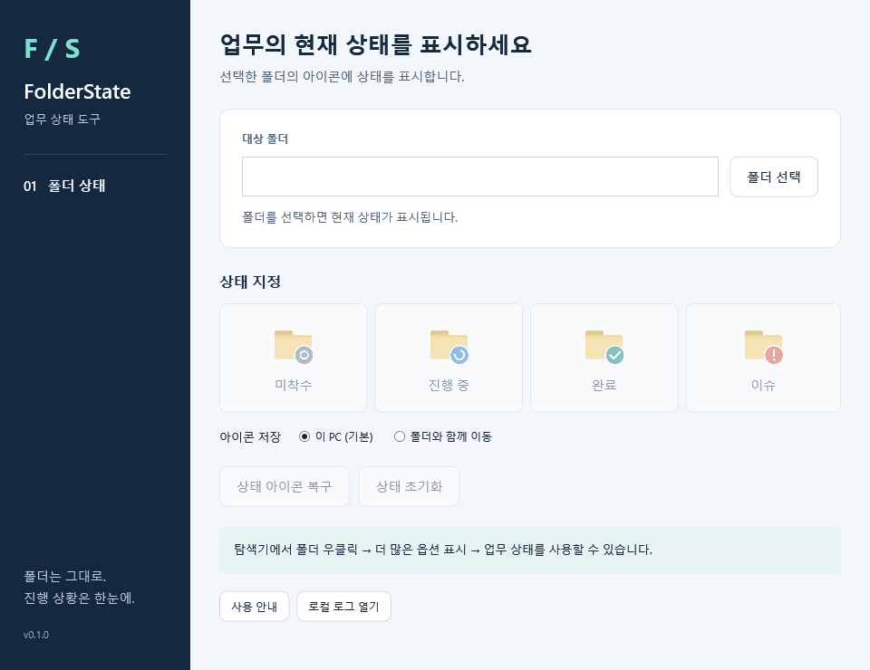

### 폴더 확인과 작업 결과 {#next-ui}

<!-- tool-figure:folderstate-guide-next-ui:start -->
<figure class="tool-figure">
  <picture>
    <source media="(max-width: 760px)" srcset="../../assets/tool-guides/folderstate-guide-next-ui-mobile.svg" width="320" height="432">
    
  </picture>
  <figcaption>위치를 바꾸면 먼저 새 폴더를 확인합니다. 저장 완료와 저장 뒤 다시 읽기 실패는 구분되므로 화면의 결과와 추가 안내를 함께 보세요.</figcaption>
</figure>
<!-- tool-figure:folderstate-guide-next-ui:end -->

폴더 위치를 고치면 화면에 표시된 이전 폴더의 상태와 결과가 사라집니다. 폴더에 저장된 상태를 지우는 것은 아닙니다. 새 폴더를 확인하기 전까지 상태를 바꿀 수 없습니다. **폴더 확인**은 같은 폴더의 최신 상태를 다시 읽을 때도 사용합니다.

현재 저장된 상태는 화면의 **현재 저장된 상태** 표시로 확인합니다. 상태 변경 시각과 저장된 아이콘 위치도 함께 보여 줍니다. 상태가 없는 폴더에서는 먼저 상태를 지정하세요. 아이콘 복구와 상태 지우기는 저장된 상태가 있을 때 사용할 수 있습니다.

저장은 완료됐지만 상태를 다시 읽지 못한 경우에는 저장 결과와 추가 확인 안내를 구분해 표시합니다. 이전 작업이 도중에 멈췄다는 안내가 나오면 **아이콘 다시 표시**로 복구합니다. 도움이 필요하면 **문제 해결 안내**를 누른 뒤 도움말의 **오류 해결**을 확인하세요.

<span id="_2"></span>

### 탐색기에서 바로 바꾸기 {#explorer}

<!-- tool-figure:folderstate-guide-explorer:start -->
<figure class="tool-figure">
  <picture>
    <source media="(max-width: 760px)" srcset="../../assets/tool-guides/folderstate-guide-explorer-mobile.svg" width="320" height="432">
    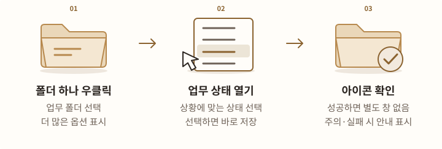
  </picture>
  <figcaption>Windows 11에서는 더 많은 옵션 표시 안의 업무 상태 메뉴를 사용합니다. 상태가 저장되면 별도 창 없이 폴더 아이콘으로 확인합니다.</figcaption>
</figure>
<!-- tool-figure:folderstate-guide-explorer:end -->

1. 업무 폴더 하나를 **마우스 오른쪽 버튼으로 클릭**합니다.
2. **더 많은 옵션 표시 → 업무 상태**를 엽니다.
3. 원하는 상태를 누릅니다.

저장되면 별도 창을 띄우지 않습니다. 실패하거나 확인할 일이 있으면 안내 창을 보여 줍니다. Windows 11에서는 첫 번째 오른쪽 클릭 메뉴에 바로 나오지 않을 수 있습니다.

<span id="_3"></span>

### 표시를 지우거나 아이콘을 다시 보이게 하기 {#reset}

<!-- tool-figure:folderstate-guide-reset:start -->
<figure class="tool-figure">
  <picture>
    <source media="(max-width: 760px)" srcset="../../assets/tool-guides/folderstate-guide-reset-mobile.svg" width="320" height="432">
    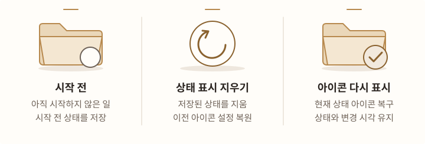
  </picture>
  <figcaption>시작 전은 상태를 저장하고, 상태 표시 지우기는 상태 자체를 없앱니다. 아이콘 다시 표시는 저장된 상태를 유지한 채 아이콘만 다시 설정합니다.</figcaption>
</figure>
<!-- tool-figure:folderstate-guide-reset:end -->

| 하고 싶은 일 | 누를 버튼 | 결과 |
|---|---|---|
| 아직 시작하지 않은 일로 표시 | **시작 전** | ‘시작 전’ 상태를 저장합니다. |
| 이 폴더에서 상태 표시를 없애기 | **이 폴더의 상태 표시 지우기**를 펼친 뒤 **상태 표시 지우기** | 저장된 상태를 지우고 이전 아이콘 설정으로 되돌립니다. FolderState 밖에서 바뀐 설정은 그대로 둡니다. |
| 저장된 상태의 아이콘 다시 보기 | **아이콘 다시 표시** | 저장된 상태에 맞게 아이콘을 다시 설정합니다. 상태와 마지막 변경 시각은 그대로입니다. |

**‘시작 전’과 ‘상태 표시 지우기’는 다릅니다.** 일을 다시 시작하려면 ‘시작 전’을 고르세요. 상태 표시 자체가 필요 없어졌을 때 설명을 확인하고 지웁니다.

예전 화면에서는 ‘시작 전’을 **미착수**, ‘확인 필요’를 **이슈**, ‘상태 표시 지우기’를 **상태 초기화**, ‘아이콘 다시 표시’를 **상태 아이콘 복구**로 표시합니다.

<span id="pc"></span>

### 다른 PC로 폴더를 옮길 때 {#portable}

<!-- tool-figure:folderstate-guide-portable:start -->
<figure class="tool-figure">
  <picture>
    <source media="(max-width: 760px)" srcset="../../assets/tool-guides/folderstate-guide-portable-mobile.svg" width="320" height="432">
    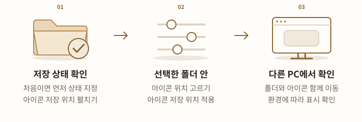
  </picture>
  <figcaption>아이콘 파일을 함께 옮기려면 선택한 폴더 안을 고른 뒤 아이콘 저장 위치 적용을 누르세요. 상태 버튼을 누르는 것만으로는 위치가 바뀌지 않습니다.</figcaption>
</figure>
<!-- tool-figure:folderstate-guide-portable:end -->

보통은 기본 설정인 **이 PC**를 쓰면 됩니다. 다른 PC에서 아이콘이 안 보이면 그 PC에도 FolderState를 설치한 뒤 **아이콘 다시 표시**를 누릅니다.

아이콘 파일을 폴더와 함께 복사하려면 다음과 같이 설정합니다.

1. FolderState에서 상태가 저장된 폴더를 확인합니다. 처음 쓰는 폴더라면 먼저 상태를 지정합니다.
2. **아이콘 저장 위치 바꾸기 (선택)**을 펼칩니다.
3. **선택한 폴더 안**을 고릅니다.
4. **아이콘 저장 위치 적용**을 누릅니다. 상태와 마지막 상태 변경 시각은 유지됩니다.

위치를 선택한 것만으로는 저장되지 않습니다. 상태 버튼을 눌러도 새 위치가 적용되지는 않습니다. 상태 저장·폴더 확인 후에는 선택 표시가 저장된 위치로 돌아오므로, 위치를 바꾸려면 다시 골라 **아이콘 저장 위치 적용**을 누르세요.

공유 폴더나 여러 PC 사이에 복사한 폴더는 사용하는 PC에서 아이콘을 확인하고, 표시되지 않으면 **아이콘 다시 표시**를 누르세요.

<span id="_4"></span>

### 반복 업무의 기본 폴더를 복사할 때 {#master}

<!-- tool-figure:folderstate-guide-master:start -->
<figure class="tool-figure">
  <picture>
    <source media="(max-width: 760px)" srcset="../../assets/tool-guides/folderstate-guide-master-mobile.svg" width="320" height="432">
    
  </picture>
  <figcaption>기본 폴더가 이미 시작 전이면 매번 상태를 지울 필요는 없습니다. 하위 폴더를 자동으로 찾아 상태를 바꾸지는 않습니다.</figcaption>
</figure>
<!-- tool-figure:folderstate-guide-master:end -->

반복 업무에서 복사해서 쓰는 기본 폴더를 `MASTER`라고 합니다. 상태를 표시한다면 그 안의 단계 폴더는 **시작 전**으로 두세요. 진행 중·완료·확인 필요는 복사해서 실제 일을 하는 폴더에서만 사용합니다. 연습도 복사본에서 합니다.

기본 폴더가 이미 시작 전이면 복사할 때마다 상태를 지울 필요는 없습니다. FolderState를 사용하지 않는 기본 폴더에는 상태 파일이 없어도 됩니다. 상태가 없는 폴더를 프로그램이 자동으로 ‘시작 전’으로 바꾸지는 않습니다.

하위 폴더를 찾아 한꺼번에 상태를 바꾸는 기능은 없습니다. 이전 상태가 남았을 때는 [반복 업무 시작과 일정 관리](../../policies/kits.md#events)를 참고하세요.

<span id="_5"></span>

### 상태를 고르기 어려울 때 {#state-choice}

<!-- tool-figure:folderstate-guide-state-choice:start -->
<figure class="tool-figure">
  <picture>
    <source media="(max-width: 760px)" srcset="../../assets/tool-guides/folderstate-guide-state-choice-mobile.svg" width="320" height="432">
    
  </picture>
  <figcaption>답변 대기는 진행 중, 기한 초과나 결정 대기는 확인 필요로 표시하는 예시입니다. 회사에서 정한 기준이 있다면 그 기준을 따르세요.</figcaption>
</figure>
<!-- tool-figure:folderstate-guide-state-choice:end -->

예정된 답변을 기다리는 동안은 **진행 중**, 기한을 넘겼거나 결정 없이는 일을 계속할 수 없으면 **확인 필요**로 표시하는 안을 제안합니다. **완료**는 필요한 결과물과 해당 업무의 승인·전달을 확인한 뒤 고릅니다. 회사에서 정한 기준이 있다면 그 기준을 따릅니다.

기본 예시는 [지금 할 일 찾기](../../quick-reference.md#work)에 있습니다. 답변 누락이나 인수인계 문제가 반복된다면 [일을 이어서 하고 다른 사람에게 넘기기](../../policies/folder-workflow.md)에서 필요한 방법만 골라 쓰세요. 프로그램이 마감이나 승인을 확인해 자동으로 상태를 바꾸지는 않습니다.

<span id="_6"></span>

### 폴더와 파일은 어떻게 되나요? {#files}

<!-- tool-figure:folderstate-guide-files:start -->
<figure class="tool-figure">
  <picture>
    <source media="(max-width: 760px)" srcset="../../assets/tool-guides/folderstate-guide-files-mobile.svg" width="320" height="432">
    
  </picture>
  <figcaption>선택한 폴더의 상태와 아이콘 설정만 다룹니다. 업무 파일 내용이나 하위 폴더 목록을 읽거나 바꾸지 않습니다.</figcaption>
</figure>
<!-- tool-figure:folderstate-guide-files:end -->

폴더 이름을 바꾸지 않으므로 문서 링크와 바로가기가 가리키는 위치도 그대로입니다. 선택한 폴더의 상태·아이콘 설정 파일만 다룹니다. 폴더 안의 업무 파일이나 하위 폴더 목록을 읽거나 바꾸지 않습니다.

## 업데이트·복구·제거 {#maintenance}

<!-- tool-figure:folderstate-guide-maintenance:start -->
<figure class="tool-figure">
  <picture>
    <source media="(max-width: 760px)" srcset="../../assets/tool-guides/folderstate-guide-maintenance-mobile.svg" width="320" height="432">
    
  </picture>
  <figcaption>필요한 작업에 맞춰 복구·업데이트·제거를 선택하세요. 폴더 상태까지 지우려면 프로그램을 제거하기 전에 각 폴더에서 상태 표시 지우기를 사용합니다.</figcaption>
</figure>
<!-- tool-figure:folderstate-guide-maintenance:end -->

### 프로그램이 고장 났을 때 {#repair}

<!-- tool-figure:folderstate-guide-repair:start -->
<figure class="tool-figure">
  <picture>
    <source media="(max-width: 760px)" srcset="../../assets/tool-guides/folderstate-guide-repair-mobile.svg" width="320" height="288">
    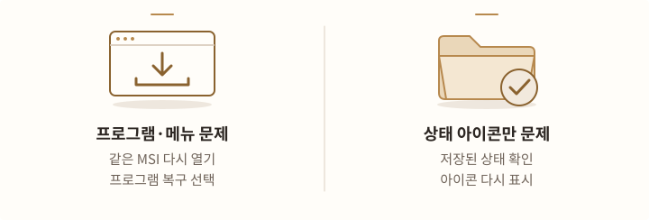
  </picture>
  <figcaption>프로그램 파일과 메뉴를 복구하는 작업과 폴더의 상태 아이콘을 다시 표시하는 작업을 구분하세요.</figcaption>
</figure>
<!-- tool-figure:folderstate-guide-repair:end -->

같은 설치 파일을 다시 열고 **프로그램 복구**를 누릅니다. 프로그램 파일과 탐색기 메뉴를 다시 설치합니다. 예전 설치 화면에서는 버튼 이름이 **복구**입니다.

폴더의 상태는 저장되어 있는데 아이콘만 보이지 않는다면 먼저 FolderState의 **아이콘 다시 표시**를 누르세요. 폴더에 저장된 상태에 맞춰 아이콘을 다시 설정합니다.

### 새 버전으로 바꾸기 {#update}

<!-- tool-figure:folderstate-guide-update:start -->
<figure class="tool-figure">
  <picture>
    <source media="(max-width: 760px)" srcset="../../assets/tool-guides/folderstate-guide-update-mobile.svg" width="320" height="432">
    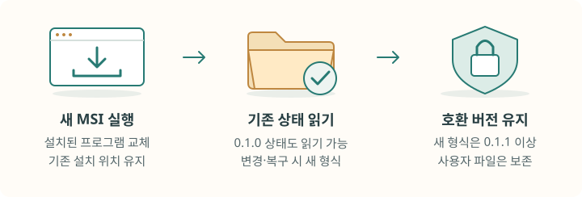
  </picture>
  <figcaption>업데이트 후 상태를 바꾸거나 아이콘을 복구해 새 형식으로 저장한 폴더는 0.1.1 이상에서 사용하세요. 오래된 버전으로 덮어 설치할 수 없습니다.</figcaption>
</figure>
<!-- tool-figure:folderstate-guide-update:end -->

새 버전의 설치 파일을 열면 설치된 프로그램을 새 버전으로 바꿉니다. 설치 위치는 그대로 유지합니다. 이미 설치된 버전보다 오래된 버전은 설치할 수 없습니다.

0.1.0에서 저장한 상태도 읽을 수 있습니다. 상태를 바꾸거나 **아이콘 다시 표시**를 누르면 새 형식으로 저장됩니다. **이렇게 바뀐 폴더는 0.1.1 이상에서 사용하세요.** 0.1.0으로 되돌려 사용하면 새 형식을 읽지 못합니다.

아이콘을 **선택한 폴더 안**에 두는 경우에는 상태에 맞는 아이콘 파일을 저장하고, 이 프로그램이 만든 것으로 확인한 이전 아이콘만 정리합니다. 사용자가 따로 넣은 파일은 지우지 않습니다.

### 프로그램 제거하기 {#remove}

<!-- tool-figure:folderstate-guide-remove:start -->
<figure class="tool-figure">
  <picture>
    <source media="(max-width: 760px)" srcset="../../assets/tool-guides/folderstate-guide-remove-mobile.svg" width="320" height="432">
    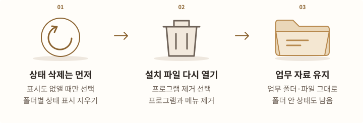
  </picture>
  <figcaption>프로그램 제거는 업무 폴더를 검색하거나 그 안의 상태를 지우지 않습니다. 이 PC의 아이콘을 쓰던 폴더는 제거 후 상태 아이콘이 보이지 않을 수 있습니다.</figcaption>
</figure>
<!-- tool-figure:folderstate-guide-remove:end -->

1. 폴더의 상태 표시도 지우려면 프로그램을 제거하기 전에 해당 폴더마다 **상태 표시 지우기**를 누릅니다.
2. 설치 파일을 다시 열고 **프로그램 제거**를 누릅니다. 예전 설치 화면에서는 **제거**입니다.

프로그램과 탐색기 메뉴, 이 PC에 설치된 아이콘, 작업 기록을 지웁니다. 업무 폴더와 업무 파일은 그대로 둡니다. 업무 폴더를 검색하지 않으며 폴더 안에 저장된 상태와 아이콘도 지우지 않습니다.

이 PC에 설치된 아이콘을 사용했다면 프로그램을 제거한 뒤 상태 아이콘이 보이지 않을 수 있습니다. 이 경우에도 폴더와 업무 파일, 저장된 상태는 남아 있습니다.

## 문제 해결 {#troubleshooting}

<!-- tool-figure:folderstate-guide-troubleshooting:start -->
<figure class="tool-figure">
  <picture>
    <source media="(max-width: 760px)" srcset="../../assets/tool-guides/folderstate-guide-troubleshooting-mobile.svg" width="320" height="432">
    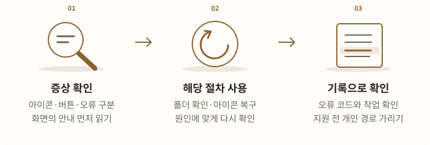
  </picture>
  <figcaption>화면에 나온 증상과 안내에 맞춰 확인하세요. 설정 파일이 손상되거나 외부에서 바뀌었다는 안내가 나오면 파일을 보존하고 지원을 요청합니다.</figcaption>
</figure>
<!-- tool-figure:folderstate-guide-troubleshooting:end -->

### 상태는 저장됐는데 아이콘이 안 바뀌어요 {#icon-refresh}

<!-- tool-figure:folderstate-guide-icon-refresh:start -->
<figure class="tool-figure">
  <picture>
    <source media="(max-width: 760px)" srcset="../../assets/tool-guides/folderstate-guide-icon-refresh-mobile.svg" width="320" height="432">
    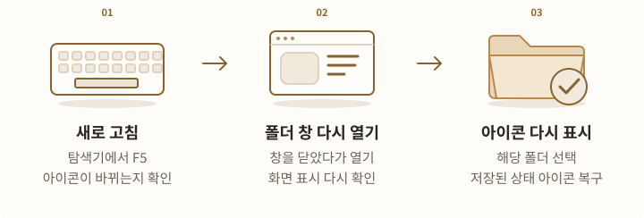
  </picture>
  <figcaption>F5, 폴더 창 다시 열기, 아이콘 다시 표시 순으로 확인하세요. 설치된 아이콘 파일이 없다는 안내가 나오면 설치 파일의 프로그램 복구를 사용합니다.</figcaption>
</figure>
<!-- tool-figure:folderstate-guide-icon-refresh:end -->

1. 탐색기에서 **F5**를 눌러 화면을 새로 고칩니다.
2. 그대로라면 폴더 창을 닫았다가 다시 엽니다.
3. FolderState에서 해당 폴더를 고르고 **아이콘 다시 표시**를 누릅니다.

다른 PC로 옮긴 폴더라면 그 PC에도 FolderState를 설치해야 할 수 있습니다. 아이콘 파일이 없다는 안내가 나오면 [설치 파일의 프로그램 복구](#repair)를 먼저 사용하세요.

아이콘 표시가 늦게 바뀌면 위 순서로 탐색기 화면을 새로 고칩니다. 프로그램은 탐색기를 종료하거나 PC 전체의 아이콘 기록을 지우지 않으며, 인터넷에서 받은 설정 파일의 출처 표시를 유지합니다.

탐색기 목록의 아이콘은 바뀌었는데 오른쪽 **세부 정보**에만 이전 아이콘이 보이면 다른 항목을 선택했다가 돌아와 보세요. 폴더 위치를 나타내는 글자가 260자 이상이면 Windows의 표시 처리 제한으로 갱신이 늦어질 수 있습니다.

### 버튼을 누를 수 없어요 {#buttons}

<!-- tool-figure:folderstate-guide-buttons:start -->
<figure class="tool-figure">
  <picture>
    <source media="(max-width: 760px)" srcset="../../assets/tool-guides/folderstate-guide-buttons-mobile.svg" width="320" height="432">
    
  </picture>
  <figcaption>폴더 확인 전에는 상태를 바꿀 수 없습니다. 아이콘 위치는 상태를 먼저 저장한 뒤 별도의 적용 버튼으로 바꾸세요. 중단·읽기 오류는 화면의 안내를 따릅니다.</figcaption>
</figure>
<!-- tool-figure:folderstate-guide-buttons:end -->

이 절은 **FolderState 0.1.3** 화면 기준입니다. 이전 버전을 사용한다면 [설치 파일](#download)에서 새 버전을 확인하세요.

- 경로를 입력하거나 바꿨다면 **폴더 확인** 또는 **Enter**를 먼저 누릅니다. 이전 폴더에 잘못 적용하지 않도록 확인 전에는 변경 버튼을 사용할 수 없습니다.
- 상태가 없는 폴더에는 네 상태 중 하나를 먼저 저장합니다. 첫 상태는 **이 PC** 설정으로 저장됩니다. 그 뒤 아이콘 위치를 고르고 **아이콘 저장 위치 적용**을 누를 수 있습니다.
- ‘이전 작업이 도중에 멈춤’ 안내가 나오면 **아이콘 다시 표시**를 누릅니다. 다른 읽기 오류라면 안내된 원인을 해결한 뒤 **폴더 확인**으로 다시 읽습니다.
- 위치를 선택만 했다면 아직 저장되지 않은 것입니다. **아이콘 저장 위치 적용**을 누릅니다. 상태 버튼은 기존에 저장된 위치를 유지하며, 상태를 저장한 뒤 선택 표시도 저장된 위치로 돌아갑니다.
- 저장 완료 뒤 상태를 다시 읽지 못했다는 안내가 함께 나올 수 있습니다. 저장 실패로 단정하지 말고 **폴더 확인**으로 현재 저장 상태를 다시 읽습니다.

**문제 해결 안내** 버튼은 동봉된 사용 안내를 엽니다. 열린 도움말에서 **오류 해결**을 선택한 뒤 화면에 나온 안내와 비교하세요.

### 안내 문구에 따라 확인하세요 {#error-codes}

<!-- tool-figure:folderstate-guide-error-codes:start -->
<figure class="tool-figure">
  <picture>
    <source media="(max-width: 760px)" srcset="../../assets/tool-guides/folderstate-guide-error-codes-mobile.svg" width="320" height="432">
    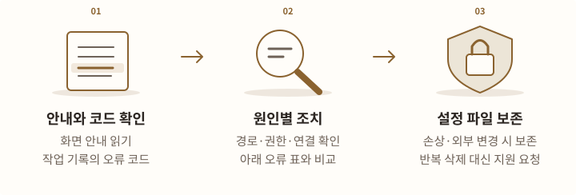
  </picture>
  <figcaption>오류 안내와 표의 조치를 함께 확인하세요. 상태·아이콘 설정과 되돌릴 때 쓸 파일은 삭제하거나 임의로 덮어쓰지 않습니다.</figcaption>
</figure>
<!-- tool-figure:folderstate-guide-error-codes:end -->

**설정 파일이 손상되었거나 다른 곳에서 바뀌었다는 안내가 나오면 현재 파일을 그대로 보관하고 아래 오류 코드에 맞춰 처리하세요.** `.folderstate.ini`, `desktop.ini`, `.folderstate-`로 시작하는 아이콘 파일, `.folderstate.transaction`은 상태 표시나 이전 상태로 되돌릴 때 쓰는 파일입니다.

오류 코드는 작업 기록에서 확인할 수 있습니다. 글로 명령을 입력해 사용했다면 그 결과에서도 확인할 수 있습니다. 화면에 나온 안내와 아래 표를 함께 보세요.

| 화면에서 알리는 문제 | 할 일 | 오류 코드 |
|---|---|---|
| 폴더에 접근할 수 없음 | 해당 폴더를 읽고 저장할 수 있는 계정인지 확인합니다. | `access_denied` |
| 파일을 읽거나 저장하지 못함 | 파일을 사용 중인 프로그램, 드라이브·네트워크 연결, 남은 저장 공간을 확인합니다. 원인을 해결한 뒤 다시 실행합니다. | `io_error` |
| 폴더를 찾을 수 없음 | 입력한 경로와 드라이브·네트워크 연결을 확인합니다. | `folder_missing` |
| 경로나 명령이 잘못됨 | 폴더 선택 버튼을 사용하거나 전체 경로를 입력합니다. 명령을 입력해 사용한다면 아래 예시와 비교합니다. | `invalid_path`, `usage`, `invalid_status` |
| 드라이브 전체를 선택함 | 드라이브나 공유 위치 안의 업무 폴더 하나를 고릅니다. | `root_not_supported` |
| 경로가 너무 긺 | 이 PC가 긴 경로를 지원하는지 관리 담당자에게 확인합니다. | `path_too_long` |
| 다시 표시할 상태가 없음 | 먼저 네 가지 상태 중 하나를 고릅니다. | `state_missing` |
| 아이콘 파일이 없거나 손상됨 | 설치 파일에서 **프로그램 복구**를 한 뒤 폴더의 **아이콘 다시 표시**를 누릅니다. | `icon_missing` |
| 설치된 아이콘 경로를 쓸 수 없음 | 프로그램 설치 위치를 확인합니다. | `invalid_icon_path` |
| FolderState 밖에서 아이콘이 바뀜 | 현재 아이콘을 먼저 확인합니다. FolderState 상태 아이콘을 쓰려면 **상태 표시 지우기**를 누른 뒤 원하는 상태를 고릅니다. | `icon_conflict` |
| 폴더 안의 아이콘이 원래 파일과 다름 | 현재 아이콘 파일을 그대로 보관하고 변경한 내용을 확인합니다. | `portable_conflict` |
| 상태 파일에 다른 정보가 추가됨 | 현재 상태 파일에서 추가된 내용을 확인합니다. 상태 표시 지우기는 중단되며 파일을 그대로 둡니다. | `metadata_conflict` |
| Windows가 설정 파일을 예상과 다르게 바꿈 | 설정 파일과 되돌릴 때 쓸 파일을 보존하고 지원을 요청합니다. | `shell_metadata_changed` |
| 상태 파일을 읽을 수 없음 | `.folderstate.ini`를 그대로 두고 지원을 요청합니다. 다른 버전에서 만든 파일일 수도 있습니다. | `invalid_metadata` |
| 이전 작업이 도중에 멈춤 | **아이콘 다시 표시**를 누릅니다. ‘저장된 상태가 없음’이 나오면 중단 전에는 상태가 없었던 것이므로 원하는 상태를 고릅니다. | `recovery_pending` |
| 멈춘 뒤 설정이 바뀜 | 되돌릴 때 쓸 파일을 그대로 두고 바뀐 내용을 확인합니다. 현재 파일과 복원 기록을 기준으로 원인을 확인합니다. | `recovery_conflict` |
| 변경도 되돌리기도 끝내지 못함 | 설정 파일과 작업 기록을 보존합니다. 파일 사용 중 여부·접근 권한과 외부 변경을 확인한 뒤 지원을 요청합니다. | `recovery_failed` |
| 되돌릴 때 쓸 파일이 손상됨 | `.folderstate.transaction`을 포함한 설정 파일을 그대로 두고 지원을 요청합니다. | `invalid_journal` |
| 작업하는 동안 설정이 바뀜 | 설정 파일을 그대로 두고 다른 프로그램이나 사용자가 바꾼 내용을 확인합니다. | `concurrent_edit` |
| 다른 위치로 연결된 폴더 또는 아직 내려받지 않은 폴더 | 이 PC에 실제로 저장된 일반 폴더를 사용합니다. | `reparse_point` |
| 설정 파일 자리에 폴더나 연결 항목이 있음 | 해당 항목을 지우지 말고 지원을 요청합니다. | `unsafe_metadata` |
| 같은 설정 파일이 여러 위치에서 연결되어 쓰임 | 연결된 파일을 그대로 두고 도움을 요청합니다. | `hard_link` |
| 설정 항목이 겹치거나 문자를 읽지 못함 | 어떤 값이 맞는지 자동으로 정할 수 없습니다. 설정 파일을 그대로 두고 지원을 요청합니다. | `ambiguous_ini`, `invalid_ini`, `invalid_encoding` |
| 같은 폴더의 다른 작업이 진행 중 | 잠시 기다렸다가 다시 실행합니다. | `busy` |
| 파일이 너무 큼 | 기존 파일을 그대로 두고 지원을 요청합니다. | `metadata_too_large` |
| 작업 기록을 저장하지 못함 | 먼저 화면의 성공·실패 결과를 확인합니다. 기록 폴더의 접근 권한과 남은 공간을 확인합니다. | 결과의 추가 안내 |

### 작업 기록 확인하기 {#logs}

<!-- tool-figure:folderstate-guide-logs:start -->
<figure class="tool-figure">
  <picture>
    <source media="(max-width: 760px)" srcset="../../assets/tool-guides/folderstate-guide-logs-mobile.svg" width="320" height="432">
    
  </picture>
  <figcaption>작업 기록은 이 PC의 사용자 데이터 폴더에 저장되며 자동 전송하지 않습니다. 도움을 요청할 때는 필요한 오류 안내만 확인하고 개인 경로를 가리세요.</figcaption>
</figure>
<!-- tool-figure:folderstate-guide-logs:end -->

FolderState에서 **작업 기록 열기**를 누릅니다. 폴더가 열리면 `operations.jsonl`을 확인합니다. 이 파일에는 작업 시각, 작업 내용, 폴더 경로, 바꾸기 전후의 상태, 성공·실패, 오류 코드와 안내가 적혀 있습니다.

기록은 `%LOCALAPPDATA%\FolderState\logs`에 저장됩니다. 업무 폴더 안에는 쌓지 않으며 자동으로 외부에 보내지도 않습니다. 도움을 요청할 때는 오류 안내와 발생한 작업을 알려 주세요. 기록을 전달하기 전 사용자 이름과 실제 업무 폴더 경로를 가립니다.

## 추가 안내 — 필요한 경우만 {#advanced}

<!-- tool-figure:folderstate-guide-advanced:start -->
<figure class="tool-figure">
  <picture>
    <source media="(max-width: 760px)" srcset="../../assets/tool-guides/folderstate-guide-advanced-mobile.svg" width="320" height="432">
    
  </picture>
  <figcaption>보통은 프로그램 화면이나 탐색기 메뉴로 충분합니다. 명령이 필요한 경우에만 아래 설명을 펼쳐 대상 경로와 작업을 확인하세요.</figcaption>
</figure>
<!-- tool-figure:folderstate-guide-advanced:end -->

<span id="locations"></span>

**설치 위치 확인하기**

| 항목 | 위치 |
|---|---|
| 프로그램·아이콘 | `%LOCALAPPDATA%\Programs\FolderState` |
| 시작 메뉴 | FolderState |
| 탐색기 메뉴 설정 | `HKCU\Software\Classes\Directory\shell\Workspace.FolderState` |
| 작업 기록 | `%LOCALAPPDATA%\FolderState\logs` |
| 저장된 업무 상태 | 선택한 폴더의 `.folderstate.ini` |

`%LOCALAPPDATA%`는 지금 로그인한 Windows 계정에서 프로그램이 쓰는 자료를 저장하는 폴더입니다. 탐색기 주소창에 그대로 붙여 넣고 Enter를 누르면 열 수 있습니다. `HKCU`는 이 계정의 Windows 설정이 저장되는 곳입니다. FolderState를 사용할 때 이 설정을 직접 바꿀 필요는 없습니다.

<span id="installer-cli"></span>

**명령으로 설치하는 담당자용**

설치 화면 대신 명령으로 처리할 때만 사용합니다. `/qn`은 화면을 표시하지 않는 옵션입니다.

```powershell
msiexec /i "FolderState-0.1.3-win-x64.msi" /qn /norestart /l*v install.log
msiexec /fa "FolderState-0.1.3-win-x64.msi" /qn /norestart /l*v repair.log
msiexec /x "FolderState-0.1.3-win-x64.msi" /qn /norestart /l*v uninstall.log
```

위 명령은 순서대로 설치, 프로그램 복구, 프로그램 제거입니다. 필요한 명령 하나만 실행하세요. 종료 코드가 `0`이면 작업을 마친 것이고, `3010`이면 PC를 다시 시작해야 합니다. 다른 코드가 나오면 해당 설치 기록 파일을 확인하세요. 문의에는 종료 코드와 해당 단계의 오류 문구를 적어 주세요.

<span id="cli"></span>

**명령으로 사용하기 — 필요한 경우만**

PowerShell 등에서 글로 명령을 입력해 사용할 수도 있습니다. 보통은 프로그램 화면이나 탐색기 메뉴만 사용하면 됩니다.

| 하고 싶은 일 | 명령 |
|---|---|
| 상태 바꾸기 | `set` |
| 저장된 상태 확인 | `status` |
| 아이콘 다시 표시 | `repair` |
| 상태 표시 지우기 | `reset` |

상태값은 `todo`(시작 전), `doing`(진행 중), `done`(완료), `issue`(확인 필요)입니다. 아래 예시의 폴더 경로를 실제 경로로 바꿔서 필요한 명령만 실행하세요.

진행 중으로 바꾸기:

```powershell
FolderState.Cli.exe set doing "D:\Work\교육 준비"
```

아이콘을 폴더 안에 함께 저장하면서 완료로 바꾸기:

```powershell
FolderState.Cli.exe set done "D:\Work\교육 준비" --mode portable
```

저장된 상태 확인하기:

```powershell
FolderState.Cli.exe status "D:\Work\교육 준비"
```

아이콘 다시 표시하기:

```powershell
FolderState.Cli.exe repair "D:\Work\교육 준비"
```

상태 표시 지우기:

```powershell
FolderState.Cli.exe reset "D:\Work\교육 준비"
```

여러 폴더를 시작 전으로 바꾸고 자동 처리용 결과 받기:

```powershell
FolderState.Cli.exe set todo "D:\Work\단계1" "D:\Work\단계2" --json
```

폴더 경로는 드라이브 이름부터 모두 입력하고 큰따옴표로 감쌉니다. 공유 폴더라면 서버 이름을 포함합니다. 최대 100개 폴더를 직접 나열할 수 있습니다. 하위 폴더를 찾아다니거나 `*`로 여러 폴더를 검색하지 않습니다. 한 폴더에서 실패해도 다른 폴더의 성공은 그대로 유지합니다.

`--json`은 결과를 다른 프로그램이 읽기 좋은 형식으로 출력합니다. 종료 코드는 `0` 성공, `1` 작업 실패, `2` 명령 입력 오류입니다. 화면용 실행 파일 `FolderState.exe`도 `set/reset/repair` 명령을 받아 탐색기 메뉴에서 사용합니다. 기존 명령과 저장된 상태값은 문구 변경 후에도 같습니다.
