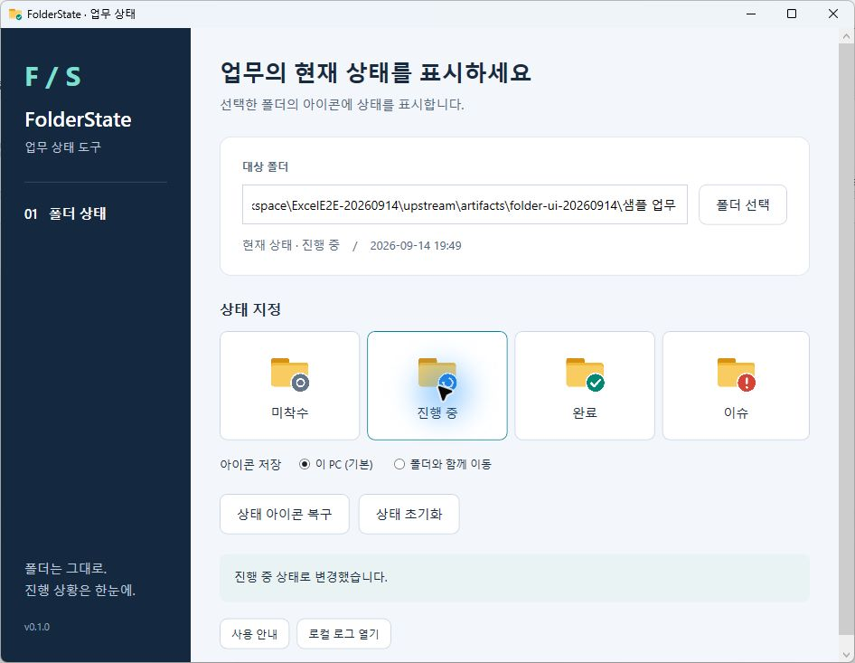
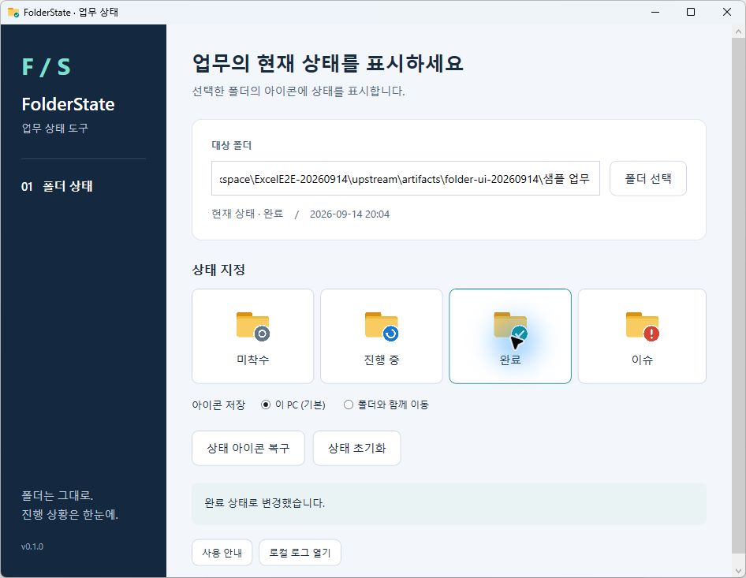
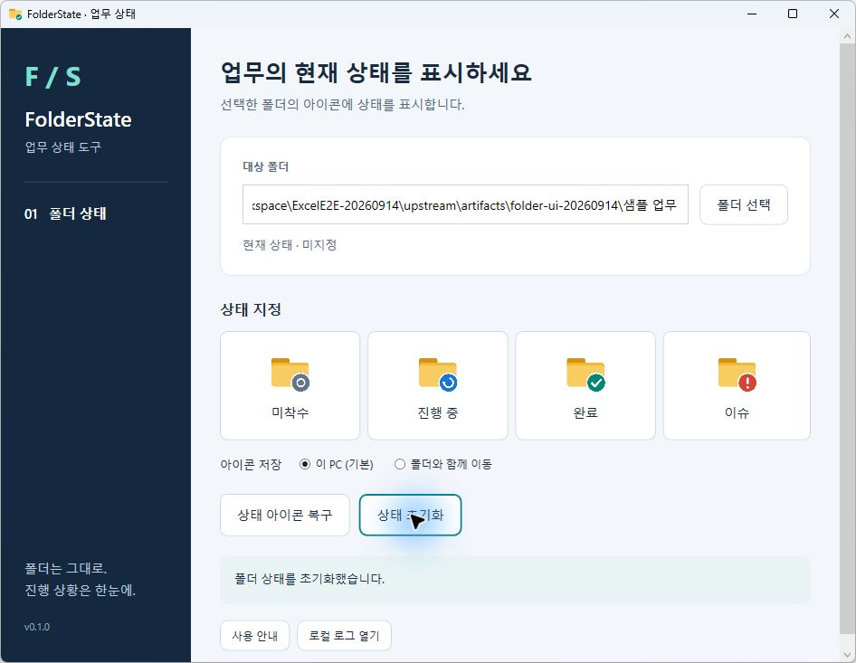

# FolderState · 설치부터 사용까지

버전: 0.1.0 평가용 · 대상: Windows 11 x64

실제 MSI 설치·복구·제거, 설치본의 상태 변경·아이콘 복구·초기화를 확인했다. 아래 이미지는 2026-09-14 Windows 11의 설치본에서 직접 촬영한 화면이며, 표시된 폴더는 합성 시험 자료다. 코드 서명이 없는 평가용 배포 후보다.

## 1. 설치

1. 릴리즈의 `FolderState-0.1.0-win-x64.msi`와 `.sha256` 파일을 내려받는다.
2. MSI를 열어 **설치**를 누른다. 현재 사용자에게 설치하며 별도의 .NET 설치가 필요 없다.
3. 완료 후 **닫기**를 누른다. 보안 정책이 설치를 막으면 조직의 승인 절차를 이용한다.

설치 창의 화면 촬영·버튼 조작은 사용한 자동화 도구가 `msiexec.exe` 접근을 차단해 수행하지 못했다. MSI 명령줄 설치는 실제 종료 코드 0을 확인했다. 아래 설치본 사용 화면과 이 제한을 구분한다.

## 2. 폴더에 상태 표시

시험용 폴더 하나를 우클릭하고 **더 많은 옵션 표시 → 업무 상태**에서 고른다.

| 상태 | 용도 |
|---|---|
| 미착수 | 아직 시작하지 않음 |
| 진행 중 | 작업하거나 정상적인 회신을 기다리는 중 |
| 완료 | 필요한 결과와 확인이 끝남 |
| 이슈 | 문제·확인·결정이 필요함 |

폴더 이름과 안의 업무 파일은 바뀌지 않는다. 상태를 바꾼 직후 표시가 갱신되지 않으면 탐색기 창을 다시 연다.

## 3. 관리 화면에서 사용

시작 메뉴의 **FolderState**를 연다. 폴더를 선택하거나 경로를 입력하고 Enter를 누른 뒤 상태 버튼을 누른다. 다른 PC로 옮길 폴더는 **폴더와 함께 이동** 옵션을 선택할 수 있다. 저장소·복사 방식에 따라 아이콘 표시에는 차이가 있을 수 있다.

작업을 마쳤으면 **완료**를 누른다. 현재 상태와 아래의 완료 메시지로 적용 결과를 확인한다.

## 4. 초기화·복구·제거

- **상태 초기화**: 상태정보를 지우고 도구가 변경한 아이콘 설정을 복원한다.
- **상태 아이콘 복구**: 저장 상태는 유지하면서 아이콘 표시를 다시 적용한다.
- **프로그램 복구/제거**: 같은 MSI를 다시 열고 **복구** 또는 **제거**를 선택한다.

프로그램을 제거해도 업무 폴더와 상태정보는 남는다. 상태까지 없애려면 제거 전에 해당 폴더에서 **상태 초기화**를 실행한다.

이번 시험에서는 초기화 후 제품 상태 파일과 `desktop.ini`가 제거됐고, 합성 업무 파일은 원래 해시를 유지했다. 시험 설치 제거 후 프로그램과 제품 메뉴도 없는 시작 전 상태로 복구했다. Explorer 우클릭 메뉴의 실제 클릭·화면 캡처는 이번 기록에 포함하지 않는다.

자세한 내용: [설치·제거 안내](installation.md), [사용 안내](index.md), [오류 해결](troubleshooting.md).
