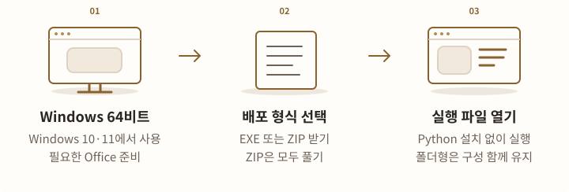
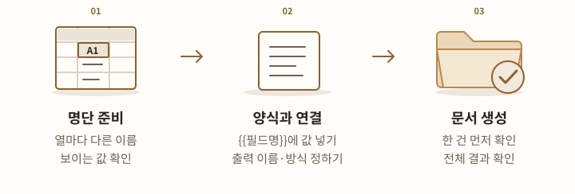

# Office 문서 자동화 실행·사용

**Office Automation Tools 0.3.1**

Excel 파일 여러 개를 하나로 합치고, 명단을 부서별 파일로 나누고, 명단의 값을 Excel·Word·PowerPoint 양식에 넣습니다. 프로그램의 **엑셀 병합 / 엑셀 분리 / 템플릿 채우기** 세 탭에서 작업합니다.

**MS Office Excel·PowerPoint(PPT)·Word용 도구입니다.** 별도의 Python 설치 없이 실행 파일을 바로 사용할 수 있습니다.

## 실행 파일 받기 {#download}

<!-- tool-figure:office-download:start -->
<figure class="tool-figure">
  <picture>
    <source media="(max-width: 760px)" srcset="../../assets/tool-guides/office-download-mobile.svg" width="320" height="432">
    
  </picture>
  <figcaption><span>설명용 도해</span> 단독 EXE는 바로 실행합니다. 폴더형 ZIP은 EXE와 _internal 폴더를 함께 유지하세요.</figcaption>
</figure>
<!-- tool-figure:office-download:end -->

대상은 **64비트 Windows 10·11 PC**입니다. 입력 파일을 읽고 결과 폴더에 저장할 수 있는 권한이 필요합니다.

[0.3.1 단독 실행 파일 받기 (EXE)](https://github.com/prozac0401/Workspace/releases/download/office-automation-tools-v0.3.1/OfficeAutomationTools.exe){ .md-button .md-button--primary }
[0.3.1 실행 파일·안내 함께 받기 (ZIP)](https://github.com/prozac0401/Workspace/releases/download/office-automation-tools-v0.3.1/OfficeAutomationTools-onefile-pyinstaller-win64.zip){ .md-button }

[0.3.1 배포 내용](https://github.com/prozac0401/Workspace/releases/tag/office-automation-tools-v0.3.1) · [파일 확인용 SHA-256](https://github.com/prozac0401/Workspace/releases/download/office-automation-tools-v0.3.1/SHA256SUMS.txt) · [폴더형 배포 받기 (ZIP)](https://github.com/prozac0401/Workspace/releases/download/office-automation-tools-v0.3.1/OfficeAutomationTools-pyinstaller-win64.zip)

| 받은 파일 | 실행 방법 |
|---|---|
| `OfficeAutomationTools.exe` | 저장한 EXE를 더블클릭합니다. 별도 설치 과정은 없습니다. |
| `OfficeAutomationTools-onefile-pyinstaller-win64.zip` | 압축을 모두 풀고 안의 `OfficeAutomationTools.exe`를 실행합니다. 안내와 연습 자료도 함께 들어 있습니다. |
| `OfficeAutomationTools-pyinstaller-win64.zip` | 압축을 모두 풀고 `OfficeAutomationTools.exe`를 실행합니다. **EXE와 `_internal` 폴더를 함께 유지**하세요. EXE만 옮기면 실행되지 않습니다. |

ZIP 안의 `run-office-tools.bat`나 `run-office-tools.ps1`로도 실행할 수 있습니다. `install-office-tools-trust`로 시작하는 파일은 인증서 신뢰 설정을 바꾸는 별도 도구입니다. 실행에 앞서 무조건 사용할 필요는 없으며, 게시자를 확인하고 조직의 정책에 따라 필요한 경우에만 사용하세요.

## 어떤 파일을 처리하나요 {#formats}

<!-- tool-figure:office-formats:start -->
<figure class="tool-figure">
  <picture>
    <source media="(max-width: 760px)" srcset="../../assets/tool-guides/office-formats-mobile.svg" width="320" height="432">
    
  </picture>
  <figcaption><span>설명용 도해</span> 병합·분리와 템플릿 채우기는 처리 범위가 다릅니다. 아래 표에서 읽는 파일과 만드는 파일을 확인하세요.</figcaption>
</figure>
<!-- tool-figure:office-formats:end -->

| 기능 | 읽는 파일 | 만드는 파일 |
|---|---|---|
| 엑셀 병합 | `.xls`, `.xlsx`, `.xlsm`의 **첫 시트** | `.xlsx`, `.xlsm`, `.xls` 중 선택한 형식의 파일 하나 |
| 엑셀 분리 | `.xls`, `.xlsx`, `.xlsm`에서 선택한 시트 | 기준 열의 값마다 `.xlsx`, `.xlsm`, `.xls` 중 선택한 형식의 파일 |
| 템플릿 채우기 | `.xlsx`, `.xlsm` 명단과 Office 템플릿 | 명단 항목마다 개별 파일 또는 여러 항목을 합친 파일 하나 |

템플릿은 `.xlsx`, `.xlsm`, `.xltx`, `.xltm`, `.docx`, `.pptx`를 사용할 수 있습니다. Excel의 `.xltx`는 `.xlsx`, `.xltm`은 `.xlsm` 결과로 저장됩니다. Word는 `.docx`, PowerPoint는 `.pptx`로 저장됩니다.

**병합·분리는 값과 셀 서식을 옮깁니다.** 수식 자체, 매크로, 다른 시트는 복사하지 않습니다. `.xlsm`으로 저장해도 원본 매크로가 복사되는 것은 아닙니다. 수식·매크로를 그대로 보존해야 하는 통합문서를 이 두 기능으로 다시 만들지는 마세요.

## 가짜 명단으로 첫 작업 해 보기 {#start}

<!-- tool-figure:office-start:start -->
<figure class="tool-figure">
  <picture>
    <source media="(max-width: 760px)" srcset="../../assets/tool-guides/office-start-mobile.svg" width="320" height="432">
    
  </picture>
  <figcaption><span>설명용 도해</span> 실제 업무자료를 넣기 전에 가짜 명단으로 행 설정과 분리 결과를 확인하세요.</figcaption>
</figure>
<!-- tool-figure:office-start:end -->

먼저 **엑셀 분리**로 작은 명단을 두 파일로 나누어 보세요. 이 예시는 실제 업무자료를 포함하지 않습니다.

1. Excel에서 새 파일을 만들고 첫 시트 이름을 **명단**으로 바꿉니다. A1부터 아래 표를 입력합니다. 행 번호는 입력하지 않습니다.

    | Excel 행 | A열: 부서 | B열: 이름 | C열: 금액 |
    |---|---|---|---|
    | 1 | 부서 | 이름 | 금액 |
    | 2 | 연습팀A | 연습가 | 1000 |
    | 3 | 연습팀B | 연습나 | 2000 |
    | 4 | 연습팀A | 연습다 | 3000 |

2. 파일을 `연습.xlsx`로 저장하고 프로그램을 실행합니다.
3. **엑셀 분리** 탭에서 **원본 통합문서**로 `연습.xlsx`를 선택합니다.
4. **원본 행 확인**을 누르고 **명단** 시트를 확인합니다. 1행을 선택해 **선택 행을 헤더로**, 2행을 선택해 **선택 행부터 데이터**를 누릅니다. **설정 적용 후 닫기**로 마칩니다.
5. **분석**을 누릅니다. **분리 기준 열**에서 **부서**를 선택합니다.
6. 새 연습 결과 폴더를 **출력 폴더**로 선택합니다. **출력 형식**은 `.xlsx`, **파일명 패턴**은 `{split_value}`로 둡니다.
7. 다시 **분석**을 누릅니다. `연습팀A.xlsx`는 2행, `연습팀B.xlsx`는 1행으로 계획되어 있는지 확인합니다.
8. **분리 실행**을 누릅니다. 끝나면 **결과·기록**에서 완료 상태와 실제 파일 경로를 확인하고 **선택 결과 열기**로 내용을 확인합니다.

!!! note "처음에는 헤더 4행·데이터 5행으로 설정되어 있습니다"
    **헤더**는 ‘부서·이름·금액’처럼 열의 이름이 있는 행입니다. 이 연습 파일은 헤더 **1행**, 데이터 시작 **2행**으로 바꿔야 합니다. 기본값을 그대로 쓰면 처리 대상이 달라집니다. 최근 설정이 복원된 경우에도 실제 파일에 맞는지 확인하세요.

## 모든 탭에서 먼저 확인할 것 {#common}

<!-- tool-figure:office-common:start -->
<figure class="tool-figure">
  <picture>
    <source media="(max-width: 760px)" srcset="../../assets/tool-guides/office-common-mobile.svg" width="320" height="432">
    
  </picture>
  <figcaption><span>설명용 도해</span> 분석 목록은 아직 만들어진 파일이 아닙니다. 행이나 시트 설정을 바꾸면 다시 분석하세요.</figcaption>
</figure>
<!-- tool-figure:office-common:end -->

작업은 **원본 행 확인 → 분석 → 실행 → 결과 확인** 순서로 진행합니다. 파일을 화면에 끌어 놓으면 분석이 먼저 시작될 수 있습니다. 행이나 시트 설정을 바꿨다면 다시 분석하세요.

| 화면에서 정할 것 | 뜻과 예 |
|---|---|
| **헤더 행 / 헤더 시작 행** | 열 이름이 있는 행입니다. 병합은 이 행부터 데이터 시작 직전까지를 헤더 구간으로 사용합니다. |
| **데이터 시작 행** | 실제 명단의 첫 행입니다. 헤더보다 뒤여야 합니다. 헤더가 1행이면 보통 2행입니다. |
| **시트** | 분리·템플릿에서 읽을 시트입니다. 병합은 각 파일의 첫 시트만 읽습니다. |
| **시작 열** | 병합에서 읽기 시작할 열입니다. 숫자 `1`은 A열, `2`는 B열입니다. |
| **출력 파일 / 출력 폴더** | 결과를 저장할 위치입니다. 입력 파일이나 템플릿과 다른 위치·이름을 선택하세요. |

**원본 행 확인**은 상단 12행과 최대 30열의 Excel 표시값을 보여 줍니다. 분리·템플릿에서는 다른 시트도 살펴볼 수 있습니다. 더 아래에서 시작해야 한다면 본 화면에서 행 번호를 직접 입력하세요. 시트만 바꾸고 행은 유지하려면 새 시트를 보고 **설정 적용 후 닫기**를 누릅니다.

**분석**은 예상 이름·개수와 오류를 확인하는 단계입니다. 이때 보이는 목록은 아직 만들어진 결과가 아닙니다. 분석 없이 실행 버튼을 누르면 분석까지만 진행합니다. 계획을 확인하고 실행 버튼을 다시 누르세요.

원본·템플릿·설정이 바뀌면 기존 분석을 사용할 수 없습니다. Excel 등 다른 프로그램에서 파일을 수정한 경우에도 변경이 감지되면 다시 분석해야 합니다. 작업 중에는 파일과 설정 변경이 잠기며, 하단 상태에서 진행 단계·완료 수·경과 시간을 확인할 수 있습니다.

## 엑셀 파일 여러 개 합치기 {#merge}

<!-- tool-figure:office-merge:start -->
<figure class="tool-figure">
  <picture>
    <source media="(max-width: 760px)" srcset="../../assets/tool-guides/office-merge-mobile.svg" width="320" height="432">
    
  </picture>
  <figcaption><span>설명용 도해</span> 병합은 각 파일의 첫 시트를 읽습니다. 같은 헤더 구간과 열 순서를 먼저 맞추세요.</figcaption>
</figure>
<!-- tool-figure:office-merge:end -->

같은 열로 만든 팀별 명단을 한 파일로 합칠 때 사용합니다. 원본마다 **첫 시트의 열 이름·순서와 헤더 구간이 같아야** 합니다.

1. **엑셀 병합 → 파일 추가**로 파일들을 목록에 넣습니다. 파일을 끌어 놓아도 됩니다.
2. 목록에서 파일을 선택하고 **↑ 위 / ↓ 아래**로 순서를 정합니다. **Alt+↑ / Alt+↓**도 사용할 수 있습니다. 위에서 아래 순서로 합칩니다.
3. **원본 행 확인**으로 선택한 파일의 첫 시트를 봅니다. 선택한 파일이 없으면 목록의 첫 파일을 보여 줍니다.
4. **헤더 시작 행 / 시작 열 / 데이터 시작 행**을 맞춥니다. 1행이 열 이름이고 2행부터 명단이면 각각 **1 / 1 / 2**입니다.
5. **출력 파일**에서 새 결과 이름과 `.xlsx`, `.xlsm`, `.xls` 형식을 정합니다.
6. **분석**으로 파일별 헤더와 예상 행 수를 확인합니다. 헤더가 다르면 원본을 맞추거나 다른 묶음으로 나눠야 합니다.
7. **병합 실행**을 누릅니다. **결과·기록**에서 완료된 파일을 열어 행 수와 열 배치를 확인합니다.

결과의 **첫 열에는 원본 파일명**이 들어갑니다. 그 뒤에 선택한 시작 열부터의 데이터가 붙습니다. 헤더 구간은 첫 파일에서 한 번 가져오며 각 파일의 데이터가 이어집니다. 여러 시트를 모두 합치거나 열 이름이 다른 파일을 자동으로 맞추는 기능은 없습니다.

이미 있는 결과를 교체해야 할 때만 **기존 결과 덮어쓰기 허용**을 선택하세요. 원본과 같은 파일에는 저장할 수 없습니다. `.xls`의 행·열 제한을 넘으면 `.xlsx`로 바꾸거나 입력 파일을 나누세요.

## 명단을 기준 열별로 나누기 {#split}

<!-- tool-figure:office-split:start -->
<figure class="tool-figure">
  <picture>
    <source media="(max-width: 760px)" srcset="../../assets/tool-guides/office-split-mobile.svg" width="320" height="432">
    
  </picture>
  <figcaption><span>설명용 도해</span> 분리 기준은 Excel에 보이는 표시값입니다. 미리보기 한 화면이 아니라 전체 계획을 처리합니다.</figcaption>
</figure>
<!-- tool-figure:office-split:end -->

부서·담당자·지역처럼 한 열에 있는 값별로 파일을 만듭니다.

1. **엑셀 분리 → 원본 통합문서**를 선택합니다.
2. **원본 행 확인**으로 시트·헤더·데이터 시작 행을 적용합니다.
3. **분석**으로 열 목록을 불러온 뒤 **분리 기준 열**을 고릅니다.
4. **출력 폴더 / 출력 형식 / 파일명 패턴**을 정합니다. 빈 기준값의 행을 빼려면 **빈 분리값 건너뛰기**를 선택합니다. 처음에는 선택되어 있습니다.
5. 다시 **분석**해 값별 행 수와 최종 파일명을 확인합니다.
6. **분리 실행**을 누르고 **결과·기록**에서 완료·실패·미처리 항목을 확인합니다.

파일명 패턴은 파일 이름을 만드는 규칙입니다. 확장자를 뺀 이름에 아래 표시를 넣습니다.

| 표시 | 들어가는 값 | 예 |
|---|---|---|
| `{split_value}` | 분리 기준 열의 값 | `연습팀A` |
| `{sheet_name}` | 선택한 시트 이름 | `명단` |
| `{column_name}` | 분리 기준 열 이름 | `부서` |

기본 `{split_value}`는 `연습팀A.xlsx`처럼 저장합니다. `{sheet_name}_{split_value}`는 `명단_연습팀A.xlsx`처럼 저장합니다. 다른 표시나 짝이 맞지 않는 중괄호는 사용할 수 없습니다.

분리는 **Excel에 보이는 표시값**을 기준으로 합니다. 실제 숫자 `1.1`과 `1.2`가 모두 `1`로 보이도록 설정되어 있으면 같은 그룹이 될 수 있습니다. 서로 다른 실제 값이 같은 표시값으로 보이는 경우에는 기본적으로 실행을 막습니다. 의도한 분류가 맞을 때만 **다른 실제 값도 같은 표시값이면 함께 분리**를 선택하고 다시 분석하세요.

선택한 시트에서 데이터 시작 전의 행과 각 그룹의 데이터 값을 가져옵니다. 수식·매크로·다른 시트는 복사하지 않습니다. 미리보기는 **이전 / 다음**으로 100개씩 볼 수 있으며, 실행하면 **전체 계획**을 처리합니다. 지금 화면에 보이는 파일만 생성하는 기능은 아닙니다.

## 명단으로 Office 양식 채우기 {#template}

<!-- tool-figure:office-template:start -->
<figure class="tool-figure">
  <picture>
    <source media="(max-width: 760px)" srcset="../../assets/tool-guides/office-template-mobile.svg" width="320" height="432">
    
  </picture>
  <figcaption><span>설명용 도해</span> Excel 명단의 한 행을 Office 양식에 넣습니다. 실제 값과 배치를 한 건 먼저 확인한 뒤 전체를 생성하세요.</figcaption>
</figure>
<!-- tool-figure:office-template:end -->

명단의 한 행을 안내문 한 장, 확인서 한 파일, 발표 자료 한 묶음으로 만들 때 사용합니다. Excel 명단의 열 이름과 양식의 표시를 맞춰 두면 같은 양식을 반복해서 채웁니다.

### 명단과 양식 준비하기

<!-- tool-figure:office-prepare:start -->
<figure class="tool-figure">
  <picture>
    <source media="(max-width: 760px)" srcset="../../assets/tool-guides/office-prepare-mobile.svg" width="320" height="432">
    
  </picture>
  <figcaption><span>설명용 도해</span> 본문 표시와 파일명 규칙의 중괄호 개수가 다릅니다. 명단의 열 이름과 양식 필드명을 맞추세요.</figcaption>
</figure>
<!-- tool-figure:office-prepare:end -->

명단은 `.xlsx` 또는 `.xlsm`으로 저장합니다. 열 이름을 서로 다르게 쓰세요. 양식의 값을 넣을 자리에 **중괄호 두 쌍**을 넣습니다.

```text
{{이름}} 님께
부서: {{부서}}
금액: {{금액}}
```

위 연습 명단의 첫 항목을 쓰면 이름에 `연습가`, 부서에 `연습팀A`, 금액에 `1000`이 들어갑니다. 명단의 금액 셀을 `1,000원`으로 표시했다면 그 표시값을 넣습니다.

파일명에는 **중괄호 한 쌍**을 사용합니다. `{이름}_안내`를 입력하면 Word 결과는 `연습가_안내.docx`처럼 만들어집니다. 본문의 `{{이름}}`과 파일명의 `{이름}`을 구분하세요.

| 양식 종류 | 값을 넣을 자리 |
|---|---|
| Excel | 셀 안에 `{{이름}}`처럼 입력합니다. |
| Word | 본문·표·머리말·꼬리말에 입력합니다. **텍스트 상자 안의 필드는 지원하지 않습니다.** |
| PowerPoint | 슬라이드의 텍스트·표·그룹 안에 입력합니다. 실제 결과의 글꼴·줄바꿈·배치를 시험 파일로 확인하세요. |

날짜·앞자리 0·금액은 **Excel에서 보이는 값**을 넣습니다. 예를 들어 `0012`가 필요하면 명단에서도 그렇게 표시되도록 준비합니다. `#####`가 보이면 열 너비를 늘리세요. Excel 오류 값이 있으면 수식을 고쳐 저장하고 다시 분석해야 합니다.

다음 세 가지는 명단에 열을 만들지 않아도 사용할 수 있습니다. 같은 이름의 원본 헤더가 있으면 헤더명을 바꾸세요.

| 필드 | 뜻 | 본문 / 파일명 |
|---|---|---|
| `row_number` | 읽은 데이터 항목의 순번 | `{{row_number}}` / `{row_number}` |
| `source_row` | 원본 Excel의 실제 행 번호 | `{{source_row}}` / `{source_row}` |
| `sheet_name` | 읽은 시트 이름 | `{{sheet_name}}` / `{sheet_name}` |

### 분석하고 한 건 먼저 만들어 보기

<!-- tool-figure:office-trial:start -->
<figure class="tool-figure">
  <picture>
    <source media="(max-width: 760px)" srcset="../../assets/tool-guides/office-trial-mobile.svg" width="320" height="432">
    
  </picture>
  <figcaption><span>설명용 도해</span> 한 건 시험 생성은 한 항목의 개별 문서입니다. 여러 항목을 합친 최종 배치까지 확인하는 단계는 아닙니다.</figcaption>
</figure>
<!-- tool-figure:office-trial:end -->

1. **템플릿 채우기**에서 **원본 통합문서 / 템플릿 문서**를 선택합니다.
2. **원본 행 확인**으로 시트·헤더·데이터 시작 행을 적용합니다.
3. **출력 폴더 / 파일명 패턴 / 출력 방식**을 정합니다. 처음에는 **개별 파일**로 확인하는 것이 편합니다.
4. **분석**을 누릅니다. **이전 / 다음**으로 전체 출력 이름과 건수를 확인합니다.
5. 항목을 선택하고 **필드 상세·제외 행**을 누릅니다. 항목을 더블클릭해도 됩니다. 각 필드의 실제 값과 미해결 필드, 제외된 원본 행의 사유를 확인합니다.
6. **선택한 1건 시험 생성**을 누릅니다. 실제 Office 파일이 열리면 이름·날짜·금액·줄바꿈·페이지 배치를 확인합니다. 항목을 선택하지 않으면 첫 항목을 사용합니다.
7. 값이나 배치를 바꾸었다면 명단·양식을 저장하고 다시 분석·시험 생성합니다.
8. 확인을 마치면 **파일 생성**으로 전체 계획을 실행하고 **결과·기록**을 확인합니다.

시험 파일은 **별도 임시 폴더에 한 항목의 개별 문서**로 만듭니다. 경로는 **작업 로그**에서 확인할 수 있습니다. 전체 결과 폴더와 실행 이력은 바뀌지 않습니다. 필요한 시험 파일은 다른 곳에 보관하세요. **단일 파일**로 설정해도 시험은 한 항목만 만드므로 여러 항목을 합친 최종 배치까지 확인한 것은 아닙니다.

명단에 없는 본문 필드는 **미해결 필드**로 표시하며 기본적으로 생성을 막습니다. 예를 들어 명단 헤더가 `이름`인데 양식에 `{{고객명}}`이 있다면 둘 중 하나를 맞추세요. 그 표시를 그대로 남길 목적일 때만 **미해결 본문 필드 원문 유지 허용**을 선택하고 다시 분석합니다. 이 선택은 잘못된 파일명 필드를 허용하지 않습니다.

모든 데이터 셀이 빈 행은 제외합니다. **빈 출력 파일명 건너뛰기**도 처음에는 선택되어 있으므로 이름에 쓰는 값이 비어 있으면 해당 행이 제외될 수 있습니다. 헤더는 있지만 일부 값만 빈 경우에는 **필드 상세·제외 행**과 시험 파일에서 확인하세요.

### 개별 파일과 한 파일로 합치기

<!-- tool-figure:office-outputs:start -->
<figure class="tool-figure">
  <picture>
    <source media="(max-width: 760px)" srcset="../../assets/tool-guides/office-outputs-mobile.svg" width="320" height="288">
    
  </picture>
  <figcaption><span>설명용 도해</span> 단일 파일은 항목별 내용을 한 파일에 모읍니다. Word의 머리말·꼬리말 값이 다르면 새 페이지 또는 개별 파일을 사용하세요.</figcaption>
</figure>
<!-- tool-figure:office-outputs:end -->

| 출력 방식 | 결과 |
|---|---|
| **개별 파일** | 데이터 항목마다 문서 하나를 만듭니다. 이름이 겹치면 분석에서 번호를 붙입니다. |
| **단일 파일** · Excel | 항목별 시트를 하나의 통합문서에 모읍니다. |
| **단일 파일** · Word | 항목별 문서 내용을 한 파일에 모읍니다. **Word 합치기 방식**에서 **새 페이지 / 한 줄 띄우기**를 선택합니다. |
| **단일 파일** · PowerPoint | 항목별 슬라이드를 한 파일에 모읍니다. |

**단일 파일**을 고르면 **단일 출력 파일명**도 정합니다. Word 머리말·꼬리말의 값이 항목마다 달라지는 양식을 여러 항목으로 합칠 때는 **새 페이지** 또는 **개별 파일**을 사용하세요. 이 경우 **한 줄 띄우기**는 지원하지 않습니다.

0.3.1은 PowerPoint 작업에 별도 임시 복사본을 사용하고 작업용 문서만 닫도록 보완했습니다. 필드 주변의 굵기·색상을 유지하도록 치환 방식도 바뀌었습니다.

## 원본과 기존 결과 보호하기 {#protection}

<!-- tool-figure:office-protection:start -->
<figure class="tool-figure">
  <picture>
    <source media="(max-width: 760px)" srcset="../../assets/tool-guides/office-protection-mobile.svg" width="320" height="432">
    
  </picture>
  <figcaption><span>설명용 도해</span> 출력 계획의 이름과 경로를 확인하세요. 중지하거나 실패해도 이미 완료한 다른 파일은 그대로 남습니다.</figcaption>
</figure>
<!-- tool-figure:office-protection:end -->

원본·템플릿과 같은 파일에는 결과를 저장할 수 없습니다. **기존 결과 덮어쓰기 허용**과 **단일 결과 덮어쓰기 허용**은 프로그램을 시작할 때 꺼져 있습니다. 기존 결과를 교체할 때만 해당 선택을 켜세요.

분리와 템플릿의 개별 파일은 분석할 때 이미 있는 이름을 피하도록 번호를 붙입니다. 분석 후 그 경로에 다른 파일이 생겼다면 그대로 덮어쓰지 않고 멈춥니다. 다시 분석하고 새 이름을 확인하세요.

저장은 결과 폴더 안의 임시 파일에서 마친 뒤 최종 이름으로 확정합니다. 기존 결과를 교체하는 경우에도 새 파일의 저장을 마치기 전에는 기존 파일을 유지합니다. **중지·실패 전에 이미 완료한 다른 파일은 그대로 남습니다.** 여러 파일을 한꺼번에 이전 상태로 돌리는 기능은 아닙니다.

분리·템플릿의 출력 폴더는 처음에 원본 옆으로 제안됩니다. 자동 제안 위치를 그대로 쓰면 원본 변경에 따라 함께 바뀌고, 직접 지정한 출력 폴더는 유지됩니다. 실행 전에 최종 경로를 확인하세요.

Windows에서 사용할 수 없는 파일명이나 예약 이름은 사용할 수 없습니다. 전체 경로는 **260자 미만**이어야 합니다. 이름에 쓰는 값이 정리되거나 중복 번호가 붙을 수 있으므로 분석 결과에서 실제 이름을 확인하세요. 이름이 길면 출력 폴더를 짧게 바꾸거나 파일명 패턴을 줄입니다.

## 중지하고 남은 작업 계속하기 {#resume}

<!-- tool-figure:office-resume:start -->
<figure class="tool-figure">
  <picture>
    <source media="(max-width: 760px)" srcset="../../assets/tool-guides/office-resume-mobile.svg" width="320" height="432">
    
  </picture>
  <figcaption><span>설명용 도해</span> 프로그램을 닫지 않은 동안 미완료 항목을 이어갈 수 있습니다. 재시작 후 JSON 기록을 불러와 재개할 수는 없습니다.</figcaption>
</figure>
<!-- tool-figure:office-resume:end -->

작업 중 하단 **중지**를 누르면 중지 요청을 등록합니다. 현재 Office 작업이 끝나고 중지 가능한 지점에 도달하면 멈춥니다. 큰 파일이나 Office 응답 대기 중에는 바로 멈추지 않을 수 있습니다. 작업 중 창을 닫으면 먼저 중지를 요청하고 정리가 끝난 뒤 종료합니다.

**결과·기록**은 해당 탭에서 **현재 프로그램을 실행한 동안 실행 버튼으로 수행한 작업**을 보여 줍니다. 작업이 여러 개면 위쪽 목록에서 고릅니다. 완료·실패·미처리 상태와 실제 파일 경로를 확인하고 완료 파일은 **선택 결과 열기**로 엽니다. 실행 중 이 창을 열었다면 이후 상태는 창을 다시 열어 확인하세요.

프로그램을 닫지 않은 상태에서 미완료 항목이 있으면 해당 작업을 고르고 **남은 작업 계속**을 누릅니다. 원래 설정과 계획 경로로 재시도하며 변경되지 않은 완료 파일은 다시 만들지 않습니다. 원본·템플릿·완료 파일이 바뀌었다면 새로 분석하세요. 설정을 바꾸어 처리할 때도 새 작업을 시작합니다.

병합이나 템플릿의 **단일 파일**은 파일 하나가 완성되어야 완료로 기록됩니다. 중간에 멈췄다면 계속할 때 해당 파일을 처음부터 다시 만듭니다.

!!! note "프로그램을 다시 실행한 뒤에는 기록을 불러와 이어갈 수 없습니다"
    **남은 작업 계속**은 같은 실행 중에만 사용할 수 있습니다. 출력 폴더의 JSON 기록은 확인용이며 재개용으로 불러오는 기능은 없습니다. 프로그램을 끝내기 전에 필요한 기록 경로와 로그를 남기세요.

## 설정과 기록 보관하기 {#settings}

<!-- tool-figure:office-settings:start -->
<figure class="tool-figure">
  <picture>
    <source media="(max-width: 760px)" srcset="../../assets/tool-guides/office-settings-mobile.svg" width="320" height="432">
    
  </picture>
  <figcaption><span>설명용 도해</span> 설정 백업에 원본·템플릿·결과 파일은 포함되지 않습니다. 덮어쓰기 같은 허용 선택은 다시 확인하세요.</figcaption>
</figure>
<!-- tool-figure:office-settings:end -->

상단 **업무 설정**에서 이름을 입력하고 **현재 설정 저장**을 누르면 원본·출력 경로, 행·열, 형식과 파일명 규칙을 보관합니다. **불러오기 / 삭제 / 기본값 복원**도 사용할 수 있습니다. 최근 입력 설정과 오른쪽 위의 **시스템 / 라이트 / 다크** 테마는 다음 실행에 복원됩니다.

병합할 파일 목록과 분석·실행 상태는 저장하지 않습니다. 분리 기준 열은 위치와 헤더가 맞을 때 복원합니다. 헤더가 달라지면 다시 선택하세요. 두 덮어쓰기 선택, 표시값 충돌 허용, 미해결 필드 허용도 저장하지 않습니다. 설정을 불러오거나 기본값을 복원하면 이 선택들은 꺼집니다. 경로와 허용 선택을 확인한 뒤 다시 분석하세요.

| 보관되는 자료 | 위치·내용 |
|---|---|
| 최근 설정·업무 설정·테마 | `%LOCALAPPDATA%\OfficeAutomationTools\ui-state.json` |
| 실행 기록 | 결과 폴더의 `.office-tools-run-<식별자>.json`. 계획 경로, 처리 상태, 오류와 완료 파일 확인 정보를 담습니다. **결과·기록 → 기록 경로 복사**로 위치를 찾습니다. |
| 작업 로그 | 각 탭의 **작업 로그**에서 확인합니다. **로그 저장**을 누르면 현재 탭의 로그를 UTF-8 텍스트 파일로 저장합니다. |
| 시험 생성 파일 | 별도 임시 폴더. 실제 경로는 **작업 로그**에서 확인합니다. |

설정을 백업하려면 프로그램을 종료하고 탐색기 주소창에 `%LOCALAPPDATA%\OfficeAutomationTools`를 입력합니다. `ui-state.json`을 다른 곳에 복사하세요. 복원할 때도 종료 후 현재 파일을 먼저 보관하고 백업을 복사합니다. 다른 PC에서는 저장된 경로를 다시 확인해야 합니다. 설정 백업에 원본·템플릿·결과 파일은 포함되지 않으므로 별도로 보관하세요.

설정·기록·로그에는 업무 파일의 경로나 출력 이름이 들어갈 수 있습니다. 개인·업무 정보가 있는 자료를 공개 게시하지 마세요. 오류 문의에는 필요한 부분만 골라 민감한 값을 가려 전달하세요.

## 업데이트하고 제거하기 {#maintenance}

<!-- tool-figure:office-maintenance:start -->
<figure class="tool-figure">
  <picture>
    <source media="(max-width: 760px)" srcset="../../assets/tool-guides/office-maintenance-mobile.svg" width="320" height="432">
    
  </picture>
  <figcaption><span>설명용 도해</span> 업데이트 전에 설정과 결과를 보관하세요. 실행 파일을 제거해도 원본·템플릿·결과와 사용자 설정은 따로 남습니다.</figcaption>
</figure>
<!-- tool-figure:office-maintenance:end -->

업데이트 전 필요한 설정과 결과를 보관하고 실행 중인 작업을 끝내세요. 기존 프로그램을 종료한 뒤 새 EXE를 실행합니다. ZIP은 **새 폴더에 모두 풀어서** 실행하세요. 폴더형의 이전 `_internal`과 새 파일을 섞지 마세요.

같은 Windows 계정에서는 기존 설정 파일을 사용합니다. 새 버전에서도 경로와 행 설정을 확인하고 다시 분석해야 합니다. 이전 버전으로 돌아갈 필요가 있다면 현재 설정을 먼저 보관하고 그 버전에 맞는 백업 설정과 실행 파일을 사용하세요.

별도 설치 과정이 없는 배포이므로 제거하려면 종료한 뒤 받은 EXE나 압축을 풀었던 실행 폴더를 삭제합니다. **원본·템플릿·결과와 사용자 설정은 따로 남습니다.** 설정까지 지우려면 필요한 백업 후 `%LOCALAPPDATA%\OfficeAutomationTools`를 별도로 삭제하세요. 결과 폴더의 실행 기록과 따로 저장한 로그·시험 파일도 필요한 범위를 정해 정리합니다.

## 문제가 생겼을 때 {#troubleshooting}

<!-- tool-figure:office-troubleshooting:start -->
<figure class="tool-figure">
  <picture>
    <source media="(max-width: 760px)" srcset="../../assets/tool-guides/office-troubleshooting-mobile.svg" width="320" height="432">
    
  </picture>
  <figcaption><span>설명용 도해</span> 오류 표에서 현재 상황에 맞는 조치를 확인하세요. 업무 원본이나 가리지 않은 로그는 공개하지 않습니다.</figcaption>
</figure>
<!-- tool-figure:office-troubleshooting:end -->

| 상황 | 다음에 할 일 |
|---|---|
| 실행이 차단돼요 | 위의 GitHub Release에서 받은 파일인지 확인하고 회사의 허용된 실행 절차를 따르세요. |
| 프로그램이 열리지 않거나 DLL·오디널 오류가 나와요 | 폴더형 ZIP이면 압축 전체를 다시 풀고 `_internal`을 함께 유지합니다. 버전, 단독 EXE·폴더형 구분, 정확한 오류 문구를 기록하세요. |
| Excel·Word·PowerPoint를 실행할 수 없다고 나와요 | 사용할 MS Office 프로그램이 정상적으로 열리는지 확인합니다. |
| 데이터가 없거나 결과 개수가 달라요 | 시트·헤더·데이터 시작 행을 확인합니다. 초기값 4행·5행을 그대로 쓰지 않았는지 보세요. 빈 분리값·빈 출력 파일명 선택과 **필드 상세·제외 행**의 제외 사유도 확인합니다. |
| 병합 헤더가 다르다고 나와요 | 각 파일의 첫 시트에서 같은 열과 순서, 같은 헤더 구간을 사용하도록 맞춥니다. 다른 양식은 별도 묶음으로 처리합니다. |
| 다른 실제 값이 같은 표시값이라고 나와요 | Excel의 셀 표시 형식을 확인합니다. 같은 그룹으로 처리하려는 경우에만 충돌 허용을 선택하고 다시 분석합니다. |
| 미해결 필드가 있어요 | 양식의 `{{필드명}}`과 원본 헤더를 맞춥니다. 파일명은 `{필드명}`입니다. Word 텍스트 상자의 필드는 본문이나 표로 옮기세요. |
| 날짜·금액·앞자리 0이 다르게 나와요 | 원본의 Excel 표시값을 고치고 저장합니다. **필드 상세·제외 행**과 **선택한 1건 시험 생성**으로 다시 확인합니다. |
| `#####`나 Excel 오류 값이 나와요 | 원본 열 너비를 늘리거나 수식을 수정해 저장하고 다시 분석합니다. |
| 기존 파일이 있다거나 다시 분석하라고 나와요 | 분석 뒤 원본·템플릿·출력 경로의 파일이 바뀌었는지 확인합니다. 다시 분석해 최종 이름을 확인합니다. |
| 저장에 실패해요 | 결과를 다른 프로그램에서 열어 두었는지, 결과 폴더에 쓸 수 있는지 확인합니다. 경로를 짧게 바꾸고 `.xls`의 행·열 제한이면 `.xlsx`로 바꿉니다. 완료된 파일은 **결과·기록**에서 먼저 확인하세요. |
| 중지를 눌렀는데 기다려요 | 현재 Office 작업이 끝나야 멈춥니다. Office 오류 대화상자가 떠 있는지 확인하고 상태·로그를 남깁니다. |
| Office 창이나 프로세스가 남아요 | 작업 종료 후 잠시 기다리고 시험 결과를 직접 연 창인지 확인합니다. 열려 있는 문서의 미저장 내용을 보관한 뒤 상태를 확인하세요. |
| 프로그램을 다시 켠 뒤 이어가기 항목이 없어요 | 실행 이력의 재개는 같은 실행 중에만 가능합니다. 기존 완료 파일을 확인한 뒤 새로 분석해 남은 범위를 정하세요. |

문의할 때는 **0.3.1 여부, 사용한 배포 형식, Windows·Office 버전, 사용한 탭, 정확한 오류 문구**를 함께 적으면 원인을 확인하는 데 도움이 됩니다. 업무 원본이나 가리지 않은 로그를 공개 댓글에 첨부하지 마세요.
