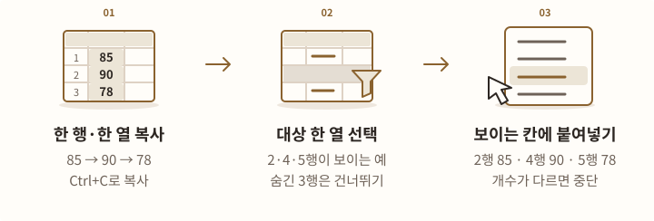
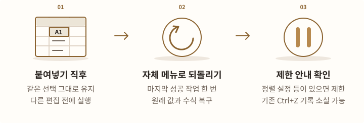

# 보이는 칸 붙여넣기 설치·사용

Excel에서 복사한 값을 **선택한 한 열의 보이는 칸에만** 순서대로 넣습니다. 필터로 가려진 행과 직접 숨긴 행은 건너뜁니다. 복사한 값과 대상 칸의 개수가 다르면 아무 셀도 바꾸지 않습니다.

## 프로그램 받기 {#download}

<!-- tool-figure:visible-paste-download:start -->
<figure class="tool-figure">
  <picture>
    <source media="(max-width: 600px)" srcset="../../assets/tool-guides/visible-paste-download-mobile.svg" width="360" height="432">
    
  </picture>
  <figcaption>설명용 도해 배포 목록에서 보이는 칸 붙여넣기 버전을 고르고 Setup.exe를 받으세요. ZIP을 제공하는 배포에서는 ZIP 방식도 사용할 수 있습니다.</figcaption>
</figure>
<!-- tool-figure:visible-paste-download:end -->

**보이는 칸 붙여넣기** · Windows PC에 설치된 Excel용 · 실행에 필요한 .NET Framework 4.8 사용

[배포 파일 목록](https://github.com/prozac0401/Workspace/releases){ .md-button .md-button--primary }

배포 목록에서 **보이는 칸 붙여넣기** 버전을 선택한 뒤, 설치 파일이 모인 **Assets**에서 `VisibleCellsPaste-버전-Setup.exe`를 받습니다. ZIP 방식이 필요한 경우 `VisibleCellsPaste_버전.zip`을 제공하는 배포를 선택할 수 있습니다.

웹용 Excel과 Mac용 Excel에서는 사용할 수 없습니다. 여러 열 붙여넣기는 지원하지 않습니다. 아래 [지원 범위](#supported)와 [되돌리기 조건](#undo)을 먼저 확인하세요.

설치 파일에는 제작자를 확인하는 전자 서명이 없습니다. 회사에서 서명된 추가 기능이나 사전 승인을 요구하면 담당자의 배포 절차를 따르세요. 설치 프로그램은 Office 보안 정책을 바꾸지 않습니다.

## 설치하기 {#install}

<!-- tool-figure:visible-paste-install:start -->
<figure class="tool-figure">
  <picture>
    <source media="(max-width: 600px)" srcset="../../assets/tool-guides/visible-paste-install-mobile.svg" width="360" height="432">
    
  </picture>
  <figcaption>설명용 도해 설치는 한 번만 하면 됩니다. 이후 Excel을 평소처럼 실행해 셀 우클릭 메뉴를 사용합니다.</figcaption>
</figure>
<!-- tool-figure:visible-paste-install:end -->

1. 열려 있는 Excel 문서를 저장하고 모든 Excel을 종료합니다.
2. 받은 **Setup.exe**를 실행합니다.
3. 설치 안내를 확인합니다. 설치 프로그램이 Excel의 32·64비트를 확인하고 맞는 파일을 설치합니다.
4. 평소처럼 Excel을 실행합니다. 셀을 우클릭하면 **보이는 칸에 붙여넣기**와 **마지막 붙여넣기 되돌리기**가 나타납니다.

ZIP 방식은 모든 파일을 한 폴더에 푼 뒤 **Install.cmd**를 실행합니다. 파일 일부만 따로 옮기지 마세요.

현재 Windows 사용자 계정에 설치하며 기본 위치는 `%LOCALAPPDATA%\VisibleCellsPaste`입니다. 관리자 권한이나 개발용 프로그램은 필요하지 않습니다. 명령을 직접 써 넣거나 따로 실행할 필요는 없습니다. 설치 후 Excel을 열면 사용할 준비가 됩니다.

설치 중 Excel이 실행 중이라는 안내가 나오면 설치를 멈춥니다. 화면에 창이 없어도 Excel이 뒤에서 실행 중이면 같은 안내가 나올 수 있습니다. 문서를 저장하고 Excel이 정상 종료된 뒤 다시 실행하세요. 설치 프로그램이 Excel을 강제로 닫지는 않습니다.

## 보이는 칸에 값 넣기 {#paste}

<!-- tool-figure:visible-paste-use:start -->
<figure class="tool-figure">
  <picture>
    <source media="(max-width: 600px)" srcset="../../assets/tool-guides/visible-paste-use-mobile.svg" width="360" height="432">
    
  </picture>
  <figcaption>설명용 도해 복사한 값 3개를 보이는 대상 3칸에 위에서 아래로 넣습니다. 숨긴 행은 유지하며 이름이나 사번을 찾아 연결하지 않습니다.</figcaption>
</figure>
<!-- tool-figure:visible-paste-use:end -->

1. 원본 Excel에서 **한 행 또는 한 열**을 선택하고 **Ctrl+C**로 복사합니다. 원본 Excel은 열어 둡니다.
2. 대상에서 값을 넣을 **한 열의 연속된 범위**를 선택합니다. 필터나 행 숨김을 적용한 상태로 선택하면 됩니다.
3. 선택한 범위 안을 우클릭하고 **보이는 칸에 붙여넣기**를 누릅니다.
4. 기존 수식을 덮어쓰거나 빈칸으로 내용을 지우는 경우에는 안내된 개수를 확인하고 진행합니다.

가로로 복사한 한 행도 위에서 아래로 입력합니다. 스크롤 아래에 있어 화면에 안 보이는 셀은 숨긴 셀이 아니므로 대상에 포함됩니다.

예를 들어 `85, 90, 78`을 복사하고 아래 네 행을 선택하면 다음과 같이 들어갑니다.

| 대상 행 | 상태 | 붙여넣은 뒤 |
|---|---|---|
| 2행 | 보임 | 85 |
| 3행 | 숨김 | 기존 값 유지 |
| 4행 | 보임 | 90 |
| 5행 | 보임 | 78 |

원본 3개와 보이는 대상 2개를 선택하면 중단합니다. 한 값을 여러 칸에 반복하거나 선택 범위를 자동으로 늘리지 않습니다.

**복사한 순서대로 입력합니다.** 이름이나 사번을 찾아 연결하지 않습니다. 원본과 대상의 개수가 같아도 사람의 순서까지 일치한다는 뜻은 아닙니다.

## 값과 표시 형식 {#values}

<!-- tool-figure:visible-paste-values:start -->
<figure class="tool-figure">
  <picture>
    <source media="(max-width: 600px)" srcset="../../assets/tool-guides/visible-paste-values-mobile.svg" width="360" height="432">
    
  </picture>
  <figcaption>설명용 도해 빈칸·숫자·문자열의 위치와 값을 보존합니다. 날짜 숫자와 대상 서식을 그대로 쓰므로 원본과 표시가 달라질 수 있습니다.</figcaption>
</figure>
<!-- tool-figure:visible-paste-values:end -->

- 숫자, 글자, 참·거짓, 빈칸과 지원하는 Excel 오류값을 처리합니다. `00123` 같은 글자 값, 긴 식별번호, 셀 안의 줄바꿈을 유지합니다.
- 수식은 **복사된 계산 결과**를 넣습니다. 수식 자체를 옮기거나 원본을 다시 계산하지 않습니다.
- 실제 빈칸도 한 항목으로 셉니다. 처음·가운데·마지막의 빈칸은 대응하는 대상의 내용을 비웁니다. 수식 `=""`처럼 아무 글자도 보이지 않는 결과도 한 항목으로 셉니다. 이 결과는 붙여넣을 때 실제 빈칸으로 저장될 수 있습니다.
- 대상의 숫자 표시 형식, 글꼴, 배경, 테두리와 조건부 서식을 유지합니다. 원본의 표시 형식을 복사하지 않습니다.
- 날짜·시간·백분율은 원래 숫자 값을 사용합니다. 날짜·시간의 숫자 값을 복사 정보에서 안전하게 확인할 수 없으면 중단합니다. 대상의 표시 형식에 따라 보이는 모양은 달라질 수 있으며, 날짜를 숫자로 바꾸는 기준 연도가 1900년 또는 1904년으로 다를 때 그 차이를 자동으로 고치지는 않습니다.
- 실제 숫자 `123`이 표시 형식 때문에 `00123`으로 보이는 경우, 넣는 값은 숫자 `123`입니다. 글자 `00123`과는 다릅니다.

값의 종류나 빈칸을 포함한 개수를 안전하게 읽을 수 없으면 중단합니다. 일반 텍스트를 숫자나 날짜로 추측해서 바꾸지 않습니다.

## 지원 범위 {#supported}

<!-- tool-figure:visible-paste-limits:start -->
<figure class="tool-figure">
  <picture>
    <source media="(max-width: 600px)" srcset="../../assets/tool-guides/visible-paste-limits-mobile.svg" width="360" height="432">
    
  </picture>
  <figcaption>설명용 도해 지원하지 않는 범위는 쓰기 전에 중단합니다. 항목 수 외에도 선택 범위·복사 데이터 크기·보이는 구간 수의 상한이 있습니다.</figcaption>
</figure>
<!-- tool-figure:visible-paste-limits:end -->

원본은 Excel에서 **Ctrl+C로 복사한 한 행 또는 한 열**이어야 합니다. 다른 Excel 파일이나 다른 Excel 창에서 복사할 수 있으며, 필터된 원본은 실제로 복사된 항목을 사용합니다. 대상은 한 열의 연속된 선택 범위 안에서 보이는 칸입니다.

다음 범위는 처리하지 않습니다.

- 여러 행과 여러 열로 된 원본, 잘라내기.
- 여러 열 대상, 전체 행·열 선택, 직접 만든 여러 영역 선택, 숨긴 대상 열.
- 합쳐진 칸, 여러 칸에 결과를 함께 표시하는 수식, 자료를 모아 합계·평균 등으로 요약하는 표, 입력할 값을 제한하는 규칙이 있는 대상.
- 수정을 막아 둔 시트, 읽기 전용 파일, 보안을 위해 편집이 제한된 보기, 여러 시트를 함께 선택한 상태.
- 웹 표·일반 텍스트·그림·파일 복사, 지원하지 않는 새로운 오류 종류(예: `#SPILL!`, `#CALC!`).

표에서는 값만 있는 데이터 열을 사용합니다. 같은 표 열의 숨긴 행에 수식이 있어도 중단합니다. 일반 셀의 기존 수식을 값으로 바꿀 때는 실행 전에 확인합니다. 다른 프로그램이나 추가 기능이 동시에 셀·행·정렬을 변경하는 동안에는 사용하지 마세요.

한 번에 원본과 보이는 대상 각각 **50,000개**, 선택 범위 **200,000칸**, 숨김으로 나뉜 구간 **20,000개**, 복사한 내용 **32 MiB**까지 처리합니다. 5,000칸 또는 1,000구간부터 진행 여부를 확인합니다. 숨긴 행이 번갈아 많으면 같은 개수의 연속 범위보다 오래 걸릴 수 있습니다.

## 마지막 작업 되돌리기 {#undo}

<!-- tool-figure:visible-paste-undo:start -->
<figure class="tool-figure">
  <picture>
    <source media="(max-width: 600px)" srcset="../../assets/tool-guides/visible-paste-undo-mobile.svg" width="360" height="432">
    
  </picture>
  <figcaption>설명용 도해 최근 한 번만 자체 메뉴로 되돌립니다. 선택·편집·정렬 상태 등에 따라 제한되며, 파일을 닫은 뒤에는 복구할 수 없습니다.</figcaption>
</figure>
<!-- tool-figure:visible-paste-undo:end -->

붙여넣은 직후 **같은 범위를 유지한 채** 우클릭하고 **마지막 붙여넣기 되돌리기**를 누릅니다. 이 도구로 마지막에 성공한 작업 한 번의 값과 수식을 복원합니다.

되돌릴 기록은 현재 Excel이 켜져 있는 동안만 보관합니다. 다음 상황에서는 되돌리기가 제한됩니다.

- 선택 범위·시트·Excel 파일을 바꾸거나 셀을 편집한 뒤.
- 행 삽입·삭제·정렬 등 구조를 바꾸거나 파일을 닫은 뒤.
- Excel을 다시 시작했거나 안전하게 같은 위치인지 확인할 수 없을 때.
- **기존 정렬 설정이 남아 있는 시트 또는 표.** 이 경우 방금 붙여넣었어도 되돌리기를 제공하지 않습니다.

이 도구로 값을 쓰면 Excel의 기존 **Ctrl+Z 기록이 지워질 수 있습니다.** 방금 실행한 작업은 이 도구의 **마지막 붙여넣기 되돌리기** 메뉴로 복구하세요. 파일을 닫은 뒤에도 남는 백업 기능은 아닙니다.

쓰기 도중 문제가 생기면 작업 전 상태로 복구를 시도합니다. 복구를 끝까지 확인하지 못하면 영향 범위와 오류를 알리고 후속 붙여넣기를 막습니다. 프로그램이 파일을 자동 저장하지 않으므로 안내를 확인하고 원본과 비교하세요.

## 업데이트·제거 {#remove}

<!-- tool-figure:visible-paste-maintenance:start -->
<figure class="tool-figure">
  <picture>
    <source media="(max-width: 600px)" srcset="../../assets/tool-guides/visible-paste-maintenance-mobile.svg" width="360" height="432">
    
  </picture>
  <figcaption>설명용 도해 업데이트와 제거 전에 Excel을 저장하고 종료하세요. 이 도구의 자동 로드 등록과 소유 파일을 정리합니다.</figcaption>
</figure>
<!-- tool-figure:visible-paste-maintenance:end -->

업데이트할 때는 Excel을 저장·종료하고 새 **Setup.exe**를 실행합니다. 기존 ZIP으로 설치했어도 같은 방식으로 업데이트합니다.

제거할 때는 Excel을 저장·종료한 뒤 Windows의 설치된 앱에서 **보이는 칸 붙여넣기**를 제거합니다. ZIP의 **Uninstall.cmd** 또는 설치 EXE의 `--uninstall`로도 제거할 수 있습니다. 이 도구의 자동 실행 설정과 프로그램 파일을 정리합니다. Excel 파일, 다른 추가 기능, PERSONAL.XLSB와 Office 보안 설정은 지우지 않습니다. 외부에서 바꾼 파일이 남았다는 안내가 나오면 내용을 확인하세요.

## 막혔을 때 {#help}

<!-- tool-figure:visible-paste-troubleshooting:start -->
<figure class="tool-figure">
  <picture>
    <source media="(max-width: 600px)" srcset="../../assets/tool-guides/visible-paste-troubleshooting-mobile.svg" width="360" height="432">
    
  </picture>
  <figcaption>설명용 도해 안내 문구에 맞춰 선택 범위와 복사한 내용을 확인하세요. 문의할 때 이름·명단·수식·업무 파일을 공개하지 마세요.</figcaption>
</figure>
<!-- tool-figure:visible-paste-troubleshooting:end -->

| 안내 또는 상황 | 다음에 할 일 |
|---|---|
| 메뉴가 없어요 | Excel을 완전히 종료한 뒤 다시 여세요. Excel의 **파일 → 옵션 → 추가 기능 → 관리: COM 추가 기능**에서 **보이는 칸 붙여넣기**를 확인하세요. 조직이 사용을 차단했다면 담당자에게 문의하세요. |
| 원본과 대상 개수가 다르대요 | 빈칸도 한 항목입니다. 복사 범위와 선택 범위를 다시 확인하세요. 숨긴 대상 행은 개수에서 빠집니다. |
| 복사 내용을 읽을 수 없대요 | 원본 Excel을 열어 둔 채 한 행 또는 한 열을 Ctrl+C로 다시 복사하세요. 지원 범위에 해당하는지도 확인하세요. |
| 표나 셀을 처리할 수 없대요 | 병합, 보호, 입력할 값을 제한하는 규칙, 여러 셀에 결과를 함께 표시하는 수식과 표 열의 수식 여부를 확인하세요. |
| 되돌리기를 할 수 없대요 | 선택·편집·정렬·파일 전환 여부와 기존 정렬 설정을 확인하세요. 조건이 달라졌으면 도구가 이전 위치에 강제로 쓰지 않습니다. |
| 설치·제거가 중단돼요 | 문서를 저장하고 Excel이 정상 종료됐는지 확인한 뒤 다시 실행하세요. |

추가 기능 차단을 풀기 위해 자동으로 작업하는 모든 기능을 허용하거나, 개발용 설정을 켜거나, 실행을 허용하는 폴더를 늘릴 필요는 없습니다. 회사 보안 기준에 따라 설치하세요.

문의할 때는 Windows·Excel 버전, 실행 순서와 오류 표시를 알려 주세요. 이름·명단·수식·복사한 내용과 업무 파일을 공개 게시물에 첨부하지 마세요. 이 도구는 외부 서비스에 연결하거나 사용 통계를 보내지 않습니다.
