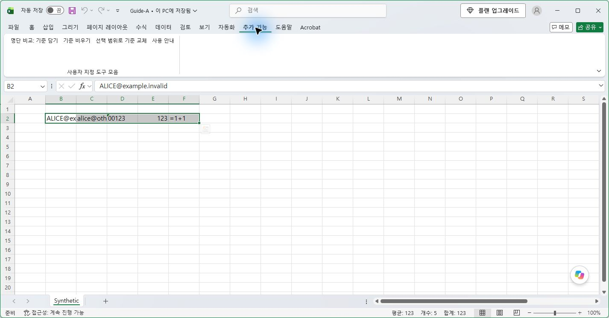
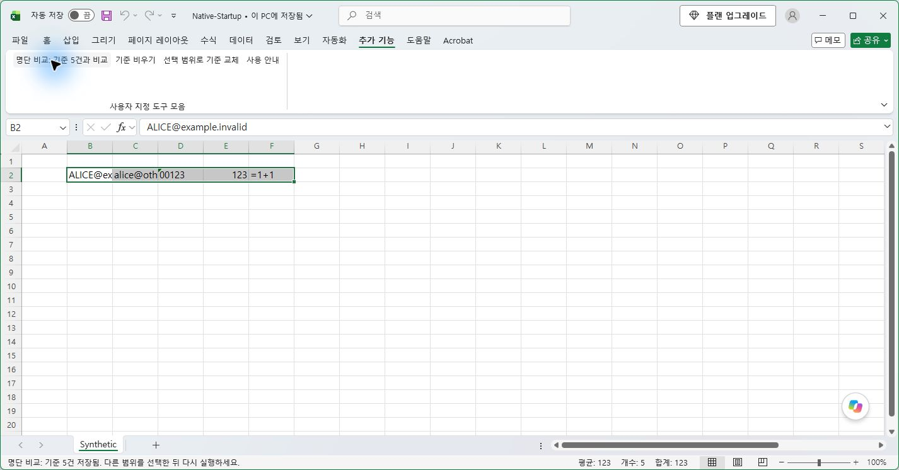
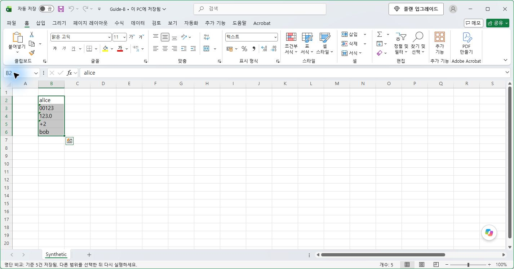
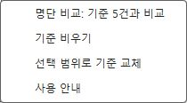
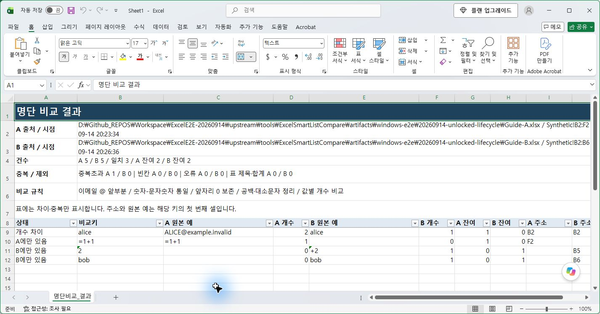
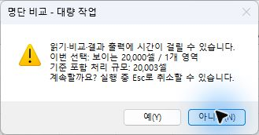
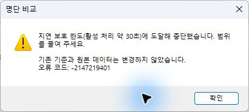
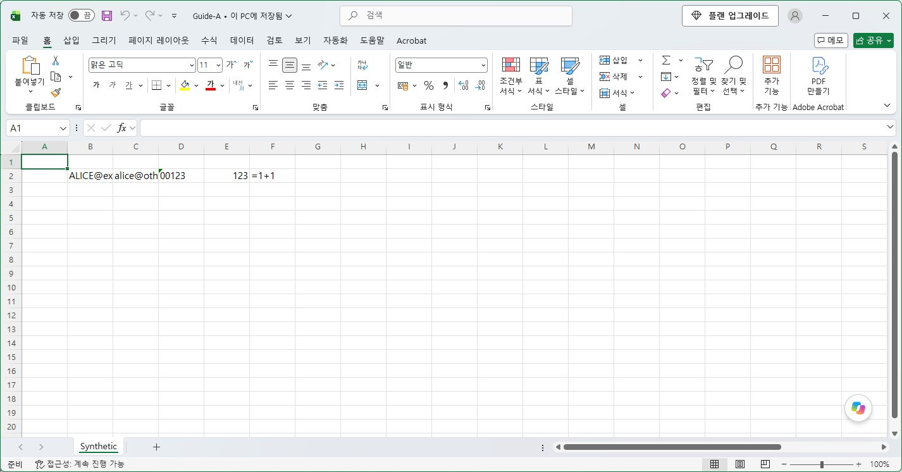

# Excel 명단 비교 사용 안내

**첫 번째 목록을 담고, 두 번째 목록을 선택해 비교합니다.** 가로·세로 방향이나 비교 모드를 따로 고를 필요는 없습니다.

**RC9 제한 평가판 · LIMITED EVALUATION** 안내입니다. 사용자의 현재 상태 배포 요청에 따라 준비하며 실제 게시는 아직 확인 전입니다. 용량 14조건·선택 14조건·실제 메뉴 5동작은 확인했지만 전체 인수는 NOT_MET입니다. 상태표시줄 복원 실패, 바꾸기 100ms의 부분 취소 확인, 자동 로드·전체 창 전환·새 EXE 설치 수명주기 미검증을 남깁니다. [설치·사용과 제한](RELEASE_README.md) · [실제 검증 기록](RC9_APPROVED_RETEST_20260917.md)

실제 확인 환경은 Windows 11의 Excel 16.0.20326.20144 64비트입니다. 48자 고유값 각 20,000개와 동일값 각 100,000개는 완료됐지만, 고유값 각 50,000·100,000개는 약 30초 처리 제한으로 중단됐습니다. 입력 100,000셀 상한이 그 크기까지의 완료 보장은 아닙니다. 32비트 Office와 다른 PC·정책 환경은 미검증입니다.

아래 사진은 문구 변경 전 RC1·RC3의 Windows 11, 데스크톱 Excel 64비트 화면입니다. 사진의 ‘기준’과 ‘A/B’는 지금 안내의 ‘첫 번째 목록 / 두 번째 목록’에 해당합니다. 이번 문구로 실행한 화면은 아닙니다.

## 1. 설치하기

1. 작업 중인 파일을 저장하고 Excel 창을 모두 닫습니다.
2. EXE 설치 파일을 받았다면 실행한 뒤 **설치**를 누릅니다. ZIP을 받았다면 압축을 모두 풀고 `Release` 폴더의 **Install.cmd**를 실행합니다.
3. 설치가 끝나면 Excel을 엽니다.
4. **추가 기능** 탭에 명단 비교 버튼이 있는지 확인합니다.

자세한 설치·업데이트·제거 방법은 [설치 안내](ONEFILE_INSTALLATION.md)를 확인하세요. 이번 교정 소스를 새 설치 파일로 배포했다는 뜻은 아닙니다.

복구 진단 충돌 뒤 시험 PC에 창 없는 Excel 프로세스가 남아 설치 보호가 작동합니다. 이 상태에서는 모든 창을 닫아도 설치가 계속 막힐 수 있습니다. 반복 설치나 보호 해제를 시도하지 마세요. 새 EXE로 위 설치·자동 시작 절차를 검증한 것은 아닙니다.

## 2. 첫 번째 목록 담기

비교할 **값이 들어 있는 셀**을 선택합니다. 일반 범위의 제목은 빼고 선택하세요. 예시는 가로 범위 `B2:F2`입니다.

**추가 기능 → 첫 번째 목록 담기**를 누릅니다. 버튼이 **두 번째 목록 담아 비교**로 바뀌고 옆에 **첫 번째 목록: 5개 항목**이 표시되면 값 5개를 담은 것입니다.

‘목록’은 선택한 셀 전체, ‘항목’은 그 안의 값 하나입니다. 빈칸·오류·표의 제목과 합계 등은 비교에서 빼고 개수를 표시합니다. 같은 값이 여러 셀에 있으면 각각 한 항목으로 셉니다.

담은 값은 나중에 원본을 고쳐도 바뀌지 않습니다. 다른 파일을 같은 Excel에 열어 둔 상태라면 첫 번째 파일을 닫아도 목록은 남습니다. Excel을 완전히 종료하면 사라집니다.

## 3. 두 번째 목록 비교하기

두 번째 목록의 셀을 선택하고 **두 번째 목록 담아 비교**를 누릅니다. 같은 Excel에서 다른 파일을 열어 비교해도 됩니다. 예시는 세로 범위 `B2:B6`입니다.

셀을 오른쪽 클릭한 뒤 **명단 비교** 메뉴에서도 실행할 수 있습니다. 메뉴를 열면 첫 번째 목록을 담았는지와 항목 수를 확인할 수 있습니다.

Ctrl 키로 여러 곳을 선택하면 그 전체가 하나의 목록입니다. 두 열을 선택했다고 자동으로 두 목록으로 나누지는 않습니다. 별도로 실행한 Excel끼리는 첫 번째 목록을 공유하지 않습니다.

## 4. 결과 확인하고 저장하기

차이·중복·오류가 있으면 새 결과 파일이 열립니다. 모두 같고 중복·오류도 없으면 같다는 안내만 나옵니다.

| 결과표의 문구 | 뜻 |
|---|---|
| 비교에 쓴 값 | 공백 등을 정리한 뒤 실제로 비교한 값 |
| 원래 값 (예) | 해당 값이 처음 나온 셀의 원래 값 |
| 첫 번째 목록 개수 / 두 번째 목록 개수 | 각 목록에서 해당 값이 나온 횟수 |
| 남은 개수 | 같은 값끼리 하나씩 짝지은 뒤 남는 수 |
| 셀 주소 | 해당 값이 처음 나온 셀의 위치 |
| 첫 번째 목록에만 있음 / 두 번째 목록에만 있음 | 한쪽 목록에만 있는 값 |

예를 들어 `alice`가 첫 번째 목록에 2개, 두 번째 목록에 1개라면 **첫 번째 목록에 1개가 남습니다**. ‘남은 개수’에는 이런 중복 개수 차이도 포함됩니다.

결과 위쪽에는 목록을 가져온 파일·범위, 담은 시각과 제외한 셀 수가 나옵니다. 필요하면 결과 파일을 원하는 위치에 직접 저장하세요. 원본과 이전 결과 파일은 덮어쓰지 않습니다.

메일 주소는 `@` 앞부분만 비교하므로 뒷부분이 달라도 같다고 나올 수 있습니다. 텍스트 `00123`은 숫자 `123`과 다릅니다. 필터에서 제외되거나 숨긴 셀은 읽지 않습니다. [전체 비교 규칙](../README.md)

## 5. 담아 둔 목록 비우거나 바꾸기

- **첫 번째 목록 비우기:** 기억해 둔 목록과 개수 표시를 비웁니다. 원본 셀은 지우지 않습니다.
- **첫 번째 목록 바꾸기:** 현재 선택한 셀로 첫 번째 목록을 다시 담습니다.

비교를 마치면 **첫 번째 목록 담기**로 돌아갑니다.

## 6. 목록이 크거나 멈추고 싶을 때

큰 목록은 값을 읽기 전에 계속할지 묻습니다. 기본 선택은 **아니요**입니다. 아니요를 눌러도 이미 담아 둔 첫 번째 목록은 남습니다.

**RC8에서는 Esc를 눌러도 작업이 취소되지 않을 수 있습니다.** 실제 시험에서 목록 바꾸기가 그대로 끝난 사례도 있습니다. 처리 중에는 원본을 편집하지 말고 기다리세요. 처음부터 범위를 나누어 비교하는 것이 좋습니다.

작업을 멈췄다는 안내가 나온 뒤 다시 실행하세요. 병합된 셀이나 제한보다 긴 값이 있으면 범위를 다시 선택해야 합니다. 100,000셀은 선택할 수 있는 상한이며, 그 크기의 목록이 항상 끝까지 비교된다는 뜻은 아닙니다. 시간이 오래 걸리면 중간 점검에서 중단할 수 있습니다.

취소가 실제로 처리되거나 오류로 중단되면 이미 담아 둔 첫 번째 목록을 유지하도록 만들었습니다. 다만 **Esc를 눌렀다는 사실만으로 취소됐다고 판단하면 안 됩니다.** 현재 실패 사례와 원본 보존 확인 범위는 [RC8 시험 결과](RC8_COMPLETION_REPORT.md)에 있습니다.

## 7. 프로그램 제거하기

파일을 저장하고 Excel 창을 모두 닫습니다. EXE로 설치했다면 **Windows 설정 → 앱 → 설치된 앱 → Excel 명단 비교 → 제거**를 선택하세요. ZIP으로 설치했다면 제공된 **Uninstall.cmd**를 실행합니다.

업무 파일, 다른 추가 기능, 설치 폴더에 사용자가 따로 넣은 파일은 남깁니다. 이 제품이 등록한 신뢰 위치도 다른 곳에서 바뀌었다면 그대로 둡니다. [설치 안내](ONEFILE_INSTALLATION.md)

이전 화면은 새 문구와 새 파일의 검증 결과를 대신하지 않습니다. Excel VBA 실행 후 기본 실행 취소 기록은 유지되지 않을 수 있습니다.
