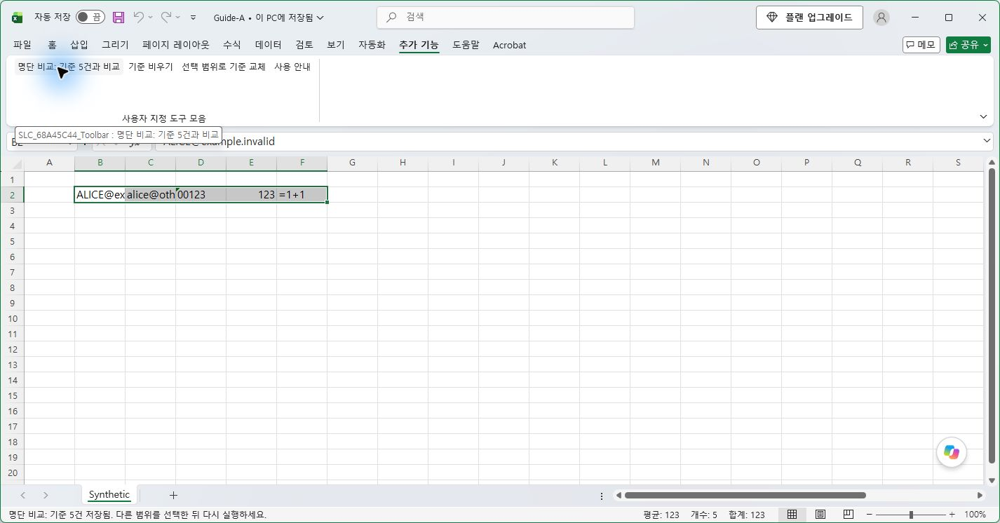
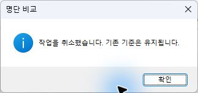

# Excel 명단 비교 · 설치부터 사용까지

버전: 0.2.0 RC1 평가용 · 확인 환경: Windows 11 / 데스크톱 Excel 64비트

선택한 첫 범위를 기준으로 담고 다음 범위와 비교합니다. 가로·세로·비교 모드를 선택할 필요가 없습니다. 아래는 2026-09-14 실제 Excel과 합성 시험 파일에서 촬영한 화면입니다.

## 1. 설치

1. Excel용 Release ZIP을 내려받아 **모두 압축 풀기**를 합니다.
2. 업무를 저장하고 Excel 창을 모두 닫습니다.
3. 풀린 `Release` 폴더의 **Install.cmd**를 실행하고 이 제품 설치를 확인합니다.
4. 완료 메시지를 확인한 뒤 Excel을 엽니다. **추가 기능** 탭에 명단 비교 버튼이 나타납니다.

현재 사용자에게 설치하며 관리자 권한, Python, VBA 편집기 접근은 필요하지 않습니다. 설치 위치는 `%LOCALAPPDATA%\ExcelSmartListCompare`입니다. 서명되지 않은 평가용 후보이므로 조직에서 매크로나 설치 스크립트를 막으면 승인된 배포 절차를 이용합니다. 매크로 알림이 나타나면 파일의 출처와 조직 정책을 확인한 뒤 이 제품에 대한 실행을 결정합니다.

설치 명령과 자동 로드는 실제 실행했습니다. 설치 확인창 자체의 버튼·캡처는 이 가이드의 검증 범위에 포함하지 않습니다. Excel이 열려 있다는 메시지가 나오면 저장·종료하고 몇 초 뒤 다시 실행합니다.

## 2. 첫 번째 명단 담기

비교할 **값만** 선택합니다. 일반 범위의 제목은 빼고 선택하세요. 예시는 가로 범위 `B2:F2`입니다.

**추가 기능 → 명단 비교: 기준 담기**를 누릅니다. 버튼이 **기준 5건과 비교**로 바뀌면 저장된 것입니다.

기준은 그 시점의 값입니다. 첫 파일을 닫아도 같은 Excel 실행 세션에서는 남아 있습니다. Excel을 완전히 종료하면 사라집니다.

## 3. 두 번째 명단 비교

같은 Excel에서 다른 파일이나 시트를 열고 비교할 범위를 선택합니다. 예시는 세로 범위 `B2:B6`입니다.

추가 기능 탭의 **명단 비교: 기준 n건과 비교**를 누릅니다. 또는 선택 셀을 우클릭하고 **명단 비교** 메뉴에서 같은 명령을 고릅니다.

독립적으로 실행한 다른 Excel 프로세스는 기준을 공유하지 않습니다. 두 번째 파일의 버튼이 **기준 담기**라면 같은 Excel 세션에서 파일을 다시 여세요. 여러 영역은 Ctrl로 선택할 수 있으며 선택 전체가 하나의 명단입니다.

## 4. 결과 읽기와 저장

차이·중복·오류가 있으면 별도의 결과 통합문서가 생깁니다. 완전히 같은 명단이면 일치 안내만 나타날 수 있습니다.

- **A/B 건수, 일치, 잔여**: 값뿐 아니라 같은 값이 몇 번 있었는지도 비교합니다.
- **A/B 개수**: 예시의 `alice`는 A에 2번, B에 1번 있습니다.
- **원본 예·주소**: 그 값이 처음 나타난 위치입니다. 출처와 기준을 담은 시각도 위에 표시됩니다.
- 결과가 필요하면 새 통합문서를 원하는 위치에 저장합니다. 원본과 이전 결과는 덮어쓰지 않습니다.

이메일은 `@` 앞 ID로 비교하므로 도메인이 달라도 같을 수 있습니다. 텍스트 `00123`은 숫자 `123`과 다릅니다. 필터로 제외되거나 숨긴 셀은 읽지 않습니다.

## 5. 기준 바꾸기와 작업 취소

**기준 비우기**는 저장한 기준을 없앱니다. **선택 범위로 기준 교체**는 현재 선택을 새 기준으로 담습니다.

20,000셀 이상 규모의 작업은 읽기 전에 확인합니다. 기본 선택은 **아니요**이며 거절해도 기준은 남습니다.

처리 중에는 원본을 편집하지 말고 기다리세요. 멈추려면 **Esc**를 누릅니다. 취소 응답은 Excel이 제어권을 돌려주는 체크포인트에서 처리됩니다.

병합 셀, 너무 긴 텍스트, 안전 상한을 넘는 선택은 중단합니다. 범위를 줄여 다시 실행하세요. 오류나 취소 후에도 기존 기준이 유지됩니다.

## 6. 재설치·제거

Excel을 모두 닫은 뒤 새 Release의 **Install.cmd**를 실행하면 재설치합니다. 같은 메뉴가 여러 세트 생기지 않는지 다음 시작에서 확인하세요.

제거는 Release 폴더 또는 설치 폴더의 **Uninstall.cmd**를 실행하고 제품 제거를 확인합니다. 이후 Excel을 다시 열면 이 제품 메뉴가 사라집니다. 업무 파일과 다른 추가 기능, 설치 폴더에 별도로 추가한 파일은 남습니다.

시험 종료 시에는 설치와 임시 빌드 권한을 시작 전 상태로 복구했습니다. 지원 범위와 남은 미검증 항목은 [실제 Windows 테스트 보고서](WINDOWS_E2E_REPORT.md)를 확인하세요. Excel VBA 실행 이후 기본 실행 취소(Undo) 기록 보존은 보장하지 않습니다.
