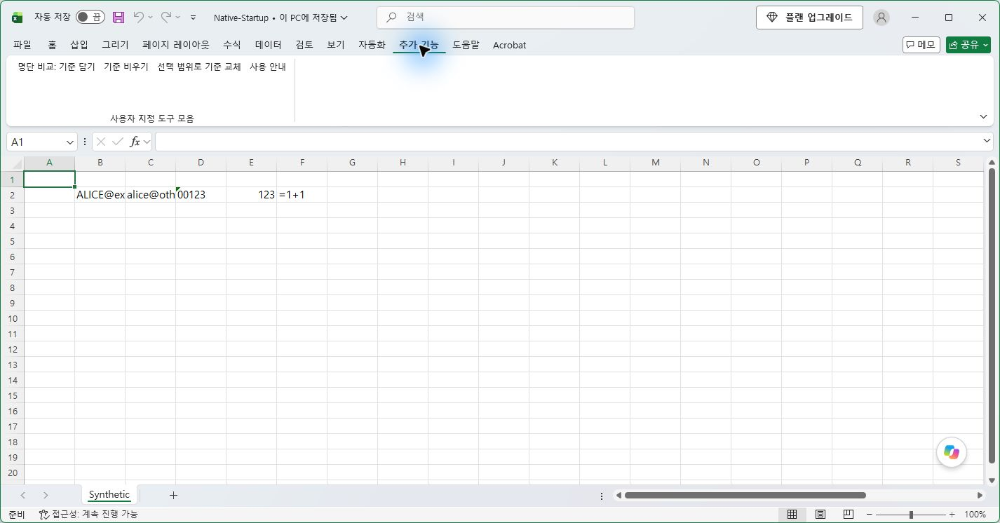

# Excel 명단 비교 · 설치부터 사용까지

버전: 0.2.0 RC6 · 기존 캡처 환경: RC1·RC3의 Windows 11 / 데스크톱 Excel 64비트

첫 번째 목록을 선택하고 **[첫 번째 목록 담기]**를 누르세요.
이어서 두 번째 목록을 선택하고 **[두 번째 목록 담아 비교]**를 누르세요.

**목록**은 선택한 셀 전체, **항목**은 그 안의 값 하나입니다. 가로·세로·비교 모드를 선택할 필요가 없습니다.

아래 실제 캡처는 문구 변경 전 RC1·RC3 화면입니다. 캡처의 ‘기준’ 및 ‘A/B’는 현재의 ‘첫 번째 목록 / 두 번째 목록’에 해당합니다. RC6는 두 파일의 창을 옮길 때도 담긴 목록과 메뉴 상태를 동기화합니다. 잠긴 데스크톱에서 메뉴·상태·결과 값을 자동 검사했으며, 새 화면의 육안 확인·클릭과 실제 Esc 입력은 미실행입니다. [RC6 검증 범위](WINDOW_STATE_REPORT.md)를 확인하세요.

## 1. 설치

1. Excel용 Release ZIP을 내려받아 **모두 압축 풀기**를 합니다.
2. 업무를 저장하고 Excel 창을 모두 닫습니다.
3. 풀린 `Release` 폴더의 **Install.cmd를 더블클릭**하고 이 제품 설치를 확인합니다. RC4부터 PowerShell 명령 입력 없이 설치 준비를 처리합니다.
4. 완료 메시지를 확인한 뒤 Excel을 엽니다. **추가 기능** 탭에 명단 비교 버튼이 나타납니다.

**이전 버전이 있어도 새 Release의 Install.cmd만 실행하세요.** RC6는 설치된 RC1~RC5를 감지하고, 한 번의 설치 확인으로 이전 제품 파일과 자동 실행 등록을 제거한 뒤 새 버전을 설치합니다. 같은 버전은 다시 설치합니다. 설치 도중 오류가 나면 이전 파일과 등록을 복구하며, 더 최신 버전이나 알 수 없는 설치 기록은 덮어쓰지 않습니다. [업데이트 검증 기록](UPGRADE_REPORT.md)

현재 사용자에게 설치하며 관리자 권한, Python, VBA 편집기 접근은 필요하지 않습니다. 설치 위치는 `%LOCALAPPDATA%\ExcelSmartListCompare`입니다. **RC2부터 설치 명령이 이 폴더를 Excel 신뢰 위치로 자동 등록합니다. 하위 폴더는 포함하지 않습니다.** 이 폴더의 파일은 매크로 알림 없이 실행될 수 있으므로 제품 파일만 보관하세요.

RC3는 설치 파일이 다른 경로로 리디렉션되는 환경을 감지하면 설치를 되돌리고 안내합니다(종료 코드 6). 이 경우 일반 Windows 파일 탐색기에서 압축을 푼 `Release\Install.cmd`를 실행하세요. 설치 성공 후 Excel을 완전히 종료했다가 다시 시작해 버튼이 표시되는지 확인합니다.

RC4 실행기는 그룹 정책과 유효 `AllSigned` 설정이 없으면 `Setup.ps1` 한 파일의 다운로드 차단 표시를 해제하고 설치 프로세스에만 `RemoteSigned`를 적용합니다. 영구 실행 정책은 바꾸지 않으며 설치·제거 확인창은 유지합니다. 그룹 정책이나 `AllSigned`가 있으면 그 설정을 따릅니다. [RC4 실행기 검증](WINDOWS_LAUNCHER_REPORT.md)은 아래 RC3 Excel 실기 기록과 구분합니다.

일반 데스크톱 환경에서의 RC3 재검증과 대용량 제한은 [RC3 실제 검증 보고서](WINDOWS_ROBUSTNESS_REPORT.md)를 참고하세요.

신뢰 위치를 차단하는 회사 정책이 있으면 설치가 중단되고 안내가 나옵니다. 서명되지 않은 평가용 후보이므로 IT의 승인된 배포 절차를 이용하세요. 모든 매크로 허용이나 회사 정책을 설치기가 변경하지 않습니다.

설치 명령과 자동 로드는 실제 실행했습니다. 설치 확인창 자체의 버튼·캡처는 이 가이드의 검증 범위에 포함하지 않습니다. Excel이 열려 있다는 메시지가 나오면 저장·종료하고 몇 초 뒤 다시 실행합니다.

## 2. 첫 번째 목록 담기

비교할 **값만** 선택합니다. 일반 범위의 제목은 빼고 선택하세요. 예시는 가로 범위 `B2:F2`입니다.

**추가 기능 → 첫 번째 목록 담기**를 누릅니다. 버튼이 **두 번째 목록 담아 비교**로 바뀌고 옆에 **첫 번째 목록: 5개 항목**이 표시되면 담긴 것입니다. 상태표시줄에도 같은 개수가 표시됩니다. 빈칸·오류·표 제목/합계 등 제외 규칙을 적용한 비교값의 개수이며, 여러 셀의 같은 값도 각각 한 항목으로 셉니다.

담은 첫 번째 목록은 그 시점의 값입니다. 두 번째 파일을 같은 Excel에 먼저 열어 둔 뒤에는 첫 파일을 닫아도 남아 있습니다. Excel을 완전히 종료하면 사라집니다.

## 3. 두 번째 목록 담아 비교

첫 번째 목록을 담은 Excel의 **파일 → 열기(Ctrl+O)**에서 두 번째 파일을 열고 비교할 범위를 선택합니다. 이미 같은 Excel에 열린 파일이라면 해당 창으로 옮기면 됩니다. 예시는 세로 범위 `B2:B6`입니다.

추가 기능 탭의 **두 번째 목록 담아 비교**를 누릅니다. 또는 선택 셀을 우클릭하고 **명단 비교** 메뉴에서 같은 명령을 고릅니다.

RC6에서는 다른 파일 창으로 옮겨도 **두 번째 목록 담아 비교**와 담긴 개수가 표시됩니다. 비우기·바꾸기도 다른 창에서 이어서 사용할 수 있습니다. 독립적으로 실행한 다른 Excel 프로세스는 첫 번째 목록을 공유하지 않으므로, 두 번째 창에 여전히 **첫 번째 목록 담기**가 표시되면 첫 목록을 담은 Excel의 **파일 → 열기**에서 그 파일을 여세요. 여러 영역은 Ctrl로 선택할 수 있으며 선택 전체가 하나의 목록입니다.

## 4. 결과 읽기와 저장

차이·중복·오류가 있으면 별도의 결과 통합문서가 생깁니다. 완전히 같은 목록이면 일치 안내만 나타날 수 있습니다.

- **첫 번째 목록 / 두 번째 목록의 항목 수, 일치, 잔여**: 값뿐 아니라 같은 값이 몇 번 있었는지도 비교합니다.
- **첫 번째 목록 개수 / 두 번째 목록 개수**: 예시의 `alice`는 첫 번째 목록에 2번, 두 번째 목록에 1번 있습니다.
- **첫 번째 목록에만 있음 / 두 번째 목록에만 있음**: 해당 목록에만 있는 값입니다.
- **원본 예·주소**: 그 값이 처음 나타난 위치입니다. 각 목록의 출처와 담은 시각도 위에 표시됩니다.
- 결과가 필요하면 새 통합문서를 원하는 위치에 저장합니다. 원본과 이전 결과는 덮어쓰지 않습니다.

이메일은 `@` 앞 ID로 비교하므로 도메인이 달라도 같을 수 있습니다. 텍스트 `00123`은 숫자 `123`과 다릅니다. 필터로 제외되거나 숨긴 셀은 읽지 않습니다.

## 5. 첫 번째 목록 바꾸기와 작업 취소

**첫 번째 목록 비우기**는 담아 둔 목록과 개수 표시를 비웁니다. **첫 번째 목록 바꾸기**는 현재 선택을 새로운 첫 번째 목록으로 담고 개수 표시를 갱신합니다. 비교를 마치면 **첫 번째 목록 담기**로 돌아갑니다.

20,000셀 이상 규모의 작업은 읽기 전에 확인합니다. 기본 선택은 **아니요**이며 거절해도 담아 둔 첫 번째 목록은 남습니다.

처리 중에는 원본을 편집하지 말고 기다리세요. 멈추려면 **Esc**를 누릅니다. 취소 응답은 Excel이 제어권을 돌려주는 체크포인트에서 처리됩니다.

병합 셀, 너무 긴 텍스트, 안전 상한을 넘는 선택은 중단합니다. 범위를 줄여 다시 실행하세요. 오류나 취소 후에도 담아 둔 첫 번째 목록과 버튼 옆 개수 표시가 유지됩니다.

100,000셀은 입력 안전 상한이며 모든 목록을 끝까지 처리한다는 보장은 아닙니다. 실제 시험에서 10만 건씩 모두 다른 목록은 활성 처리 약 30초의 지연 보호로 중단됐습니다. 범위를 나누어 비교하세요.

## 6. 재설치·제거

Excel을 모두 닫은 뒤 새 Release의 **Install.cmd**를 실행하면 재설치합니다. 같은 메뉴가 여러 세트 생기지 않는지 다음 시작에서 확인하세요.

제거는 Release 폴더 또는 설치 폴더의 **Uninstall.cmd**를 실행하고 제품 제거를 확인합니다. 이후 Excel을 다시 열면 이 제품 메뉴가 사라집니다. 설치기가 만든 신뢰 위치도 제거합니다. 기존 사용자 신뢰 위치와 외부에서 수정한 항목은 보존합니다. 업무 파일과 다른 추가 기능, 설치 폴더에 별도로 추가한 파일은 남습니다.

최신 실제 시험·복구 결과와 미실행 항목은 [RC6 검증 기록](WINDOW_STATE_REPORT.md)을 확인하세요. [RC3 강건성 보고서](WINDOWS_ROBUSTNESS_REPORT.md)·[RC2](WINDOWS_TRUST_LOCATION_REPORT.md)·[RC1](WINDOWS_E2E_REPORT.md)은 이전 실행 기록입니다. Excel VBA 실행 이후 기본 실행 취소(Undo) 기록 보존은 보장하지 않습니다.
