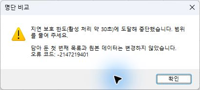
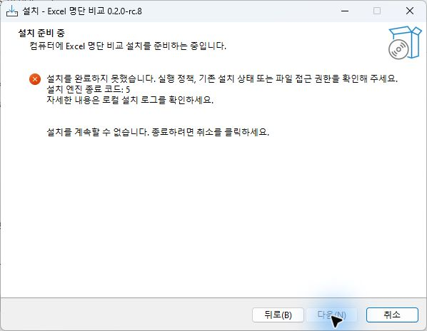
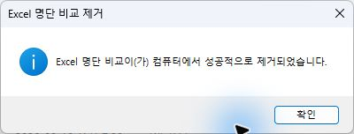

# RC8 · 취소와 제거 보완 검증

날짜: 2026-09-16 · 상태: **예정된 후속 시험과 정리 완료, 인수 실패로 배포 보류.** Esc 3회가 취소되지 않았고 대화형 설치의 첫 시도도 접근 거부로 실패했다. 후속 성공으로 이 실패를 지우지 않는다. 코드 서명이 없는 시험 후보이며 회사 배포 승인판이 아니다.

## 대상과 변경

Windows 11 23H2 x64, 데스크톱 Excel 64비트 `16.0.20326.20144`, 일반 사용자 환경에서 실행했다. 업무 문서 대신 합성 통합문서와 별도 시험 폴더를 사용했다. 기계 판독용 결과는 [검증 요약 JSON](../evidence/rc8/validation.json)에 남겼다.

| 파일 | SHA-256 |
|---|---|
| RC8 XLAM | `b1d9e044b6976ec385e3e85ba69021e4f892c4c0a8e98acb9584b71f65410f39` |
| RC8 단일 EXE | `761195046c8121f5d6489067861e4cb3844b83890c9f0475f2fde7338ccb7e70` |

[ADR-0010](ADR-0010-Cancellation-and-removal.md)에 따라 정규화와 선택 메타데이터에서 취소 오류 18을 상위 처리로 전달하도록 보완했다. 화면 이벤트를 처리하는 체크포인트 전후에 Excel 취소 처리를 다시 설정하지만 실제 Esc 실패는 해소하지 못했다. COM 조회에서 관찰한 문자열 False의 방어 처리도 넣었다. 해당 문자열의 원인이 Excel인지 PowerShell COM 변환인지는 확정하지 않았다. 실제 화면의 기본 표시와 외부 상태 문자열 보존은 별도로 확인했다.

설치 폴더의 `Uninstall.cmd`는 두 실행 파일만 새 임시 폴더에 복사해 실행 제어를 넘긴다. 원본 CMD와 현재 디렉터리가 제거돼도 엔진 종료 코드를 반환한다. EXE는 설치·제거 오류 문구를 구분한다. 일반 사용자 설치, HKCU 등록, 조직 정책 준수와 기존 설치 기록 형식은 유지한다.

## 현재 파일의 검증

| 검사 | 실제 결과 |
|---|---|
| VBA 원본·ASCII·XLAM 대조 | PASS. 5개 VBA 구성 요소의 실행 코드·문자열·주석 대조 |
| Python 회귀 | PASS. 63개. 설치 폴더 CMD 자기 삭제·종료 코드 0/37·추가 파일 보존 3개 하위 경우 포함 |
| 실제 EXE 설치 수명주기 | 자동·분할 검사 47개 PASS, 최종 원복 2개 PASS. 아래 대화형 설치 실패를 포함한 전체 설치 판정은 FAIL |
| 메뉴 내용·창·정규화 통합 | PASS. 실제 설치 파일 정상 시작, 164개 단언 및 내장 정규화·통합 19개 |
| 취소 오류 주입·상태 복원·체크포인트 | PASS. RC7 정규화는 오류 18을 무시하고 RC8은 전달. 기본 상태·이전 외부 문구·실행 중 외부 변경·취소 처리 재설정 4개 검사. 메모리 코드와 설치 파일 해시 복원 |
| 실제 우클릭·명령·Esc 입력 | 셀 우클릭 담기, 다른 파일의 실제 비교, 비우기와 외부 상태 문구 보존 PASS. Esc 비교 2회·바꾸기 1회는 모두 FAIL |
| 실제 설치·제거 화면 | 설치 취소·제거 취소·등록된 제거 PASS. 첫 설치 FAIL(엔진 5, EXE 7), 같은 파일 재시도 PASS(0). 실패 원인 미확정 |
| 선택 시나리오 | PASS. 14가지. 가로·세로·사각·단일·다중·겹친 범위, 전체 행·열, 숨김 행·열, 필터·표, 수동 계산과 같은 범위의 원본 변경 후 스냅샷 비교. 수식 없음·설정 복원·이전 편집 결과 보존 단언 포함 |
| 문서 strict 빌드·로컬 링크 | PASS. MkDocs strict 및 공개 14개 페이지·404의 경로·자산·검색·사이트맵 검사. 배포 HTML 링크는 포장 시 별도 검증 |
| 최종 원복 | PASS. 제품·관리 폴더·앱 등록·Excel 프로세스 없음. Office·PowerShell 14개 레지스트리 그룹의 값·형식 동일. 창 위치·Excel 프린터 캐시·임시 개발 접근 복원. 시험 예약 작업 모두 제거 |

설치 자동 검사는 최초 단계 16개, 업그레이드·실패 롤백·재설치 22개, 한글·특수 경로 2개, 실행 중 Excel 보호·정상 시작 5개, 설치 폴더 CMD 자기 삭제·남은 앱 항목 제거 2개다. 원복 2개를 포함하면 49개이며, 한 번의 연속 실행 49개로 기록하지 않는다. 별도 설치기 함수 회귀 23개와 신뢰 위치 회귀 23개도 통과했다.

## 실제 Esc와 보존 결과

합성 파일의 첫 목록 42개와 서로 다른 48자 값 100,000셀을 사용했다. 경고에서 예를 클릭한 뒤 처리 중 화면을 확인하고 UI 도구로 Esc를 전달했다. 물리 키보드 입력 시험은 아니다.

| 시도 | 예 클릭 호출 시작 → Esc 호출 | 실제 결과 |
|---|---|---|
| 비교 1 | 12.990초 | FAIL. 처리가 계속됐고 약 30초 지연 보호 오류 `-2147219401`로 중단 |
| 비교 2 | 13.325초 | FAIL. 같은 지연 보호로 중단 |
| 첫 목록 바꾸기 | 13.987초 | FAIL. 바꾸기가 완료되어 담긴 목록이 42개에서 100,000개로 변경 |

위 시간은 도구 호출 기록이며 Excel의 키 수신 시각이 아니다. 오류 18 주입과 체크포인트 단위 검사 PASS는 실제 키 취소 성공의 증거가 아니다. 입력 전달과 Excel의 처리 경로를 구분하는 후속 진단이 필요하다.

비교 두 번의 지연 보호 뒤에는 기존 42개·설정 5개·통합문서 수가 유지됐다. 바꾸기는 취소되지 않아 기존 목록 보존 요구도 충족하지 못했다. 세 번 모두 저장해 둔 이전 결과의 사용자 표식·요약·Saved 상태는 유지됐고, 종료 후 두 합성 원본 파일의 SHA-256도 같았다. 실제 화면의 상태표시줄은 비교·지연 보호 후 기본 준비 표시로 돌아왔고, 외부 문구를 넣은 뒤 실제 비우기를 해도 그 문구가 유지됐다.

## 대화형 설치 실패와 재시도

등록된 제거의 취소·실행은 성공했다. 이어 같은 최종 EXE를 일반 사용자로 새로 설치했을 때 첫 시도는 `Access is denied.`와 엔진 코드 5, EXE 코드 7로 실패했다. 제품·관리 폴더·앱 항목은 없었다. 보안 정책·ACL을 바꾸지 않고 같은 EXE를 다시 실행하자 코드 0으로 완료됐고 설치된 4개 제품 파일의 해시가 일치했다.

이 재시도는 최초 접근 거부의 원인이 해결됐다는 증거가 아니다. RC7에서 있었던 제거 중 접근 거부와 원인이 같다고 확정하지 않는다. 설치 폴더의 새 CMD는 자기 파일과 폴더가 제거된 뒤에도 코드 0을 반환했고, 등록된 제거로 남은 관리 항목까지 정리됐다.

## 실패 이력과 범위

- [RC7 실제 실패](UNLOCKED_UI_REPORT.md)를 덮어쓰지 않는다. 이번 재현에서도 RC7 취소 성공과 실패가 모두 나왔고, 최초 접근 거부 GUI 제거 오류는 다시 재현되지 않았다. CMD 자기 삭제와 같은 원인이라고 단정하지 않는다.
- RC8 중간 후보는 취소 오류 전달을 고쳤지만 반복 Esc 시험에서 취소되지 않고 완료하거나 30초 지연 보호로 중단된 사례가 남았다. 이 후보의 해시와 기록은 로컬에 보존하며 최종 파일의 PASS로 합산하지 않는다.
- 장시간 설치 시험의 Windows PowerShell 호스트가 `ntdll.dll`, 예외 `0xc0000005`로 종료된 이력이 있다. 그 실행에서 끝난 38개 검사와 미완료 검사를 구분했다. 임시 경로 시험은 자식 설치 프로세스에만 TEMP/TMP를 전달하도록 격리했다. 후속 호스트도 충돌해 PowerShell 7 감독 실행기와 짧은 Windows PowerShell 검사 단계로 분리했다. 현대 실행기의 모듈 검색 경로가 자식에게 전달되는 준비 실패는 자식의 Windows PowerShell 기본 모듈 경로로 격리하고 재실행했다. 호스트 충돌의 원인을 제품 결함이나 이 환경 변수로 확정하지 않는다.
- 최초 결함 주입 준비는 미신뢰 임시 통합문서의 매크로 실행이 거부됐다. 이후 설치된 시험 추가 기능의 메모리 안에서만 코드를 바꾸고 원문 복원·파일 해시를 확인했다. 배포 XLAM에는 결함 주입 코드를 저장하지 않았다.
- 선택 범위 검사 첫 실행은 120초인 시험 호스트 제한시간에 걸려 9개까지만 완료됐다. 종료 확인창을 취소하고 시험 자식 프로세스가 끝난 것을 확인한 뒤, 기록된 Excel PID·시작 시각과 합성 파일 경로·미저장 결과 이름을 대조해 19개 시험 문서만 저장 없이 정상 종료했다. 재실행에서는 13개 완료 후 호스트가 비정상 종료됐다. 확인된 합성 문서 27개를 닫고 Quit한 뒤 남은 창 없는 소유 Excel 프로세스만 별도로 정리했다. 남은 스냅샷 1개는 새 Excel 세션에서 통과했다. 마지막 호스트의 단일 JSON 건수 집계 오류는 실제 종료 코드 0과 결과를 배열로 읽는 별도 검사로 확인했다. 최종 14개는 13+1의 분할 결과다.
- 빌드 후 정상 Quit에도 남은 숨겨진 Excel은 기록된 PID·시작 시각·창 없음이 일치하는 소유 프로세스만 정리했다. 업무 Excel을 강제 종료한 시험으로 기록하지 않는다.

## 원복과 배포

원시 계정·경로·레지스트리·설치 로그와 시험 파일은 로컬 `artifacts`에 보관한다. 임시 VBA 개발 권한은 제품 설치 요구가 아니며, Excel 종료 시 설정이 다시 기록될 수 있어 최종 종료 후에도 시작 전 상태를 확인한다. 최종 원복 결과는 위 표와 배포 검증 요약을 따른다.

원복 집계에서 레지스트리 경로의 대소문자·정렬 차이가 실패로 잡혔다. 독립 검사에서는 키·값 이름의 대소문자와 열거 순서만 정리하고, 중복 항목을 유지한 채 실제 값과 형식을 비교해 14개 모두 일치했다. 외부 보안 값을 바꿔 통과시키지 않았다. 시험용 COM 상태 설정에서 Boolean을 문자열로 바꾸지 못한 준비 오류도 원시 기록에 남겼으며 제품의 상태 복원 결과와 구분한다.

공개 게시·릴리즈 업로드는 하지 않았다. RC8 배포 게이트의 실제 취소 PASS 조건을 만족하지 못하므로 배포용 Release ZIP을 만들지 않는다. 실패한 시험 후보 EXE·XLAM은 정확한 해시와 함께 로컬에 보존하고, 소스·실패 검증 요약을 검토 자료로 남긴다. 빌드 당시 작업 트리가 수정 상태였다는 원래 EXE 빌드 기록을 보존한다.

## 제한

물리 키보드 직접 입력, Ctrl+Break, 다른 Office 빌드·x86 Excel·조직 정책 배포, 전원 손실과 모든 타사 추가 기능의 공존은 미검증이다. Excel 내부 COM 호출 중에는 즉시 취소를 보장하지 않는다. 기본 상태의 문자열 `FALSE`도 Excel의 False 표식으로 처리하므로, 작업 전에 외부에서 의도적으로 표시한 같은 문자열은 기본 표시로 복원될 수 있다. 처리 중 바뀐 외부 문자열은 덮지 않는다. 기존 도구 모음의 이벤트 비활성 상태 갱신 제한은 [RC7 기록](UNLOCKED_UI_REPORT.md)을 따른다.

설치 폴더에서 시작한 제거의 작은 실행 복사본은 사용자 임시 폴더에 남을 수 있다. 업무 파일과 설치 기록은 이 복사본에 포함하지 않는다. 코드 서명·게시자·회사 인수 승인은 별도다.
