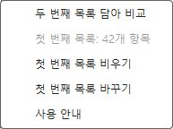
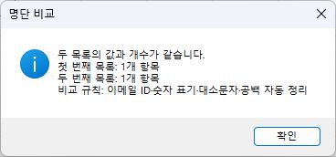
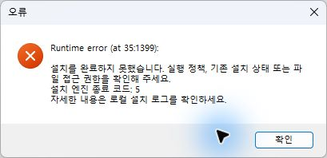

# RC7 · 잠금 해제 후 실제 화면 검증

후속 수정과 현재 파일의 검증 결과는 [RC8 검증 기록](RC8_COMPLETION_REPORT.md)을 따른다. 아래는 해당 버전 당시의 기록이다.

도구 ID: ExcelSmartListCompare · 엔진: 0.2.0-rc.7 · EXE 포장: 1 · 실행: 2026-09-15 22:38~23:15 KST

상태: **시험 실행 완료, 인수 실패 항목 있음.** 창별 우클릭 메뉴·비교·경고·설치 화면은 확인했다. 처리 중 Esc 입력은 2회 모두 취소되지 않았고, 최초 GUI 제거도 실패했다. 시험 설치는 복구 절차로 정리했다. 서명되지 않은 평가용 후보이며 전체 인수·상용 배포 승인을 뜻하지 않는다.

적용 기준: [추가 도구 개발 기준](../../../docs/policies/tools.md), [문서 작성 규칙](../../../docs/policies/documentation.md), [인수 요구](ACCEPTANCE_TESTS.md). 이전 자동 검증은 [RC7 메뉴 기록](CONTEXT_MENU_REPORT.md)과 [EXE 기록](ONEFILE_REPORT.md)에 보존한다.

## 대상과 방법

Windows 11 23H2 x64 `10.0.22631`, 데스크톱 Excel x64 `16.0.20326.20144`, Windows PowerShell 5.1, 일반 사용자 데스크톱에서 실행했다. 시작 시 Excel 프로세스·제품 설치·설치 관리 폴더·앱 제거 항목이 없었다.

| 대상 | SHA-256 |
|---|---|
| ExcelSmartListCompare-0.2.0-rc.7-Setup.exe | `dbac4ab9920e093b1ec5d8c1b29727f6d5c853585cd8f29019d7e75b6a1e69be` |
| ExcelSmartListCompare.xlam | `5da5ff891232dde733d60ee6151cbfb26e251d6b75a51cb6a3f224effde4c18b` |
| Setup.ps1 | `1ae6bc71c3fa8b7bc8bc46401f76df6570e60664b5369e57919c77a845120801` |

대상 소스 커밋은 `ec746627f92166c39f44bf1a0b472b65b163b742`다. 이번에는 VBA·XML·설치 엔진·배포 파일을 수정하거나 다시 빌드하지 않았다. 내려받은 EXE와 설치된 XLAM의 해시를 대조했다.

합성 통합문서 두 개와 시험 결과만 사용했다. COM은 파일 준비, 범위 선택, 보기·이벤트·새 창 조건 설정과 결과 단언에 사용했다. 제품 명령은 실제 추가 기능 탭과 우클릭 메뉴를 클릭했고 대화상자는 화면을 확인한 뒤 조작했다. 두 번째 파일을 Excel 안에서 여는 경로는 실제 파일 열기 대화상자를 사용했다. Esc는 UI 도구의 키 입력으로 전달했으며 물리 키보드 입력 시험은 아니다.

## 실제 Excel 화면 결과

| 검사 | 판정과 관찰 |
|---|---|
| 두 파일을 각각 열기 | **PASS.** 첫 파일을 정상 Excel로 시작하고 둘째 파일을 Windows 파일 연결로 열었다. 같은 Excel 세션에서 첫 파일의 42개를 담은 뒤 둘째 창의 실제 메뉴에도 비교·42개·비우기·바꾸기가 표시됐다. |
| 첫 파일에서 둘째 파일 열기 | **PASS.** 둘째 파일을 닫고 첫 파일에서 42개를 담았다. Excel 파일 열기 대화상자로 둘째 파일을 다시 열어 동일한 실제 메뉴를 확인했다. |
| 실제 담기·비교·바꾸기·비우기 | **PASS.** 메뉴에서 42개 담기와 비교, 4개로 바꾸기, 표 메뉴에서 비우기를 실행했다. 비교·비우기 뒤 담기 상태와 개수 숨김을 확인했다. |
| 8개 우클릭 위치 | **PASS.** 일반 보기의 셀·행·열·표와 페이지 레이아웃의 셀·행·열·표에서 현재 목록과 명령을 확인했다. |
| 이벤트 비활성 조건 U11 | **PASS(동적 메뉴).** 4개로 바꾼 뒤 이벤트를 끄고 다른 파일의 표에서 연 메뉴는 4개를 표시했다. 이때 기존 추가 기능 도구 모음은 42개를 표시해 별도 갱신 한계가 관찰됐다. |
| 새 창·원본 닫기 | **PASS.** 한 항목을 담고 둘째 통합문서의 새 창을 만든 뒤 첫 파일을 닫았다. 새 창의 메뉴가 한 항목을 유지했고 실제 비교 클릭으로 1개 대 1개 일치 안내가 나왔다. 다른 창의 메뉴도 비교 후 초기화됐다. |
| 차이 결과·용어 | **PASS.** 42개 대 2개에서 일치 1개, 첫 목록 잔여 41개, 둘째 잔여 1개. 별도 결과 통합문서의 10개 열·요약을 확인했다. 긴 제목은 가로 스크롤로 읽을 수 있었고 `=1+1` 원문을 포함해 결과에 수식이 없었다. |
| 사용 안내·일치 대화상자 | **PASS.** 실제 클릭으로 한국어 문구와 RC7 버전, 첫 번째·두 번째 목록 용어를 확인했다. |
| 대량 경고·기본 아니요 | **PASS.** 선택 20,000셀과 담긴 42셀의 합계 20,042셀 경고를 확인했다. 기본 버튼에서 Enter로 거절했고 첫 목록을 유지했다. |
| 빈 목록·병합 셀·4,097자 셀 | **PASS.** 빈 목록 비교, 병합 범위로 바꾸기, 길이 초과 비교 각각의 안내·오류를 확인했다. 4,096자 제한과 기존 목록 보존 문구가 표시됐다. |
| 오류·거절 후 보존 | **PASS(확인한 상태).** 위 네 경로에서 담긴 42개, ScreenUpdating·EnableEvents·Interactive·EnableCancelKey·Calculation, 저장해 둔 이전 결과의 표식·요약·Saved 상태가 유지됐다. 상태표시줄은 일부 오류 뒤 `FALSE`가 표시돼 목록 개수 표시까지 항상 유지된 것으로 기록하지 않는다. |
| 처리 중 Esc / P07·U03 취소 부분 | **FAIL.** 100,000셀 비교 중 두 번 입력했으나 모두 비교 완료로 진행했다. 아래 실패 기록을 따른다. |

이 환경의 두 파일 열기 경로에서는 보고됐던 창별 우클릭 메뉴 불일치가 재현되지 않았다. 다른 Office 환경이나 별도 Excel 프로세스 간 공유까지 확인한 결과는 아니다. U09의 모든 변형, U13의 오래된 비교 명령에 첫 목록이 없는 분기는 이번 네이티브 화면 시험으로 추가 확인하지 않았다.

## 실패 기록: Esc 취소

첫 목록 42개를 담고 두 번째 목록으로 같은 합성 값 100,000셀을 선택했다. 경고에서 예를 클릭한 뒤 처리 중 화면을 확인하고 Esc를 전달했다.

| 시도 | 예 클릭 호출 시작부터 Esc 호출까지 | 관찰 결과 |
|---|---|---|
| 1 | 약 15.42초 | 처리 중 상태가 계속 표시된 뒤 100,000셀 비교 결과 생성, 첫 목록 초기화 |
| 2 | 약 12.91초 | 동일하게 결과 생성, 첫 목록 초기화 |

시간은 UI 도구 호출 전후의 기록이며 Excel이 키를 수신한 정확한 시각은 아니다. 입력 전달·처리 시점과 제품의 취소 처리 중 어느 부분이 원인인지는 확정하지 않았다. 취소 안내가 나타나지 않아 취소 후 목록 보존 경로도 통과로 처리하지 않는다. Ctrl+Break는 이번에 실행하지 않았다. 이전 RC1 취소 캡처나 참조 엔진의 취소 검사로 이번 실패를 대체하지 않는다.

후속 확인은 같은 입력에서 물리 Esc 수신과 VBA 체크포인트를 관찰해 원인을 구분하는 것이다. 수정하면 새 배포 파일의 해시를 고정해 실제 취소·목록 보존을 재검증해야 한다. 이번 작업은 실패를 기록했으며 수정 완료로 표시하지 않는다.

## 실제 설치·제거 화면

| 검사 | 판정과 관찰 |
|---|---|
| 설치 준비·취소 | **PASS.** 준비 화면과 취소 확인에서 종료했다. 제품·관리 폴더·앱 항목이 생기지 않았다. |
| 일반 사용자 설치 | **PASS.** 일반 데스크톱 Windows PowerShell 5.1에서 EXE를 시작해 설치 버튼과 완료 화면을 확인했다. 엔진 코드 0, 설치된 XLAM 해시 일치, 정상 Excel 자동 로드와 위 실제 비교 확인. |
| 제거 취소 | **PASS.** 등록된 제거 프로그램의 확인창에서 아니요를 클릭했다. 제품·관리 폴더·앱 항목과 XLAM 해시가 유지됐다. |
| 최초 GUI 제거 / I28 성공 부분 | **FAIL.** 확인창의 예 클릭 후 엔진이 `Access is denied.`와 종료 코드 5를 기록했다. 관리 항목은 보존됐고 오류 화면에는 제거 중에도 ‘설치를 완료하지 못했습니다’가 표시됐다. |
| 기존 CMD로 제품 제거 | **복구 중 실패.** 설치 폴더를 작업 디렉터리로 한 명령은 제품 파일·등록을 제거한 뒤 사용 중인 빈 폴더를 지우지 못해 코드 1로 끝났다. 이미 기록된 실행 중 CMD·작업 폴더 문제이며 정상 제거 통과로 세지 않는다. |
| 남은 관리 항목 정리 / I29 해당 경로 | **PASS(복구).** 시험 소유의 빈 제품 폴더임을 확인해 비재귀로 정리했다. 등록된 제거 프로그램을 다시 실행하자 관리 폴더의 엔진 복구본으로 코드 0, 제거 성공 화면, 관리 파일·앱 항목 삭제를 확인했다. |

GUI 제거의 최초 접근 거부 원인은 미확정이다. 복구 성공이 최초 제거 실패를 해소한 증거는 아니다. 후속 시험에서는 새 설치 상태의 실제 제거를 재현하고, 설치 폴더 엔진과 관리 복구본을 임시 경로에 준비하는 과정을 확인해야 한다.

설치 초기의 별도 자동화 호스트 시험도 남긴다. PowerShell 7에서 EXE를 시작했을 때 상속된 모듈 경로 때문에 Windows PowerShell의 Microsoft.PowerShell.Security 모듈을 로드하지 못해 코드 1로 실패했다. 이후 일반 사용자 데스크톱 작업에서 설치가 성공했다. 영구 실행 정책·조직 정책·ACL을 변경해 통과시키지 않았다.

## 보존·원복과 증거

- 원본 합성 파일 `First.xlsx`, `Second.xlsx`의 전후 SHA-256이 같았다. 저장한 이전 결과의 사용자 표식과 요약도 유지됐다. 실제 업무 파일은 시험 대상으로 사용하지 않았다.
- 시험 Excel을 정상 종료했고 남은 Excel 프로세스는 0개였다. 제품 폴더·관리 폴더·앱 항목은 시작 전처럼 없었다.
- Office·PowerShell 관련 14개 레지스트리 그룹을 전후 대조해 모두 같았다. 이번에는 VBA 프로젝트 접근을 허용하지 않았으며 전역 보안 설정을 바꾸지 않았다.
- 일반 사용자 실행용 임시 예약 작업 6개는 모두 제거됐다. 원시 화면·계정·레지스트리·설치 로그·합성 파일은 로컬 `artifacts/excel-unlocked-ui-20260915`에 보관한다. 위 첨부는 경로·계정이 없는 실제 팝업 화면만 복사했다.

주요 증거: `07-second-menu-shares-42`, `11-open-inside-native-menu-42`, `12-table-current-four-events-disabled`, `13`~`18` 메뉴 화면, `preservation-checks.json`, `24-esc-timing.json`, `25-esc-timing.json`, `27-match-dialog-original-closed`, `uninstall-complete.private.log`, `uninstall-manager-retry.private.log`, `fixture-preservation.json`, `after-recovery.private.json`, `Native-UI-Validation.json`.

시험 제어 스크립트의 종료 코드 0과 응답 JSON의 `PASS`는 해당 파일 준비·상태 읽기 명령의 성공을 뜻할 수 있다. 최종 인수 판정은 위 표와 `Native-UI-Validation.json`을 따른다. 특히 Esc와 최초 GUI 제거를 전체 PASS로 집계하지 않는다.

## 문서 검증

| 검사 | 실제 결과 |
|---|---|
| 저장소 docs 가상 환경의 `python -m mkdocs build --strict` | PASS, 종료 코드 0 |
| `python scripts/check-site.py site` | PASS, 공개 14페이지·404, 검색·사이트맵·로컬 링크·자산 및 비공개 원본 제외 확인 |
| 변경 Markdown의 로컬 링크·이미지 파일 | PASS, 문서 10개·링크 116개 |
| `git diff --check` | PASS |

## 검증 범위와 남은 항목

이번에는 잠금으로 미뤘던 RC7 화면 시험을 실행했다. 기존 164개 COM 단언·Python·업데이트 회귀는 이전 보고서의 결과이며 새 실행 횟수에 합산하지 않는다. 제품 코드·바이너리 변경이 없어 엔진 검사를 반복하지 않았다.

다른 Windows·Office 버전, x86, 조직 GPO·MDM, 실제 전원 단절, 모든 통합문서를 닫고 Excel만 남긴 뒤 다시 여는 경로, 타사 추가 기능 전반의 공존·Undo, 물리 키보드 취소는 미검증이다. Esc 취소·최초 GUI 제거 실패와 도구 모음·상태표시줄 관찰 사항은 후속 확인 대상으로 남긴다. 이번 보고서는 로컬 변경이며 릴리즈·공개 사이트를 갱신하지 않았다.
