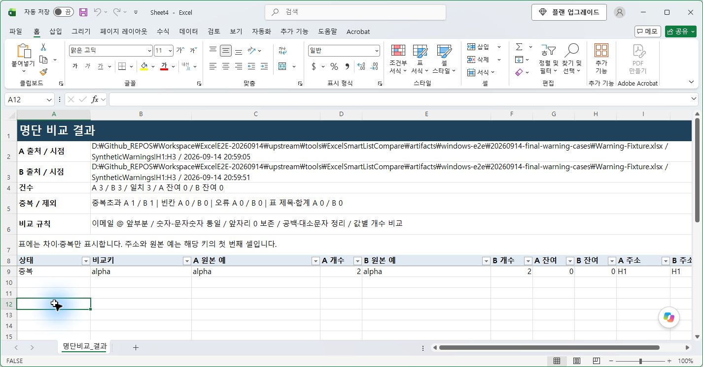

# Excel Smart List Compare · 실제 Windows E2E 보고서

> 후속 범위 정정(2026-09-15): 아래 RC1 기록은 당시 실행 호스트의 파일·레지스트리 보기에서 수행한 실제 Excel 시험이다. 일반 데스크톱 설치의 추가 검증은 [RC3 보고서](WINDOWS_ROBUSTNESS_REPORT.md)를 따른다. 이전 실제 VBA 빌드·기능 실행 결과는 보존한다.

이 문서는 RC1에서 수행한 VBA 엔진·설치 검증의 보존 기록이다. RC2의 제품 폴더 신뢰 위치 자동 등록과 후속 실행 결과는 [RC2 보고서](WINDOWS_TRUST_LOCATION_REPORT.md)에 따로 기록한다. XLAM은 두 후보에서 동일하다.

실행일: 2026-09-14 · 최종 확인: 21:22 KST · 판정: **설치 가능한 배포 후보**

실제 Windows Excel에서 빌드 → 설치 → 실행 → 재시작 → 재설치 → 제거 → 제거 후 재시작을 수행했다. 발견한 빌드·설치·Esc·진단 명령 오류를 수정하고 재검증했다. 아래 범위에서 통과했으며 전체 인수 완료를 뜻하지 않는다. 코드 서명은 없다.

## 환경과 최종 파일

| 항목 | 실제 확인 |
|---|---|
| 운영체제 | Windows 11 Pro 10.0.22631 |
| Excel | 16.0.20326.20144, x64 |
| 실행 계정 | 데스크톱과 같은 계정·세션, 비관리자 |
| PowerShell | Windows PowerShell 5.1.22621.6133 |
| 제품/형식 | SLC_Version 0.2.0, XLAM FileFormat 55 |
| 최종 XLAM SHA-256 | `c6f55886c368294c4e21396366d0cf3c368605e965f3ca2bd153f2e75bc8ae86` |
| 최종 Setup SHA-256 | `ea77f5c6c0b167b6c1de4d4e7009406327a4c5b7449382a44634d294a0334516` |
| 작업 위치 | 별도 ExcelE2E-20260914 폴더의 격리 checkout |

XLAM을 저장·닫고 제품 메타데이터를 기록한 뒤 다시 열어 실제 검사를 실행했다. 검사 후 바이너리를 다시 저장하지 않았다. 설치·제거·진단 스크립트 후속 수정은 VBA 바이너리 해시를 바꾸지 않았다. 일반 사용자는 완성 Release를 설치하며 VBA 프로젝트 접근 권한은 필요하지 않다.

## 실제 통과 범위

각 행은 다른 실행 층이다. 내장 검사에 포함된 항목과 일반 명령 검사는 겹칠 수 있으므로 합산해 고유 테스트 개수로 표시하지 않는다.

| 실행 | 결과·독립적으로 확인한 내용 |
|---|---|
| 실제 빌드 | PASS, 종료 0. 저장된 XLAM의 정규화와 Excel 통합 19개 |
| 최종 Test_Excel.cmd | PASS, 종료 0. 설치된 XLAM의 19개 검사 |
| COM 기능 7개 | 모두 PASS. 버전·내장 검사·SLC_Run·별도 결과·닫힌 A 스냅샷·중복 개수·수식 방지·합성 원본 해시 |
| 일반 명령 SLC_Run 14개 | 모두 PASS. 가로↔세로·사각형·단일·다중/겹침·전체 행/열·숨김 행/열·AutoFilter·Table 필터/합계·수동 계산·같은 범위 수정 후 이전 기준 |
| 경고·오류 복구 5개 | 모두 PASS. 20,000셀 경고에서 아니요, 빈 B, 병합 셀, 4,097자 거절, 보존된 A로 재비교 |
| 최종 실제 도구 모음 클릭 | PASS. A 3 / B 3 / 일치 3, 중복 2회, 새 결과 HasFormula=False |
| 실제 Esc 입력 | PASS. 100,000셀 작업에서 68,096셀 진행을 관찰한 뒤 Esc. 취소 메시지·기준 3건·설정 복원 확인 |
| 설치 안전장치 11개 | 모두 PASS. .cmd의 Excel 열림 차단 4개, 소유 시험 PID 보존, mutex 충돌 2개, 반복 제거 2개, 누락 XLAM 진단·설치 거절 |
| 설치 실패 주입 | PASS. 매니페스트 교체를 파일 공유 잠금으로 실패시킴. 종료 1, 기존 5개 파일 해시·OPEN 등록 복원, 임시 파일 0 |
| PowerShell 파서 | 14/14 PASS |
| Python 참조/정적 검사 | 53/53 PASS. Excel 검증과 별도 |

내장 19개에는 숨긴 단일 셀, 오류/수식 빈문자 제외, 필터 제목 옆 일반 데이터, Table 제목/합계, 100,001 가시 셀 거절과 큰 스캔 상한 거절도 포함된다. 모든 경계값의 앞뒤를 검사했다는 뜻은 아니다.

일반 명령 14개는 합성 원본으로 Selection을 만든 뒤 실제 SLC_Run을 호출했다. 각 결과의 기대 요약은 독립 리터럴이며 제품 정규화 함수로 기대값을 재계산하지 않았다. 모든 결과는 HasFormula=False였고 Excel 설정과 앞서 편집한 결과의 시험 표식이 유지됐다. 이 14개는 COM을 통한 실제 사용자 명령 검사이며 마우스로 14개 시나리오를 입력한 것은 아니다.

## 설치 → 재시작 → 재설치 → 제거

| 단계 | 실제 결과 |
|---|---|
| 시작 전 | 제품 미설치, 기존 Excel 0개 |
| 한국어·공백 경로의 Install.cmd | 종료 0, 최종 XLAM 해시 일치, Excel 프로세스를 만들지 않음 |
| 정상 시작 | 자동 로드 PASS, Cell/Row/Column 메뉴 각각 1개, 도구 모음 4개 |
| 정상 종료 뒤 재시작 | 같은 등록과 메뉴 개수 PASS |
| 재설치 및 후속 Setup 재설치 | 각각 종료 0 |
| 재설치 후 정상 시작 | 자동 로드와 메뉴 한 세트 PASS |
| Uninstall.cmd | 종료 0, 소유 5개 파일과 정확한 제품 OPEN 등록 제거 |
| 설치 폴더의 추가 파일 | 시험 파일 해시 유지 PASS. 시험 후 그 파일만 정리 |
| 제거 후 정상 Excel 시작 | 자동 로드 없음, 제품 메뉴·도구 모음 0, 실제 화면에 누락 파일 경고 없음 |
| 반복 제거 | 2회 종료 0, 다른 파일·등록 변경 없음 |

자동 로드 검사 전에 XLAM을 열거나 SLC_AttachUI를 호출하지 않았다. EXCEL.EXE 정상 시작과 일반 XLSX만 사용했고 이후 로드 상태를 읽었다.

빌드/진단 및 일부 정상 종료는 창 없는 시험용 Excel을 남겼다. 최종 제거 후 시험 PID도 Quit 이후 남아 소유 PID·시작 시각·실행 파일·창 없음이 일치하는 것을 확인한 뒤 그 PID만 정리했다. 사용자 프로세스는 종료하지 않았다. 최종 감사에서 Excel 프로세스 0개를 확인했다. 설치·제거 코드에는 프로세스 강제 종료가 없다.

## 발견한 오류와 재검증

| 실제 실패 | 수정 및 확인 |
|---|---|
| COM 자동화 모드에서 VBA 프로젝트 접근 거부 | 새 정상 Excel 시작과 소유 PID 확인으로 빌드 성공. 승인한 AccessVBOM 한 항목은 즉시 원복 |
| COM 속성 접근이 원래 오류를 누락 | 명시적인 COM 속성 호출로 진단 보완 |
| XLAM 저장 뒤 매크로 없는 원본 Save가 보안/형식 대화상자를 유발 | 저장·닫기·최종 XLAM 재열기 검사로 변경 |
| AddIns.Add 설치 실패와 불완전 소유 기록 | Excel을 시작하지 않는 제품 전용 HKCU OPEN 등록과 원자적 매니페스트로 변경. 설치·실패 복구·제거 통과 |
| 매니페스트 교체의 빈 backup 경로 오류 | PowerShell 5.1 NullString 처리. 실제 재설치 통과 |
| Interactive=False로 실제 Esc가 먹지 않음 | 입력 차단 제거, 재진입 보호 유지. 최종 바이너리에서 실제 Esc 취소 통과 |
| Test_Excel.cmd가 존재하는 설치 XLAM 재열기 실패 | 정상 Excel 시작·정확한 이름/경로 확인. 최종 명령 종료 0 |
| .cmd 종료 코드 유실·한글 소스·테스트 COM SaveAs 형식 오류 | 종료 코드 보존, UTF-8 BOM, 명시한 COM 인자 타입. 최종 파서·실제 명령·기능 재실행 |

초기 후보의 Esc 두 번은 **실패**였고 30초 지연 보호가 대신 실행됐다. 이를 Esc 통과로 재분류하지 않았다. [설계 결정](ADR-0002-Excel-native-lifecycle.md)과 [과거 차단 기록](WINDOWS_INITIAL_E2E_REPORT.md)을 보존했다.

## 성능과 남은 검증

최종 후보의 5셀 A 읽기 전체는 517.84ms, B 읽기·비교·출력 전체는 1561.21ms였다. 이 PC·합성 자료 한 번의 총시간이며 단계별 시간, 일반 처리량이나 최악 시간 보장이 아니다. 성능 상수는 변경하지 않았다.

| 상태 | 항목·한계 |
|---|---|
| 이전 후보에서만 실제 PASS | 독립 Excel 프로세스의 기준 비공유, 마우스 기준 담기→원본 A 닫기→셀 우클릭 비교, 30초 체크포인트 보호. 이전 해시 86b0ba7b…의 결과이며 최종 C6 해시 검사와 구분 |
| NOT_RUN | 19,999/20,000 및 모든 합산·영역 조각·스캔·전체 문자열 상한의 직전/직후 전체 조합 |
| NOT_RUN | A/B 각각 100,000개가 모두 다른 결과의 끝까지 출력·메모리 측정, 단계별 성능 측정 |
| NOT_RUN | 모든 타사 추가 기능·단축키 매핑의 기능 공존, Undo 기록 보존 실측, v0.1/PERSONAL 코드 마이그레이션 |
| NOT_RUN | 설치 프로세스 강제 중단·전원 단절의 모든 시점, 복구 도중 외부 프로그램이 파일/등록을 동시에 변경하는 경합 |
| NOT_RUN | 설치/제거 기본 확인창의 아니요 버튼과 설치창 자체 캡처. 실제 .cmd 설치·제거·자동 로드는 수행 |
| 환경 없음 | x86 Excel, 다른 Office/Windows 빌드, 다른 계정·조직 GPO·서명된 배포 |
| BLOCKED_TOOL | 오프라인 HTML의 브라우저 배치 확인: 브라우저 도구가 file URL 접근을 거절했다. 실제 앱 캡처 이미지는 확인했고 HTML 링크·내장 이미지·ZIP 무결성은 파일 검사로 확인 |
| 서명 | 코드 서명 없음 |

일부 경계·환경 검증은 남았으므로 완전한 인수 통과나 모든 PC의 정상 동작을 선언하지 않는다. 일반 사용 안내는 [실제 캡처 퀵가이드](QUICK_GUIDE.md)를 따른다.

## 원상복구와 증거

21:22 KST 최종 감사 **PASS**. Excel 제품 디렉터리 없음, 제품 자동 로드/메뉴 없음, Excel 프로세스 0개. HKCU/HKLM의 보안·정책·타 추가 기능·Excel OPEN 값 14개 범주는 시작 전과 같았다. Excel이 기록한 일반 창/사용 옵션은 통째로 덮어쓰지 않았다. AccessVBOM은 원래의 값 없음 상태다.

FolderState도 MSI 미설치 상태(-1), 제품 Explorer 메뉴·설정·시험 설치 실행 파일 없음으로 복원했다. FolderState의 합성 업무 파일은 원래 해시를 유지했다. 업무 파일은 열거나 편집하지 않았고 기존 Excel 프로세스도 변경하지 않았다.

로컬 원시 증거는 도구의 artifacts/windows-e2e 아래 `20260914-final-build-cancel-fix`, `final-functional`, `final-public-matrix`, `final-warning-cases`, `final-lifecycle`, `final-setup-rollback`, `final-removal`, `final-guards-02` 및 최종 restoration JSON에 있다(각 디렉터리 접두어는 20260914-). 계정·경로·원시 레지스트리·설치 로그는 공개 자산에서 제외했다. Release/Validation.json은 위 실행에서 필요한 값만 추린 요약이다.
