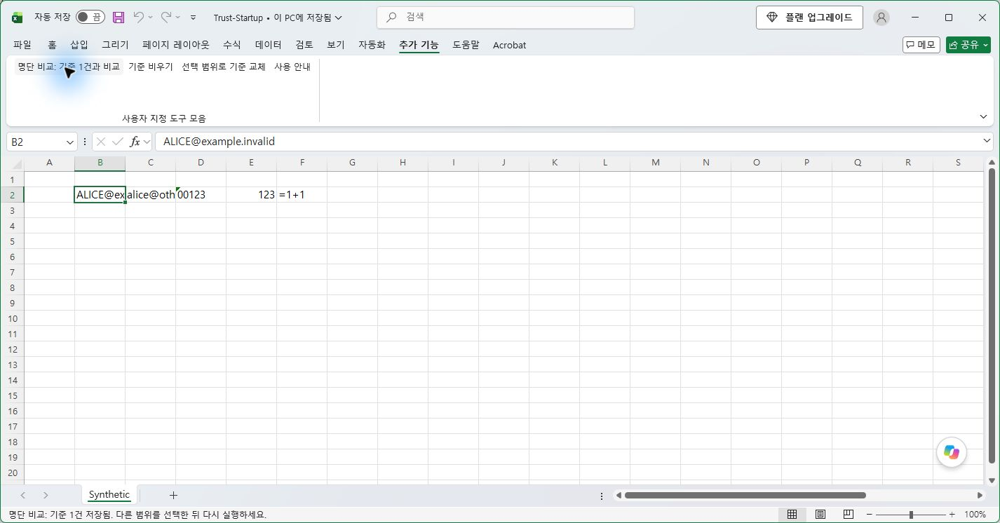

# Excel RC2 · 신뢰 위치 자동 등록 실제 검증

> 후속 범위 정정(2026-09-15): 아래 시험은 당시 실행 호스트의 AppData/HKCU 보기에서 수행됐다. 같은 SID·세션이라는 확인만으로 일반 데스크톱 설치까지 검증했다고 해석하지 않는다. 일반 Windows 사용자 환경을 별도로 검증한 결과와 실제 경로 검사 수정은 [RC3 보고서](WINDOWS_ROBUSTNESS_REPORT.md)를 따른다. 아래 실제 실행 사실과 해시는 보존한다.

실행일: 2026-09-14 · 최종 원복 확인: 2026-09-14 22:21:30 KST · 판정: 설치 가능한 평가용 후보

Install.cmd가 제품 폴더를 자동 등록하도록 수정한 뒤 실제 Windows Excel에서 설치 → 실행 → 재시작 → 재설치 → 제거 → 제거 후 시작을 다시 실행했다. 매크로 포함/콘텐츠 사용을 누른 횟수는 0회다. 등록 폴더는 `%LOCALAPPDATA%\ExcelSmartListCompare`이고 새 항목은 하위 폴더를 포함하지 않는다.

## 환경과 파일

Windows 11 Pro 10.0.22631, Excel 16.0.20326.20144 x64, Windows PowerShell 5.1.22621.6133, 일반 사용자 권한에서 실행했다. VBA 엔진은 RC1에서 실제 빌드·검증한 동일 XLAM을 재사용했다. 이번 변경으로 VBA를 재빌드하지 않았고 AccessVBOM을 변경하지 않았다.

- XLAM SHA-256: `c6f55886c368294c4e21396366d0cf3c368605e965f3ca2bd153f2e75bc8ae86`
- 설치 Setup.ps1 SHA-256: `9878171520d673594c06e21a9280f581c26d0b83118c516acdd5325d8943eee4`
- 제품 버전 0.2.0 / 설치기 버전 0.2.0-rc.2 / Office 버전 16.0을 분리해 기록한다. 기존 설치기에서 대소문자만 다른 PowerShell 변수 때문에 제품 버전이 Office 버전으로 기록되던 오류도 수정했다.

## 실제 통과한 Windows Excel 검사

| 검사 | 결과와 실제 증거 |
|---|---|
| Install.cmd | 종료 코드 0. 제품 폴더에 Location6 등록, AllowSubfolders DWORD 0 |
| 최초 정상 시작 | 매크로 경고 없이 자동 로드. Cell/Row/Column 메뉴 각 1개, 도구 모음 4개 |
| 실제 버튼 클릭 | 합성 파일 B2 선택 후 기준 담기 클릭. 기준 1건으로 변경 |
| Excel 완전 종료 후 재시작 | 새 프로세스에서 자동 로드·메뉴 개수 통과 |
| 재설치 후 시작 | 종료 코드 0. 같은 신뢰 키/토큰 유지, 메뉴 중복 없음 |
| Test_Excel.cmd | 별도 정상 Excel에서 정규화 + 내장 Excel 통합 19개 통과, 종료 코드 0 |
| 설치 실패 주입 | 기존 install.json을 교체할 수 없도록 잠금. 종료 코드 1, 5개 파일 해시·모든 OPEN 값·전체 신뢰 위치 원상 유지, 임시 기록 0개 |
| Uninstall.cmd | 종료 코드 0. 자기 파일·OPEN·신뢰 위치 삭제, 별도 합성 추가 파일 보존 |
| 제거 후 재시작 | 자동 로드 없음, 제품 메뉴 0개 |
| PC 원복 | 제품 폴더 없음, Excel 프로세스 0개, 보안/정책/다른 추가 기능/OPEN 등 14개 레지스트리 범주 시작 전과 동일 |

기존 6개 사용자 신뢰 위치와 알 수 없는 값은 설치 중에도 동일했다. 새 신뢰 위치는 제거 후 사라졌다. 업무 파일을 열거나 기존 Excel 프로세스를 사용하지 않았다. 일부 시험용 Excel은 정상 Quit 후 창 없는 프로세스로 남아, 생성 기록의 PID/시작 시각과 닫힌 시험 파일을 확인한 뒤 그 프로세스만 정리했다. 제품 설치기는 프로세스를 강제 종료하지 않는다. Test_Excel.cmd의 Excel은 정상 종료했다.

최초 원복 비교에서 Excel이 새 시험 창을 열며 기록한 창 위치 `Options/Pos` 한 값이 달랐다. 기존 Excel이 없는 상태와 현재 값이 시험 후 값인지 확인한 뒤 시작 전 값으로 복원하고 다시 비교했다. 최종 14개 범주의 동일 판정은 이 복원 이후 결과다. 시험 중 열려 있는 XLAM의 파일 잠금으로 초기 설치 상태 스냅샷 한 번이 실패했으며, 시험 Excel 종료 후 다시 채취했다.

실제 Windows 설치 보호 검사 11개도 다시 통과했다. Excel이 실행 중이면 설치·제거·빌드·진단을 종료 코드 3으로 거절하고 해당 프로세스를 보존했다. 설치 잠금 충돌은 4, 미설치 상태의 반복 제거는 0, XLAM이 없는 패키지의 설치·진단은 1을 반환했다.

## 격리 시험과 정적 검사

실제 Office 설정이 아닌 별도 HKCU 시험 브랜치에서 23개 검사를 실행해 모두 통과했다. 기존 정확한 경로의 사용자 신뢰 항목 보존, 재설치 재사용, 외부 설명/추가 값/하위 키 보존, 동시 생성 충돌, 소유 토큰 이후 3개 중단 단계 제거, 신뢰 활성화 직후 실패 롤백, RC1 소유 기록 업그레이드, 다른 파일이 들어 있는 새 신뢰 폴더 거절을 포함한다. 시험용 레지스트리 브랜치는 정리했다.

Office ADMX의 차단 정책 값 판독은 격리 브랜치에서 검사했다. 회사 GPO나 보안 값을 시험 목적으로 변경하지 않았다. PowerShell 5.1 구문 검사 15개 파일과 Python 참조/소스 검사 53개도 통과했다. 이 결과를 실제 Excel 실행 검사의 대체물로 분류하지 않는다.

## 미실행과 한계

- x86 Excel, 다른 Office 버전, 조직 GPO/Cloud Policy/MDM 배포 실기는 미실행이다. 조직 정책이 차단하면 설치기는 정책을 바꾸지 않고 종료 코드 6으로 안내한다.
- 실제 전원 단절과 모든 명령 사이의 강제 종료는 미실행이다. 소유 토큰 기록 전 강제 중단은 신뢰 경로가 없는 빈 키를 남길 수 있다.
- 대화형 설치 확인 버튼과 그 화면 캡처는 미실행이다. 실제 Install.cmd와 명시적 제품 확인 인자를 사용했다.
- HTML 브라우저 배치 검증은 도구 접근 제한으로 미실행이다. 실제 Excel 캡처, 이미지 디코딩·포함, 파일 구조와 로컬 링크를 검증한다.
- RC1 엔진의 세부 14개 선택·경고·대량 취소 등 전체 검사를 이번 설치기 변경에서 반복하지 않았다. 동일 XLAM의 기존 실제 결과는 [RC1 보고서](WINDOWS_E2E_REPORT.md)에 보존하고, RC2에서는 위 19개 내장 검사와 실제 버튼 실행을 수행했다.
- 서명 없는 평가용 후보다. 상용 또는 조직 전체 배포 승인을 의미하지 않는다.

원시 레지스트리·사용자 식별자·PID 로그는 로컬 artifacts에만 보관한다. [설계 및 원본 요구와의 변경 관계](ADR-0003-Product-trusted-location.md), [캡처 퀵가이드](QUICK_GUIDE.md)를 함께 제공한다.
